# 数据结构

## Chapter 1    前序知识

### 1.1    递归

**Q1:  （举例）递归输出 $n$ 个元素的所有子集**

```c++
void dfs(int index) // 回溯深度 index：当前判断的字幕序号 
{
    // 若选该字母
    isChosen[index] = 1;
    if(index == n - 1) printResult(); // 如果到了最后一层，就打印
        else dfs(index + 1); // 如果没到最后一层，就递归进入下一层 
    
    // 若不选该字母 
    isChosen[index] = 0;
    if (index == n-1) printResult();
        else dfs(index + 1);
}

dfs(0);
```

**Q2:  （举例）递归改非递归**
$$
f(n)=
\left\{
\begin{array}{lll}
n/2 & &\text{n is even} \\
f(3n+1) & & \text{n is odd}
\end{array}
\right.
$$

```c++
int calc(int n)
{
    if (n % 2 == 0)
        return n / 2;
    else return (3n + 1) / 2;
}
```

### 1.2	排序

**Q1:  序列 { 8，9，2，13，0，7，1，6，5 } ，请分别进行选择排序、插入排序、冒泡排序、快速排序（以 8 为轴），并给出第一轮及第二轮排序结束后各自的结果**

- 选择排序

    8，9，2，5，0，7，1，6，13

    8，6，2，5，0，7，1，9，13

- 插入排序

    8，9，2，13，0，7，1，6，5

    2，8，9，13，0，7，1，6，5

- 冒泡排序

    8，2，9，0，7，1，6，5，13

    2，8，0，7，1，6，5，9，13

- 快速排序

    1，5，2，6，0，7，8，13，9

    0，1，2，6，5，7，8，9，13

### 1.3	搜索


## Chapter 2    线性结构

### 2.1    数组与链表

**Q1:  线性表 { 8，9，2，13，0，7，1，6，5 }，请描述公式化描述及链表描述的空间需求；如果需要删除元素 13，请描述各自的时间复杂度**

- 空间需求

    公式化描述：sizeof(T) * arrayLength bytes

    链表描述：[sizeof(T) + sizeof(*T)] * listSize bytes （需要额外的空间来存放指针）

- 删除元素的复杂度

    公式化描述：需要移动后续的 5 个元素，时间复杂度为 $O(listSize-theIndex)$

    链表描述：需要定位到元素所在的节点，然后更改前驱的后继，时间复杂度为 $O(theIndex)$


**Q2:  将一个数组中的奇数元素都移到偶数元素之前，要求有最优时间复杂度，写出算法思想，并用 C++ 实现，再求出时间复杂度**

- 采用双指针，分别从左往右、从右往左扫，左指针遇到偶数元素停下，右指针遇到奇数元素停下，然后交换这两个数，接着继续扫，直到左指针大于右指针

    ```c++
    i = l - 1, j = r + 1;
    while (i < j)
    {
        do i++; while (q[i] < x);
        do j--; while (q[j] > x);
        if (i < j) swap(q[i], q[j]);
    }
    ```

    时间复杂度为 $O(n)$


**Q3:  一元素大小依次递增的链表，存在重复元素，请设计算法去除链表中重复元素**

从头到位访问每一个节点，current = next 前，last = current，若 current 与 last 相同，删去 current

```c++
template <class T>
*T last, current = first, next = first.next;

while (current != NULL)
{
    if (current.element != last.element)
    {
        last = current;
        current = next;
        next = current.next;
        continue;
    }
    delete(current);
    current = next;
    last.next = next;
    next = current.next;
}
```

因为从头到尾遍历了链表吗，故时间复杂度为 $O(n)$

### 2.2    矩阵

**Q1:  写出将四维数组以列主映射方式映射到一维数组的映射公式**

 四维数组：$S[u_1][u_2][u_3][u_4]$

列主映射公式：$\text{map}(i_1,i_2,i_3,i_4)=i_1 + u_1\cdot i_2+u_1u_2\cdot i_3+u_1u_2u_3\cdot i_4$


**Q2:  $n\times n$ 的反对角矩阵有 $a_{i,j} = 0~~(i + j \neq n+ 1)$**

- **画出一个 $4\times 4$ 的反对角矩阵**
    $$
    \left[
    \begin{array}{cccc}
      &   &   & x  \\
      &   & x &    \\
      & x &   &    \\
    x &   &   &    \\
    \end{array}
    \right]
    $$

- **写出将反对角矩阵压缩到一个长度为 $n$ 的数组中的映射公式**
    $$
    AD(i,j)=
    \left\{
    \begin{array}{ll}
    t[n-i] & i + j = n + 1 \\
    0 & i + j \neq n + 1
    \end{array}
    \right.
    $$


**Q3:  $n$ 阶 $Z$ 形矩阵表示如下，$x$ 表示非零元素，其余为零元素，求该矩阵在一维数组中存储时的映射公式**
$$
\left[
\begin{array}{ccccc}
x & x & x & x & x \\
  &   &   & x &   \\
  &   & x &   &   \\
  & x &   &   &   \\
x & x & x & x & x \\
\end{array}
\right]
$$

$$
Z(i,j)=
\left\{
\begin{array}{ll}
t[j - 1] & i = 1 \\
t[2n + j - 3] & i = n \\
t[n + i - 2] & i + j = n + 1,~i \neq 1,~i \neq n\\
0 & \text{otherwise}
\end{array}
\right.
$$


**Q4:  一个二维数组 $A[20][30]$ 的首地址为 $100$，每个元素占据 $4$ 个字节，分别求行主映射和列主映射下**

- **$A[2][3]$ 的地址**

    行主映射：$100 + [(2-1) \times 30 + (3-1)]\times 4 = 228$

    列主映射：$100 + [(3-1) \times 20 + (2-1)]\times 4 = 264$

- **地址 $300$ 对应元素在数组中的位置**

    设对应元素为 $A[i][j]$

    - 行主映射
        $$
        100 + [(i-1) \times 30 + (j-1)]\times 4 = 300 \\
        30i + j = 81
        $$
        对于约束 $1 \leqslant i \leqslant 20,~1 \leqslant j \leqslant 30$，解得
        $$
        i = 2 & j = 21\\
        $$

    - 列主映射
        $$
        100 + [(j-1) \times 20 + (i-1)]\times 4 = 300 \\
        20j + i = 71
        $$
        对于约束 $1 \leqslant i \leqslant 20,~1 \leqslant j \leqslant 30$，解得
        $$
        i = 11 & j = 3\\
        $$


**Q5:  设有三对角矩阵 $(a_{ij})_{n×n}$，将其三条对角线上的元素逐行地存于数组 $B[3n-2]$ 中，使得 $B[k]=a_{ij}$，用 $i,~j$ 表示 $k$ 的下标变换公式**
$$
k = - 1 + (i-1)\times 3 +(j-i+1) =2i+j-3
$$


Q6:  $a$ 是一个 $(n-1)×n$ 的数组，用来描述一个 $n$ 顶点图的邻接矩阵 A (如下图所示)。$a$ 中没有描述矩阵的对角线

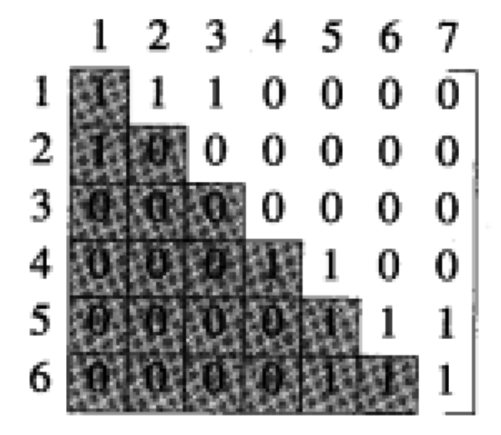

- 编写两个函数 Store 和 Retrieve 分别存储和搜索 $A(i, j)$ 的值，每个函数的复杂性应为 $Θ( 1 )$

    

-  编写函数 indegree($i$)，计算顶点 $i$ 的入度，并分析其复杂度

### 2.3	栈和队列

**Q1:  入栈序列为 ABCDE，是否可能存在 BCAED 和 DBACE 的出栈序列，并说明原因**

可能存在 BCAED 的出栈序列，但不可能存在 DBACE 的出栈序列

- A 入栈，BC直接出去，A 出栈，D 入栈，E 直接出去，D 出栈，可得到 BCAED 的序列

- 若 D 直接出去，则 ABC 已经入栈，其出栈的相对顺序为 CBA 与 DBACE 中的 BAC 矛盾

 

**Q2:  一组序列 $1,2,3,4,...,n$ 依次进栈，若出栈序列为 $p_1,p_2,p_3,...,p_n$，若 $p_1=n$，求 $p_i$ 的表达式**

出栈的第一个元素 $n$ 是入栈序列的最后一个元素，说明它前面的元素已经全部进栈

故出栈的顺序已确定为 $n,n-1,n-2,...3,2,1$，求得通项为
$$
p_i = n - i + 1
$$


**Q3:  入栈序列 $A_i$ 为互不相同的 $n$ 个元素，给出计算出栈序列可能数量的表达式**

考虑 $f(4)$，元素编号为 a, b, c, d，对于出栈序列的四个位置分类

- 元素 a 在 1 号位置，那么只可能 a进栈，马上出栈，此时还剩元素 b, c, d 等待操作，就是子问题 $f(3)$

- 元素 a 在 2 号位置，那么一定有一个元素比 a 先出栈，即有 $f(1)$ 种可能顺序（只能是 b），还剩 c, d，即 $f(2)$，根据乘法原理，一共的顺序个数为 $f(1) \times f(2)$

- 如果元素 a 在 3 号位置，那么一定有两个元素比 1 先出栈，即有 $f(2)$ 种可能顺序（只能是b, c），还剩d，即 $f(1)$，根据乘法原理，一共的顺序个数为 $f(2) \times f(1)$
- ....

推广到 $n$，我们可以得到（Catalan 数）
$$
f(n) = \sum\limits_{i = 0}^{n-1}f(i)f(n-1-i) = \frac{1}{n+1}\left(\begin{array}{c}2n \\ n \end{array}\right)
$$

| 1    | 1    | 2    | 5    | 14   | 42   | 132  | ...  |
| ---- | ---- | ---- | ---- | ---- | ---- | ---- | ---- |
|      |      |      |      |      |      |      |      |

### 2.4    跳表和散列

**Q1:  已知线性表：{8，9，2，13，0，7，1，6，5}，散列函数为 $H(k)=k\%7$，散列表长度为 11**

- **请给出线性开型寻址的散列表**

    |  0   |  1   |  2   |  3   |  4   |  5   |  6   |  7   |  8   |  9   |  10  |
    | :--: | :--: | :--: | :--: | :--: | :--: | :--: | :--: | :--: | :--: | :--: |
    |  0   |  8   |  9   |  2   |  7   |  1   |  13  |  6   |  5   |      |      |

- **基于以上散列表，查找元素 1，给出需要的查找次数**

    比较 8，9，2，7，1，共 5 次

- **画出删除元素 2 后的散列表**

    |  0   |  1   |  2   |  3   |  4   |  5   |  6   |  7   |  8   |  9   |  10  |
    | :--: | :--: | :--: | :--: | :--: | :--: | :--: | :--: | :--: | :--: | :--: |
    |  0   |  8   |  9   |  7   |  1   |  5   |  13  |  6   |      |      |      |

- **若使用单链表存储上述线性表，请阅读以下程序，并给出程序运行结果及其时间复杂度**

    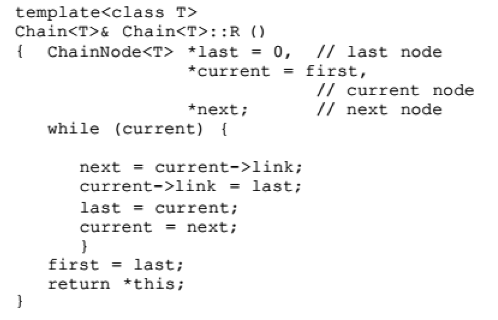

    该程序将链表翻转，结果为

    |  5   |  6   |  1   |  7   |  0   |  13  |  2   |  9   |  8   |
    | :--: | :--: | :--: | :--: | :--: | :--: | :--: | :--: | :--: |


**Q2:  简述跳表与 HASH 的区别与联系**

- 跳表和散列均使用了随机过程来提高字典操作的性能
- 跳表和散列操作的平均复杂度分别是对数级和常数级
- 最坏情况下的空间需求而言，跳表远远大于链式散列
- 跳表比散列更灵活，只需简单地沿着 0 级链就可以在线性时间内按关键字升序输出所有的元素


## Chapter 3    层次结构

### 3.1    二叉树

**Q1:  已知一个二叉树前序序列 ABHFDECKG 和中序序列 HBDFAEKCG，求后序序列**

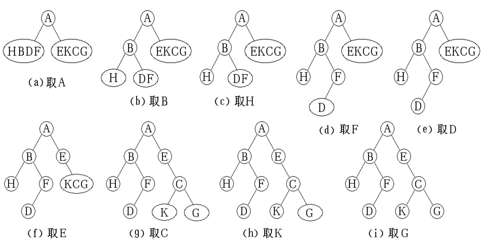

其后序序列为：HDFBKGCEA


**Q2:  二叉树的层次遍历序列为 ABCDEFGHIJ，中序遍历序列为 DBGEHJACIF，写出该二叉树的前序遍历 序列**

中序遍历确定根和左右子树，对于一个子树，在层次遍历中先出现的是子树的根

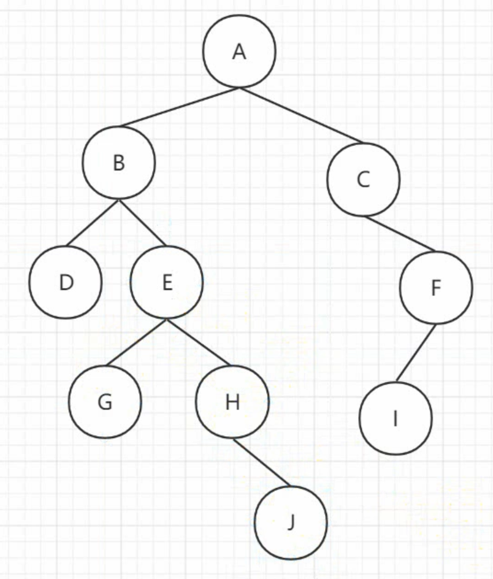

其前序序列为：ABDEGHJCFI	


**Q3:  给定二叉树的前序遍历序列 FGHK，后续遍历序列 HKGF，请画出所有可能的二叉树，并给出可能的二叉树数量 m 与二叉树中度为 1 的节点数量 s 之间的关系**


**Q4:  二叉树的节点：lchild 左指针域，data 数据，rchild 右指针域，构建一个单链表，将二叉树的叶子节点从左至右连接起来，head 为此单链表头节点，用叶节点的右指针域存放链表节点，写出算法思想，并用代码实现，并分析算法复杂度**

对该二叉树中序遍历，若遇到叶子节点就加入叶子链

```c++
template <class T>
void inOrder(binaryTreeNode<T> *t)
{
    stack <BinaryTreeNode<T> *> s(MaxLength);
    BinaryTreeNode<T> *p=t
    do
    {
        while (p)
        {
            s.push(p);
            p = p->lchild;
        }
        if (!s.IsEmpty)
        {
            p = s.top();
            s.pop();
            if (p->lchild == NULL && p->rchild == NULL)
                cout << p->data << " ";
            p = p->rchild;
        }
    } while (p || !s.IsEmpty())
}
```

时间复杂度同中序遍历，为 $O(n)$


**Q5:  二叉树的带权路径长度 (WPL) 是二叉树中所有叶结点的带权路径长度之和。给定一棵二叉树 T，采用二叉链表存储，结点结构为：｜ left ｜ weight ｜ right ｜，其中叶结点的 weight 域保存该结点的非负权值。设 root 为指向 T 的根结点的指针，请设计求 T 的 WPL 的算法，要求：1. 给出算法的基本设计思想；2. 使用 C 或 C++语言，给出二叉树结点的数据类型定义；3. 根据设计思想，采用 C 或 C++语言描述算法，关键之处给出注释。**

采用深度优先搜索，dfs 的参数中需要包含当前树结点 root 以及深度 depth

- 每次首先判断当前树结点是否为空，若为空则直接返回 0
- 其次判断是否为叶节点，若为叶节点则返回该结点值与深度的乘积
- 否则继续搜索其左子结点及右子结点

```c++
int sum(TreeNode* root, int level) 
{
    if(!root) return 0; // 空节点
    if(!root->left && !root->right) // 叶子节点
        return root->val * level; // 返回 权重 * 路径长
    // 递归处理左右子树
    return sum(root->left, level + 1) + sum(root->right, level + 1);
}
cout << sum(root, 0) << endl;
```

在递归过程中每个节点只访问一次，所以时间复杂度为 $O(N)$

### 3.2    堆、哈夫曼树

**Q1:  一个最大堆为 (66，37，41，30，25，40，35，18)，依次从中删除最大的两个元素，写出最后得到的堆**

第一次删除，18 替代 66 然后下沉，（41，37，40，30，25，18，35）

第二次删除，35 替代 41 然后下沉，（40，37，35，30，25，18）


**Q2:  序列 （20，12，35，15，10，80，30，17，2，1），通过堆排序删除 $2$ 个最小元素，画出删除 $2$ 个最小元素后的堆**

构建最小堆

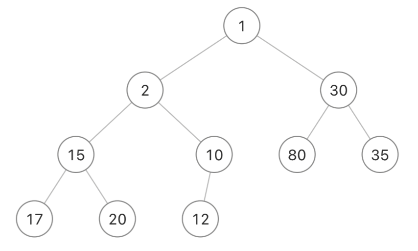

删除两个最小元素后

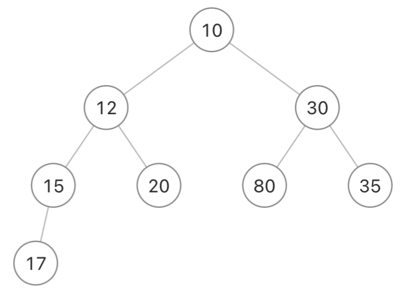


**Q3:  序列 28、19、27、49、56、12、10、25，在实现堆排序的过程中，需要按照元素递增顺序输出，请画出堆排序初始化的图示**

元素递增顺序输出需要一开始初始化为大根树

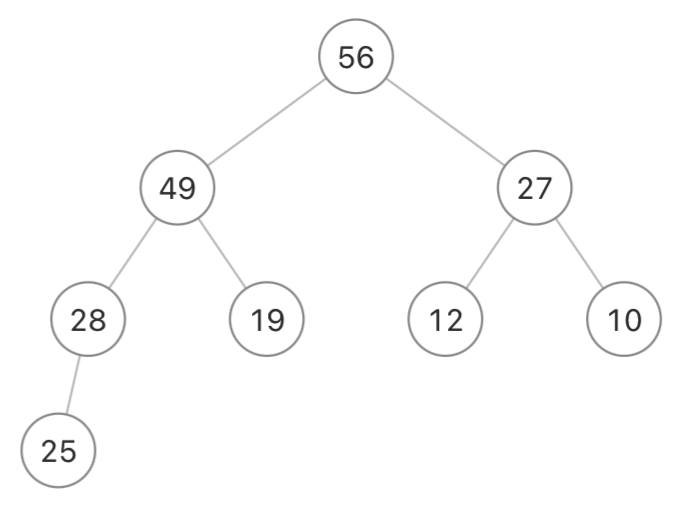


**Q4:  有一份电文中共使用 6 个字符：A、B、C、D、E、F，它们的出现频率依次为 10、6、5、2、15、 4，简述哈夫曼树的算法思想，然后画出对应的赫夫曼树（请按左子树根节点的权小于等于右子树根节点的权的次序构造，左 0 右 1)，并求出每个字符的赫夫曼编码**

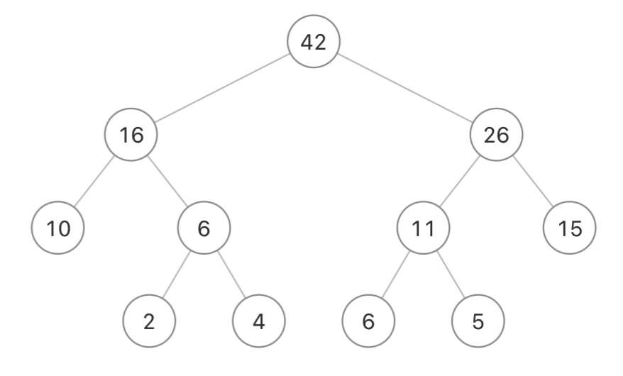

对于给定一组具有确定权值（频率）的叶结点，树的带权路径长度最小的二叉树称为霍夫曼树，对于霍夫曼树来说，其叶结点权值（频率）越小，离根越远，叶结点权值（频率）越大，离根越近

叶子节点从左到右依次为 A、D、F、B、C、E

故对应编码为	A 00		B 100		C 101		D 010		E 11		F 011

### 3.3    平衡搜索树

Q1:  对给定输入序列 { 19, 5, 7, 11, 26, 18, 16, 17 }，构建 AVL 树，并求出平均查找长度（每个节点出现的概率相等），然后按照序列顺序依次删除节点

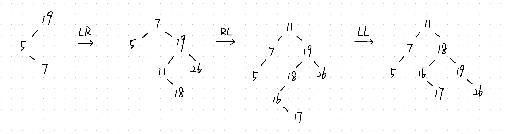

平均查找长度：$(1\times 1 + 2 \times 2 + 3 \times 3 + 4 \times 2)/8 = 2.75$

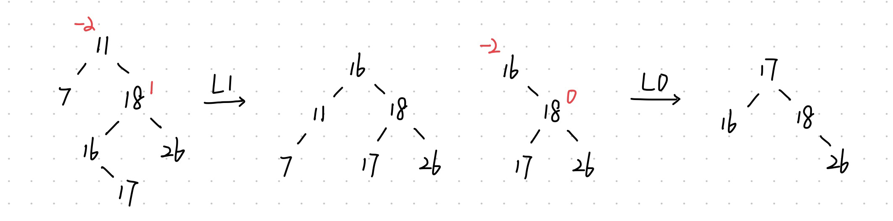


**Q2:  若一颗 $m$ 叉搜索树的树高为 $h$，请分析该 $m$ 叉搜索树的节点个数的范围**
$$
h \leqslant n \leqslant m^h - 1
$$


**Q3:  含有 $n$ 个非叶节点的 $m$ 阶 B-树，计算出该树非叶节点所含有的最少的关键字总数**

根结点至少一个关键字，其余非叶节点各自至少 $\lceil m/2\rceil-1$ 个关键字，故总最少关键字为
$$
1+ (\lceil m/2\rceil-1)\times (n-1)
$$


**Q4:  请说出 B-树在元素插入过程中的算法思想**

- 首先要检查具有相同关键值的元素是否存在，如果找到了这个元素，那么插入失败
- 当搜索不成功时，便可以将元素插入到搜索路径中所遇到的最后一个内部节点处
- 当新元素需要插入到饱和节点中时，饱和节点需要被分开


**Q5:  在下列 5 阶 B-树中首先插入关键字 85，然后删除关键字 70，画出插入元素和删除元素后的 B-树**

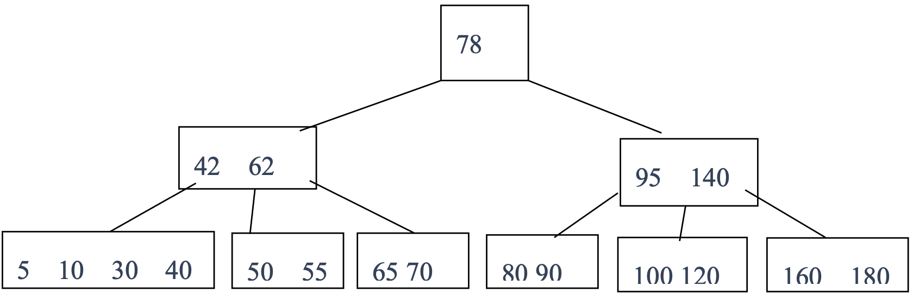

$\lceil m/2\rceil = 3$，一个节点至少 3 个孩子，至少 2 个关键字，最多 5 个孩子，最多 4 个关键字

插入：85 直接插入 80 90 之间

删除：																			42 78 95 140

​										5 10 30 40			50 55 62 65			80 85 90			100 120			160 180

## Chapter 4    网状结构

**Q1:  给一个 $AOV$ 图，简述拓扑排序的算法思想，并写出图中所有的拓扑序列**


从一个空序列 V 开始，逐步构造拓扑序列，每一步在排好的序列中加入一个顶点，利用如下贪婪准则来选择顶点：从剩下的顶点中，选择顶点 w，使得 w 不存在这样的入边 (v, w)，其中顶点 v 不在已排好的序列结构中出现

V1 V2 V3 V4 V5 V6

V1 V2 V3 V4 V6 V5

V1 V2 V4 V3 V5 V6

V1 V2 V4 V3 V6 V5

V1 V3 V4 V2 V5 V6

V1 V3 V4 V2 V6 V5

V1 V3 V4 V6 V2 V5

V1 V3 V2 V4 V5 V6

V1 V3 V2 V4 V6 V5

V1 V4 V2 V3 V5 V6

V1 V4 V2 V3 V6 V5

V1 V4 V3 V2 V5 V6

V1 V4 V3 V2 V6 V5

V1 V4 V3 V6 V2 V5


**Q2:  Kruskal 算法的算法思想，给出一个有向有权重的图，求最小数生成树的过程**

开始，初始化含有n个顶点0条边的森林，Kruskal 算法所使用的贪婪准则是：从剩下的边中选择一条不会产生环路的具有最小耗费的边加入已选择的边的集合中

O($n+eloge$)


**Q3:  给出一个有向图各边权重的表，请写出该有向图的一个拓扑序列，请说出Dijkstra算法思想，求出从A点出发的最短路径与最短路径长度**

按路径长度递增顺序产生最短路径。首先最初产生从 sourceVertex 到它自身的路径， 这条路径没有边，其长度为 0

在贪婪算法的每一步中，产生下一个最短路径：在目前产生的每一条最短路径中，考虑加入一条边到达未产生最短路径的顶点，再从所有这些新路径中选择最短的


**Q4:  请给出从加权无向图中生成最小耗费生成树的两种方法，请分别描述其算法思想，并给出各自的时间复杂度**

Prim：从具有一个单一顶点（可以是原图中任意一个顶点）的树 T 开始重复地往 T 中加入一条代价最小的边 (u,v) 使其仍是一棵树，对于边 (u,v)， u,v 中正好有一个顶点位于 T 中；直到 T 中包含 n-1 条边为止

O($n^2$)


**Q5:  请给出判断 n 个顶点的无向图是否为连通图的算法思想**

DFS/BFS 对访问的点作标记，最后检查是否有点没有被标记


**Q6:  给一个无向加权图，使用 Prim 算法，从题中指定的顶点开始构建最小成本生成树**


**Q7:  下面是某有向加权图（顶点 A,B,C,D,E）的耗费邻接矩阵，先给出一个拓扑序列，然后，使用 Dijkstra 算法依次计算出顶点 A 至其它各顶点的最短路径和最短路径长度**

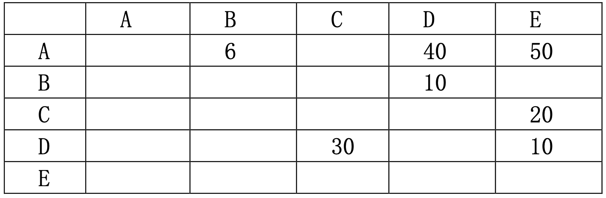


