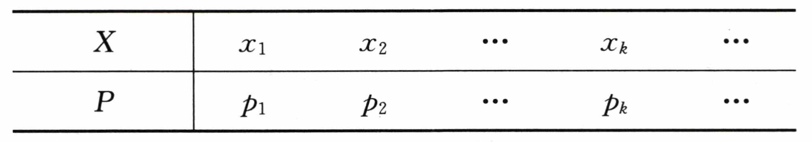
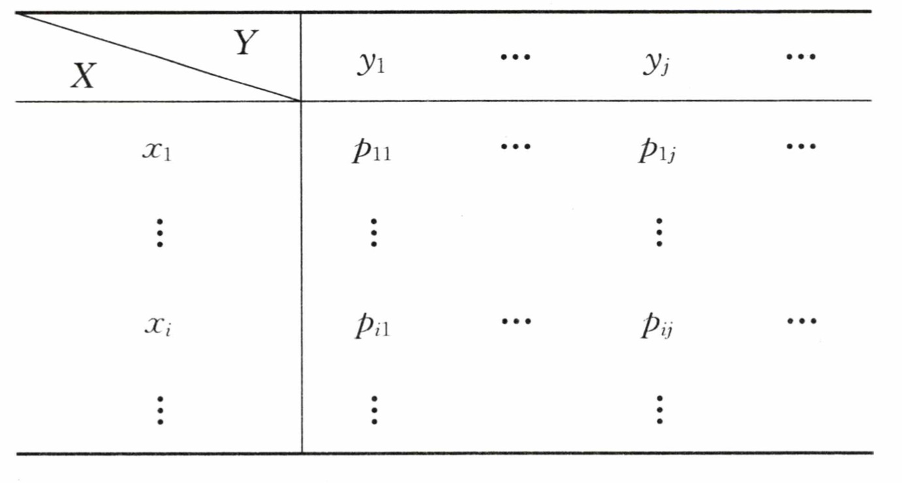
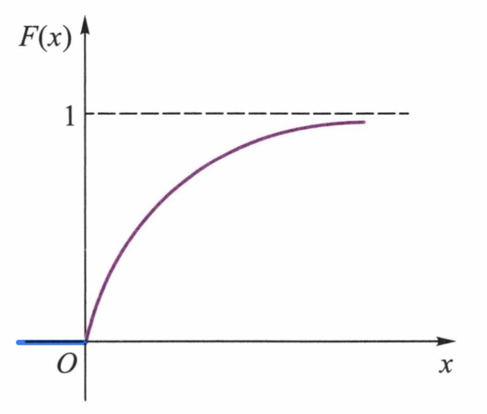
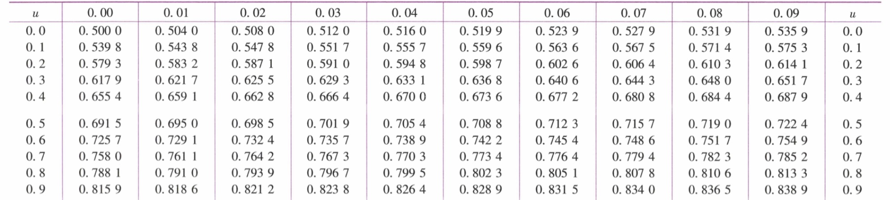
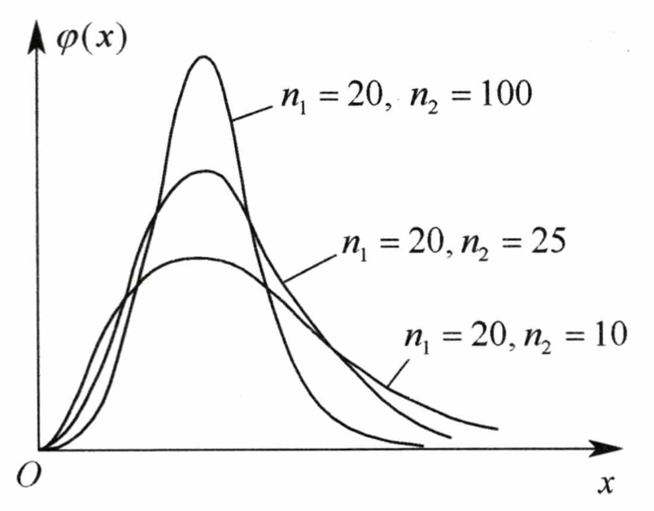

# 概率论与数理统计

## 第一目    随机事件及其概率

### 1.1    随机事件及其运算

- 随机事件的相关概念

    随机实验、样本空间、随机事件、基本事件、必然事件、不可能事件

- 时间的关系及运算

    包含、相等、事件的和 $A \cup B$、事件的积 $A \cap B~~\text{or}~~AB$、事件的差 $A-B$、互斥事件、对立事件 $\overline A$

#### 事件的运算律

|  名称  |                             等式                             |
| :----: | :----------------------------------------------------------: |
| 交换律 |                   $$A \cup B = B \cup A$$                    |
| 结合律 |          $$(A \cup B) \cup C = A \cup (B \cup C)$$           |
| 分配律 | $$(A \cup B)C = (AC) \cup (BC),~~A \cup (BC) =(A \cup B)(A \cup C)$$ |
| 摩根律 | $$\overline {A \cup B} = \overline A \cap \overline B,~~\overline {A \cap B} = \overline A \cup \overline B$$ |

### 1.2    随机事件的概率

- 概率的统计定义：频率估计概率
- 概率的公理化定义：非负性、规范性、可列可加性

#### 古典概型

- 每次实验只有有限种可能的实验结果
- 每次实验中，各基本事件出现的可能性完全相同

$$
P(A) = \frac {\small A ~\normalsize\text{中基本事件数}}{\small \Omega \normalsize ~\text{中基本事件数}} = \frac {m}{n}
$$

#### 几何概型

- 样本空间是一个区域
- 每个实验结果的出现具有等可能性

$$
P(A) = \frac {\small A ~\normalsize \text{的测度（长度、面积、体积）}} {\text{样本空间的测度（长度、面积、体积）}}
$$

### 1.3    概率基本运算法则

#### 概率的性质

$$
\begin{align}
&(1) ~~
0 \leqslant P(A) \leqslant 1
\\~\\
&(2) ~~ 
P(\Omega) = 1,~~P(\varnothing) = 0
\\~\\
&(3) ~~ 
P(\overline A) = 1 - P(A)
\\~\\
&(4) ~~ 
\text{If } A \subset B\\
&~~~~~~~P(B-A) = P(B) - P(A)
\\~\\
&(5) ~~ 
\text{If events }A_1,A_2 ...A_n\text{ mutually exclusive}\\
&~~~~~~~P(A_1+A_2+...+A_n) = P(A_1) + P(A_2)+...+P(A_n)
\\~\\
&(6) ~~
P(A \cup B) = P(A) + P(B) - P(AB)\\
&~~~~~~~P(A_1 \cup A_2 \cup ... \cup A_n) = \sum\limits_{i=1}^n P(A_i) - \sum\limits_{1 \leqslant i \leqslant j \leqslant n} P(A_iA_j) + \sum\limits_{1 \leqslant i \leqslant j \leqslant k \leqslant n} P(A_iA_jA_k) +...\\
&~~~~~~~~~~~~~~~~~~~~~~~~~~~~~~~~~~~~~~~~~~~~~~~+ (-1)^{n-1}P(A_1A_2...A_n)

\end{align}
$$

#### 条件概率

$$
P(B|A) = \frac {P(AB)}{P(A)},~~~~P(A)>0 
$$

#### 乘法公式

$$
\begin{align}
& P(AB) = P(A|B)P(B) = P(B|A)P(A)\\~\\
& P(A_1...A_n) = P(A_n|A_1...A_{n-1})...P(A_3|A_2A_1)P(A_2|A_1)P(A_1)
\end{align}
$$

### 1.4    全概率公式与贝叶斯公式

- 完备事件组：两两互斥、和为全集

#### 全概率公式

$$
P(A) = \sum\limits_{i=1}^n P(B_i)P(A|B_i)
$$

#### 贝叶斯公式

$$
P(B_i|A) = \frac {P(B_i)P(A|B_i)}{\sum\limits_{j=1}^n P(B_j)P(A|B_j)}
$$

### 1.5    随机事件独立性

$$A \text { or }\overline A$$ 与 $$B \text{ or }\overline B$$ 独立
$$
P(AB)=P(A)P(B)
$$
拓展到 $$n$$ 个事件
$$
\begin{align}
& P(A_1A_2...A_n) = P(A_1)P(A_2)...P(A_n)
\\
& P(\sum\limits_{i=1}^n A_i) = 1 - \prod_{i=1}^n P(\overline {A_i})
\end{align}
$$
两两独立不等同于相互独立，还应满足积的概率等于概率的积

关于独立性检验的一些情况：

- 如果事件 $A$ 或事件 $B$ 发生的概率都不为 $0$，互斥不独立，独立不互斥

- 零概率事件与任何事件独立；1概率事件与任何事件独立

- 不可能事件与任何事件既独立又互斥

## 第二目    随机变量及其分布

### 2.1    随机变量与分布函数

#### 随机变量

设 $$E$$ 是一个随机试验，其样本空间为 $$\Omega =\{\omega\}$$ ，如果对于每一个样本点 $$\omega \in \Omega$$ 都有唯一的一个实数 $$X(\omega)$$ 与之对应，则称 $$X(\omega)$$ 为一维随机变量，通常用 $$X,~~Y,~~Z,~...$$ 表示随机变量

由 $$X=X(\omega),~Y=Y(\omega)$$ 构成的向量 $$(X,Y)$$ 称为二维随机变量

#### 一维 分布函数

$$
F(x) = P(X \leqslant x)
$$

基本性质：

- 单调性：$$F(x)$$ 是一个 **单调不减** 的函数
- 有界性
    - $$0 \leqslant F(x) \leqslant 1$$
    - $$F(+\infin) = \lim\limits_{x \to +\infin}F(x) =1$$
    - $$F(-\infin)=\lim\limits_{x \to -\infin}F(x)=0$$
- 连续性：$$F(x+0)=F(x)$$，即 $$F(x)$$ 是 **右连续** 函数

- 由分布函数求概率
    $$
    P(a < X \leqslant b) = F(b) - F(a)
    $$

#### 二维 联合分布函数

$$
F(x,y)=P(X \leqslant x, Y\leqslant y)
$$

基本性质：

- 单调性：$$F(x,y)$$ 是$$x$$ 或 $$y$$ 的**单调不减** 函数
- 有界性
    - $$0 \leqslant F(x,y) \leqslant 1$$
    - $$F(-\infin,y)=F(x,-\infin)=F(-\infin,-\infin)=0$$
    - $$F(+\infin,+\infin)=1$$
- 连续性：$$F(x+0)=F(x)$$，即 $$F(x)$$ 是 **右连续** 函数

- 由分布函数求概率
    $$
    P(x_1 < X \leqslant x_2,~~y_1 <Y\leqslant y_2) = F(x_2,y_2) - F(x_1,y_2)-F(x_2,y_1)+F(x_1,y_1)
    $$

#### 二维 边缘分布

- 边缘分布函数
    $$
    F_X(x)=\lim\limits_{y \to +\infin} F(x,y) = F(x,+\infin) & & & F_Y(y)=\lim\limits_{x \to +\infin} F(x,y) = F(+\infin,y)\\
    $$

- 边缘分布律
    $$
    p_{i\cdot} = \sum\limits_{j=1}^\infin p_{ij} = P(X=x_i) & & &
    p_{\cdot j} = \sum\limits_{i=1}^\infin p_{ij} = P(Y=y_j)\\
    $$

#### 随机变量的独立性

$$
F(x,y) = F_X(x) \cdot F_Y(y) ~~\Rightarrow~~ \text{Mutually Independent}
$$

充要条件（边缘密度函数见后续章节）：

- 离散型：$$p_{ij} = p_{i\cdot}~p_{\cdot j}$$
- 连续型：$$f(x,y)=f_X(x) \cdot f_Y(y)$$

### 2.2    离散型随机变量

若随机变量 $$X$$ 的全部可能取值是有限个或可列个，则称 $$X$$ 为离散型随机变量

#### 一维 分布律

$$
P(X = x_k)=p_k & (k=1,2,\cdots)\\
$$

性质：

- $$P(X=x_k)= p_k \geqslant 0, & k=1,2,\cdots\\$$
- $$\sum\limits_k P(X=x_k)=\sum\limits_k p_k = 1$$

分布律与分布函数、概率：

- $$F(x)=P(X\leqslant x) = \sum\limits_{x_k \leqslant x}p_k$$
- $$P(a < X \leqslant b)=\sum\limits_{a < x_k \leqslant b}p_k$$
- $$P(X = x_k)=F(x_k)-F(x_k - 0), & k=1,2,\cdots\\$$

#### 一维 重要分布

- $$(0-1)$$ 分布（**Bernoulli**）
    $$
    X \sim 
    \left[
    \begin{array}{cc}
    ~0 & 1~ \\
    ~1-p & p~
    \end{array}
    \right]
    $$

- 几何分布（**Geometric**）：$$n$$ 重 *Bernoulli* 试验中，事件 A 首次出现时的试验次数 $$X$$
    $$
    X \sim G(p) & P(X=k)=(1-p)^{k-1}p\\
    $$

- 二项分布（**Binomial**）：设在 $$n$$ 重 *Bernoulli* 试验中事件 A 发生的次数为 $$X$$
    $$
    X \sim B(n,p) & P(X=k)=C_n^k p^k (1-p)^{n-k}\\
    $$
    $$p$$ 为事件 A 在每次实验中出现的概率

    - 二项分布最可能值
        - $$(n+1)p$$ 为正整数：$$k = (n+1)p, & k = (n+1)p-1\\$$
        - $$(n+1)p$$ 不是整数：$$k=\left[ (n+1)p\right]$$

    - 泊松定理：设随机变量 $$X_n$$ 服从参数为 $$n,p$$ 的二项分布，若 $$\lim\limits_{n \to \infin} np_n = \lambda$$，则有
        $$
        \lim_{n \to \infin} P(X_n = k)=\frac{\lambda^k}{k!}e^{-\lambda}
        $$

- 泊松分布（**Poisson**）：作为 $$n > 10,~p < 0.1$$ 时二项分布的近似分布
    $$
    X \sim P(\lambda) & P(X=k)=\frac{\lambda^k}{k!}e^{-\lambda} \\
    $$

    - 泊松分布最可能值

        - $$\lambda$$ 为整数：$$k = \lambda, & k = \lambda-1\\$$

        - $$\lambda$$ 不是整数：$$k=\left[ \lambda \right]$$

    - 泊松分布表
        $$
        \sum\limits_{k = x}^\infin \frac{\lambda^k}{k!}e^{-\lambda} & & \textcolor{red}{k \geqslant x}\\
        $$
        

- 超几何分布（**Hypergeometric**）：$$N$$ 件产品中 $$M$$ 件次品，从中不放回抽取 $$n$$ 件，其中所含次品数 $$X$$
    $$
    X \sim H(N,M,n) & P(X=k)=\frac{C_M^kC_{N-M}^{n-k}}{C_N^n}\\
    $$

#### 二维 联合分布律

$$
P(X=x_i,Y=y_i) = p_{ij}
$$

性质：

- $$p_{ij}\geqslant 0$$
- $$\sum\limits_{i=1}^\infin\sum\limits_{j=1}^\infin p_{ij}=1$$

#### 二维 条件分布律

设 $$(X,Y)$$ 是二维离散型随机变量，若 $$p_{\cdot j}>0$$
$$
P(X=x_i|Y=y_i) = \frac{p_{ij}}{p_{\cdot j}} & & & 
P(Y=y_i|X=x_i) = \frac{p_{ij}}{p_{i \cdot}}
\\
$$

#### 随机变量函数

$$
Y=g(X) & & P(Y=y_j)=\sum\limits_{g(x_k)=y_j}P(X=x_k)\\
Z=g(X,Y) & & P(Z=z_k)=\sum\limits_{g(x_i,y_i)=z_k}P(X=x_i,Y=y_i)\\
$$

### 2.3    连续型随机变量

#### 一维 概率密度函数

函数 $$f(x)$$ 为 $$X$$ 的概率密度函数
$$
F(x) = \int_{-\infin}^x f(t)dt \\~\\
f(x) = F^\prime(x)
$$
性质：
$$
(1) & f(x) \geqslant 0 \\~\\
(2) & \int_{-\infin}^\infin f(x)\mathrm dx = 1 \\~\\
(3) & P(X=a) = 0
$$

#### 一维 重要分布

- 均匀分布（**Uniform**）
    $$
    X \sim U[a,b] & & 
    
    f(x)=
    \left\{
    \begin{array}{cc}
    \cfrac{1}{b-a} &   a \leqslant x \leqslant b\\
    0 &  \text{otherwise}
    \end{array}
    \right.\\
    $$
    任一区间内的概率与该区间的长度成正比，而与区间的位置无关

- 指数分布（**Exponential**）
    $$
    X \sim E(\lambda) & & f(x)=
    \left\{
    \begin{array}{cc}
    \lambda e^{-\lambda x} & x > 0 \\
    0 & x \leqslant 0
    \end{array}
    \right.
    \\
    $$
    
    $$
    F(x)=
    \left\{
    \begin{array}{cc}
    1 - e^{-\lambda x} & x > 0 \\
    0 & x \leqslant 0
    \end{array}
    \right.
    $$
    

    常作为各种「寿命」分布的近似

    无记忆性：$$P(X > s + t | X > s) = P(X > t)$$

- 正态分布（**Normal**）
    $$
    X \sim N(\mu,\sigma^2) & & f(x)=\frac{1}{\sqrt{2\pi}\sigma}e^{\Large-\frac 1 2 \left(\frac {x-\mu}{\sigma}\right)^2} \\
    $$
    

    - 标准正态分布：$$U = \cfrac{X -\mu}{\sigma} \sim N(0,1)$$
        $$
        \varphi(x) = \frac{1}{\sqrt{2\pi}}e^{\Large-\frac 1 2 x^{\large 2}} & & \varPhi(x) = \int_{-\infin}^x\varphi (t)\mathrm d t\\
        $$
        性质：

        - $$\varPhi(-x) = 1 - \varPhi(x)$$
        - $$\varPhi(0)=0.5$$
        - $$\varPhi(|x|<a )= 2~\varPhi(a)-1$$

    - 标准正态分布表
        $$
        \varPhi(u) = \frac{1}{\sqrt{2\pi}}\int_{-\infin}^u e^{\Large-\frac 1 2 x^{\large 2}} \mathrm dx & & &  x \leqslant u,~~~u \geqslant 0\\
        $$
        

#### 二维 联合密度函数

$$
F(x,y) = \int_{-\infin}^x \int_{-\infin}^y f(x,y)\mathrm d u \mathrm d v \\~\\
f(x,y) = \frac{\part^2F(x,y)}{\part x \part y}
$$

性质：
$$
(1) & f(x,y) \geqslant 0 \\~\\
(2) & \int_{-\infin}^\infin\int_{-\infin}^\infin f(x,y)\mathrm dx \mathrm d y = 1 \\~\\
(3) & P\left\{(X,Y)\in G\right\} = \iint\limits_G f(x,y)\mathrm dx \mathrm dy 
$$

#### 二维 边缘密度函数

$$
f_X(x) = \int_{-\infin}^\infin f(x,y)\mathrm dy & & & f_Y(y) = \int_{-\infin}^\infin f(x,y)\mathrm dx\\
$$

#### 二维 常用分布

- 二维均匀分布
    $$
    f(x,y) = \left\{
    \begin{array}{cc}
    \Large\frac{1}{A} & \normalsize (x,y) \in D \\
    0 & \text{otherwise}
    \end{array}
    \right.
    $$
    $$A$$ 为区域 $$D$$ 的面积

- 二维正态分布
    $$
    (X,Y) \sim N(\mu_1,\sigma_1^2;~\mu_2,\sigma_2^2;~\rho) \\~\\
    f(x,y) = \frac{1}{2\pi\sigma_1\sigma_2\sqrt{1-\rho^2}} 
    e^{\LARGE  
    -\frac{1}{2(1-\rho^{\large 2})}
    \left[
    (\frac{x-\mu_{\large 1}}{\sigma_{\large 1}})^{\Large 2}
    + (\frac{y-\mu_{\large 2}}{\sigma_{\large 2}})^{\Large 2}
    \Large
    -2\rho
    \LARGE
    (\frac{x-\mu_{\large 1}}{\sigma_{\large 1}})
    (\frac{y-\mu_{\large 2}}{\sigma_{\large 2}})
    \right]
    }
    $$
    

    性质：
    $$
    (X,Y) \sim N(\mu_1,\sigma_1^2;~\mu_2,\sigma_2^2;~\rho) ~~\Rightarrow~~ X\sim N(\mu_1,\sigma_1^2),~Y\sim N(\mu_2,\sigma_2^2)
    $$

#### 一维 随机变量函数

$$
Y = g(X) & & F_Y(y) = P(Y \leqslant y) = P\left(g(X)\leqslant y\right) = \int\limits_{g(x)\leqslant x} f_X(x)\mathrm dx
\\
$$

若 $$g(x)$$ 在 $$\R$$ 上严格单调可导，有反函数 $$h(y)=g^{-1}(y)$$
$$
f_Y(y) =
\left\{
\begin{array}{cc}
f_X\left[h(y)\right]|h^\prime(y)| & \alpha < y < \beta \\
0 & \text{otherwise}
\end{array}
\right.
\\
$$

#### 二维 随机变量函数

$$
Z=g(X,Y) & & 
F_Z(z) = P(Z \leqslant z) = P(g(X,Y)\leqslant z) = \iint\limits_{g(x,y)\leqslant z} f(x,y)\mathrm dx \mathrm dy
\\
$$

**特殊类型：**

- $$Z =X+Y$$
    $$
    f_Z(z) = \int_{-\infin}^\infin f(x,z-x)\mathrm dx 
    =
    \int_{-\infin}^\infin f(z-y,y)\mathrm dy
    $$
    若 $$X,Y$$ 相互独立
    $$
    f_Z(z) = f_X * f_Y = \int_{-\infin}^\infin f_X(x)f_Y(z-x)\mathrm dx 
    =
    \int_{-\infin}^\infin f_X(z-y)f_Y(y)\mathrm dy 
    $$

- $$X\sim N(\mu_1,\sigma_1^2),~Y\sim N(\mu_2,\sigma_2^2)$$
    $$
    aX + bY \sim N(a\mu_1+b\mu_2,~a^2\sigma_1^2+b^2\sigma_2^2)
    $$

- $$M=\max(X,Y),~N=\min(X,Y)$$，$$X,Y$$ 相互独立
    $$
    F_M(z) = F_X(z)F_Y(z) & & &
    F_N(z) = 1 - [1-F_X(z)][1-F_Y(z)]
    \\
    $$

- $$Z=\Large\frac X Y$$
    $$
    f_Z(z) = \int_{-\infin}^\infin |y|f(yz,y) \mathrm dy
    $$
    若 $$X,Y$$ 相互独立
    $$
    f_Z(z) = \int_{-\infin}^\infin |y|f_X(yz)f_Y(y) \mathrm dy
    $$
    

## 第三目    随机变量的数字特征

### 3.1    数学期望 $E$

​	// 可以理解为，期望是可能取值在概率加权下的平均

​	// 下述无论是级数还是积分，都要求绝对收敛，否则数学期望不存在

#### 离散型

随机变量 $X$ 的分布律为 $P\{X = x_k\} = p_k~~~(k=1,2,...)$
$$
EX = \sum\limits_k x_k p_k
$$
一维随机变量函数 $Y = g(X)$
$$
EY = \sum\limits_k g(x_k)p_k
$$
二维随机变量函数 $Z = g(X,Y)$，$(X,Y)$ 的联合分布律为 $P\{X = x_i, Y= y_i\} = p_{ij}$
$$
EZ = \sum\limits_i \sum\limits_j g(x_i,y_i)p_{ij}
$$

#### 连续型

随机变量 $X$ 的概率密度函数为 $f(x)$
$$
EX = \int_{- \infin}^{+\infin} xf(x) ~\mathrm{d} x
$$
​	// 积分需要注意积分区域上下限，可能需要分段积分

一维随机变量函数 $Y = g(X)$
$$
EY = \int_{-\infin}^{+\infin} g(x)\cdot f(x)~\mathrm{d}x
$$
二维随机变量函数 $Z = g(X,Y)$，$(X,Y)$ 的联合密度函数为 $f(x,y)$
$$
EY = \int\limits_{-\infin}^{+\infin}\int\limits_{-\infin}^{+\infin} g(x,y)\cdot f(x,y)~\mathrm{d}x\mathrm{d}y
$$
若把 $x$ 或 $y$ 的期望看作二维随机变量函数来求解的话，注意积分也是双重积分

#### 数学期望的性质

$$
\begin{align}
&(1) ~~ E(c) = c
\\~\\
&(2) ~~ E(cX) = cEX
\\~\\
&(3) ~~ E(X \pm Y) = EX \pm EY
\\~\\
&(4) ~~ E(XY) = EX \cdot EY \text{（当相互独立时）}
\\~\\
&(5) ~~ \left[E(XY)\right]^2 \leqslant E(X^2) \cdot E(Y^2)
\end{align}
$$

### 3.2    方差

#### 统一定义与简化公式

若随机变量 $X$ 的数学期望 $EX$ 存在，则方差定义为
$$
\begin{align}
DX &= E(X - EX)^2 \\~\\
&= E(X^2) - (EX)^2 
\end{align}
$$

#### 方差的性质

$$
\begin{align}
&(1) ~~ D(c) = 0
\\~\\
&(2) ~~ D(cX) = c^2DX
\\~\\
&(3) ~~ D(X \pm Y) = DX + DY \text{（当相互独立时）}
\end{align}
$$

### 3.3    常见分布的数字特征

#### 常见离散型分布的数字特征

$$
\begin{align}
(\text{Binomial})~~&X\sim B(n,p)~~~~~~~~~~EX = np,~~DX = np(1-p) \\~\\
(\text{Bernoulli})~~&X\sim B(1,p)~~~~~~~~~~EX = p,~~DX = p(1-p) \\~\\
(\text{Poisson})~~&X\sim P(\lambda)~~~~~~~~~~~~~~EX = \lambda,~~DX = \lambda \\~\\
(\text{Geometric})~~&X\sim G(p)~~~~~~~~~~~~~~EX = \frac 1 p ,~~DX = \frac {1-p}{p^2}
\end{align}
$$

#### 常见连续型分布的数字特征

$$
\begin{align}
(\text{Normal})~~&X\sim N(\mu,\sigma^2)~~~~~~~EX = \mu,~~DX = \sigma^2 \\~\\
(\text{Exponential})~~&X\sim E(\lambda)~~~~~~~~~~~~~EX = \frac 1 \lambda,~~DX = \frac 1 {\lambda^2} \\~\\
(\text{Uniform})~~&X\sim U[a,b]~~~~~~~~~~EX = \frac {a+b} 2 ,~~DX = \frac {(b-a)^2}{12}
\end{align}
$$

### 3.4    协方差与相关系数

#### 协方差

对于二维随机变量 $(X,Y)$，其协方差定义为
$$
\begin{align}
\text{Cov}(X,Y) &= E[X - EX][Y - EY] \\~\\
&= E(XY) - EX \cdot EY
\end{align}
$$

#### 协方差的性质

$$
\begin{align}
&(1) ~~ \text{Cov}(X,X) = DX
\\~\\
&(2) ~~ \text{Cov}(X,Y) = \text{Cov}(Y,X)
\\~\\
&(3) ~~ \text{Cov}(aX,bY) = ab\text{Cov}(X,Y)
\\~\\
&(4) ~~ \text{Cov}(X_1 + X_2,Y) = \text{Cov}(X_1,Y) + \text{Cov}(X_2,Y)
\\~\\
&(5) ~~ D(X \pm Y) = DX + DY \pm 2\text{Cov}(X,Y)
\end{align}
$$

#### 相关系数

相关系数反映了两个随机变量的线性相关程度
$$
\rho_{XY} = \frac{\text{Cov}(X,Y)}{\sqrt{DX} \sqrt{DY}}
$$
相关系数绝对值越接近 $1$ 时，$X$ 与 $Y$ 的线性相关程度就越强，反之，越接近 $0$ 时，$X$ 与 $Y$ 线性相关程度就越弱，等于零意味着（线性）不相关

#### 相关系数的性质

$$
\begin{align}
&(1) ~~ -1 \leqslant \rho_{XY} \leqslant 1
\\~\\
&(2) ~~ \text{相互独立}~\Rightarrow~ \rho_{XY} = 0
\\~\\
&(3) ~~ \text{线性关系}:~Y = aX + b  ~\Rightarrow~ |\rho_{XY}| = 1~~\text{（与 a 同号）} \\~\\
&(4) ~~ \text{二维正态分布}:~~\text{相互独立}~\Leftrightarrow~ \text{不相关}
\\~\\
&(5) ~~ \rho_{aX+b,cY+d} = \rho_{X,Y}~~\text{（a, c 同号）} 
\end{align}
$$

#### 矩

- 原点矩

$$
\begin{align}
k~\text{阶原点矩}&:~~ E(X^k) \\~\\
k+l~\text{阶混合原点矩}&:~~ E(X^kY^l)
\end{align}
$$

- 中心矩

$$
\begin{align}
k~\text{阶中心矩}&:~~ E\left[(X-EX)^k\right] \\~\\
k+l~\text{阶混合中心矩}&:~~ E\left[(X-EX)^k(Y -EY)^l\right]
\end{align}
$$

#### 协方差矩阵

设 $\bold X= (X_1,X_2,...,X_n)$ 为 $n$ 维随机变量，记 $C_{ij} = \text{Cov}(X_i,X_j),~~i,j = 1,2,...,n$
$$
\begin{align}
\text{var}(\bold X) &= E \left[(\bold X - E \bold X)(\bold X - E \bold X)^T\right] \\~\\
&=
\left[
\begin{array}{cccc}
C_{11} & C_{12} & \cdots & C_{1n} \\
C_{21} & C_{22} & \cdots & C_{2n} \\
\cdots & \cdots & \cdots & \cdots \\
C_{n1} & C_{n2} & \cdots & C_{nn}
\end{array}
\right]
\end{align}
$$
这个矩阵称也称为随机向量 $\bold X$ 的方差，是从一维随机变量方差到高维随机向量的自然推广

## 第四目    极限定理

### 4.1    切比雪夫不等式

#### 马尔可夫不等式

设 $X$ 为一个非负随机变量，不等式给出了其大于等于某正数的概率的上界
$$
P (X \geqslant a) \leq \frac {DX}{a}
$$
定义随机变量 $X$ 为 $(X - EX)^2$，令 $a = \varepsilon^2$，括号内开方取绝对值就得到了切比雪夫不等式

#### 切比雪夫不等式

设随机变量 $X$ 具有数学期望 $EX$ 和方差 $DX$，则对任意的 $\varepsilon > 0$ 满足
$$
\begin{align}
P\left(|X - EX| \geqslant \varepsilon\right) &\leq \frac {DX} {\varepsilon^2} \\~\\
P \left(|X - EX| < \varepsilon \right) &\geq 1 - \frac {DX}{\varepsilon^2}
\end{align}
$$

### 4.2    大数定律

概率论中用来阐明大量随机现象平均结果的**稳定性**的定理统称为大数定律

#### 切比雪夫大数定律 与 辛钦大数定律

以下两种条件对应相同的结论

- （切比雪夫）随机变量 $X_1,X_2,...,X_n$ **相互独立**，且具有**相同的数学期望与方差**，即

$$
E(X_k) = \mu~~~~~~~~~~~D(X_k) = \sigma^2
$$

- （辛钦）随机变量 $X_1,X_2,...,X_n$ **独立同分布**，且具有**相同的数学期望**，即

$$
E(X_k) = \mu
$$

对于任意的 $\varepsilon > 0$，满足
$$
\begin{align}
\lim\limits_{n \to +\infin} 
P \left(
\left| \frac 1 n \sum\limits_{k = 1}^n X_k - \mu \right| < \varepsilon
\right) &= 1 \\~\\
\lim\limits_{n \to +\infin} 
P \left(
\left| \frac 1 n \sum\limits_{k = 1}^n X_k - \mu \right| \geqslant \varepsilon
\right) &= 0
\end{align}
$$
切比雪夫大数定律说明，在试验次数无限增多的情况下, 算术平均值与 $\mu$ 接近的可能性无限变大

辛钦大数定律说明，对独立同分布的随机变量序列，只要验证数学期望是否存在，就可判定其是否服从大数定律

#### 伯努利大数定律

设 $k_n$ 是 $n$ 次**独立重复试验**中事件 $A$ 发生的次数，而 $p$ 是事件 $A$ 在每次试验中发生的概率，对于任意的 $\varepsilon > 0$，满足
$$
\lim\limits_{n \to \infin} P \left(\left|\frac {k_n}{n} - p\right| < \varepsilon\right) = 1
$$
伯努利大数定律说明，在试验条件不改变的情况下，将试验重复进行多次，则随机事件的频率在它发生的概率附近摆动

### 4.3    中心极限定理

#### 独立同分布的中心极限定理

设随机变量 $X_1, X_2, ..., X_n$ 独立同分布，且具有相同的期望和方差，即
$$
E(X_k) = \mu~~~~~~~~~~~D(X_k) = \sigma^2
$$
对于任意的实数 $x$，满足
$$
\lim\limits_{n \to +\infin} P
\left(
\frac{\sum\limits_{k = 1}^n X_k - n\mu}{\sigma \sqrt n} \leqslant x 
\right)
= \int_{-\infin}^x \frac{1}{\sqrt{2 \pi}} e^{-\frac {t^2} 2} \mathrm dt
= \varPhi(x)
$$
当 $n$ 充分大时，**独立同分布的随机变量之和** $\sum\limits_{k = 1}^n X_k$ 近似服从正态分布
$$
\sum\limits_{k = 1}^n X_k \sim N(n\mu,n\sigma^2)
$$
除以 $n$，记 $\overline X = \cfrac 1 n \sum\limits_{k = 1}^n$，得到关于 $\overline X$ 的正态分布
$$
\overline X \sim N(\mu, \frac{\sigma^2}{n})
$$
具体使用该定理时候，可以考虑标准化为标准正态分布

令 $X_k$ 服从 $(0-1)$ 分布，则 $Y_n = \sum\limits_{k = 1}^n X_k$ 的极限分布也是正态分布，由此得到下述特例

#### 二项分布的极限分布是正态分布

设 $Y_n$ 服从二项分布 $B(n,p)$，则对任意的实数 $x$，满足
$$
\lim\limits_{n \to +\infin} P
\left(
\frac{Y_n - np}{\sqrt {np(1-p)}} \leqslant x 
\right)
= \int_{-\infin}^x \frac{1}{\sqrt{2 \pi}} e^{-\frac {t^2} 2} \mathrm dt
= \varPhi(x)
$$
 当 $n$ 充分大时，$Y_n$ 近似服从正态分布
$$
Y_n \sim N(np,np(1-p))
$$

## 第五目    数理统计的基本概念

### 5.1    定义解释

**总体**：研究对象的**某个性能指标**的全体，通常用一随机变量 $X$ 代表总体

**个体**：**每一个**研究对象

**样本**：从总体中取出的 $\boldsymbol n$**个**个体，**容量**为 $n$

**简单随机样本**：相互**独立**，与总体**同分布**，以随机向量 $(X_1, X_2,...,X_n)$ 表示，$x_1,x_2,...,x_n$ 称为样本值

### 5.2    统计量

称**不含未知参数**的样本函数 $g(X_1, X_2, ...,X_n)$ 为统计量

|      常见统计量      |                            计算式                            |
| :------------------: | :----------------------------------------------------------: |
|     样本**均值**     |     $\overline X = \cfrac 1 n \sum\limits_{i = 1}^n X_i$     |
|     样本**方差**     | $S^2 = \cfrac 1 {n-1} \sum\limits_{i = 1}^n (X_i - \overline X)^2$ |
|    样本**标准差**    |                      $S = \sqrt {S^2}$                       |
| $k$ 阶样本**原点矩** |        $A_k = \cfrac 1 n \sum\limits_{i = 1}^n X_i^k$        |
| $k$ 阶样本**中心矩** | $B_k = \cfrac 1 n \sum\limits_{i = 1}^n(X_i - \overline X)^k$ |

其中
$$
B_2 = S_n^2 = \frac 1 n \sum\limits_{i = 1}^n (X_i - \overline X)^2 = \frac {n-1} n S^2
$$

### 5.3    经验分布函数

从总体 $X$ 中抽取一个容量为 $n$ 的样本，将其观测值 $(x_1,x_2,...,x_n)$ 按大小排序
$$
x_{(1)} \leqslant x_{(2)} \leqslant \cdots \leqslant x_{(n)}
$$
设其中互不相同的共 $l$ 个，分别为
$$
x_{(1)}^* < x_{(2)}^* < \cdots < x_{(l)}^*
$$
对应相同的个数分别为 $n_1,n_2,...,n_l$，定义经验分布函数为
$$
F_n(x) = \left\{
\begin{array}{ll}
0 & x <x_{(1)}^* \\
\cfrac{n_1 + n_2 + ... + n_k}{n} & x_{(k)}^* \leqslant x < x_{(k+1)}^* \\
1 & x \geqslant x_{(l)}^*
\end{array}
\right.
$$

### 5.4    常用分布

#### $\boldsymbol \chi^2$ 分布

$X_1, X_2, ..., X_n$ 相互独立且同分布 $N(0,1)$
$$
\chi^2 = \sum\limits_{i =1}^n X_i^2~~~\longrightarrow~~~ \chi^2 \sim \chi^2(n)~~~\text{自由度为 }n
$$
其概率密度函数为（不要求掌握）

$$
f_{\chi^2}(x) = \left\{\begin{array}{lc} \cfrac{1}{2^{\frac n 2}\Gamma(\cfrac n 2)} x^{\frac n 2 - 1} e^{- \frac x 2} & x>0 \\ 0 & x \leqslant 0 \end{array} \right.
$$
- $\Gamma$ 函数的特性（可以用于简化积分计算）

$\Gamma$ 函数是离散的阶乘在连续域上的拓展
$$
\Gamma (\alpha) = \int_0^{+\infin} x^{\alpha - 1} e^{-x} \mathrm dx
$$

$$
\begin{align}
&(1) ~~ \Gamma (\alpha + 1) = \alpha \Gamma(\alpha)
\\~\\
&(2) ~~ \Gamma (n + 1) = n!
\\~\\
&(3) ~~ \Gamma (\frac 1 2) = \sqrt \pi
\end{align}
$$

$\chi^2$ 分布的性质
$$
\begin{align}
&(1) ~~ E\left(\chi^2(n)\right) = n
\\~\\
&(2) ~~ D\left(\chi^2(n)\right) = 2n
\\~\\
&(3) ~~ X+Y\sim \chi^2(m+n)
\end{align}
$$

#### $\boldsymbol t$ 分布

设随机变量 $X,Y$ 相互独立，且
$$
X \sim N (0,1)~~~~~~~~Y\sim \chi^2(n)
$$
则称随机变量 $T$ 为服从自由度为 $n$ 的 $t$ 分布
$$
T = \frac{X}{\sqrt{Y/n}} \sim t(n)
$$
其密度函数为（不要求掌握）

$$
f_t(x) = \frac{\Gamma \large(\frac{n+1}{2})}{\sqrt{n\pi}~\Gamma \large(\frac n 2)} (1 + \frac {x^2}{n})^{-\large\frac{n+1}{2}}
$$
$t$ 分布的性质
$$
\begin{align}
&(1) ~~ E(t(n)) = 0~~~~~~~~~~~~~~~~n>1
\\~\\
&(2) ~~ D(t(n)) = \frac{n}{n-2}~~~~~~~n>2
\\~\\
&(3) ~~ n \geqslant 30~~\Longrightarrow~~t_\alpha(n) \to u_\alpha
\end{align}
$$

#### $\boldsymbol F$ 分布

（基本不考，因为后续章节没用到）

设随机变量 $X,Y$ 相互独立，且
$$
X \sim \chi^2 (m)~~~~~~~~Y\sim \chi^2(n)
$$
则称随机变量 $F$ 为服从自由度为 $m,n$ 的 $F$ 分布
$$
F = \frac{X/m}{Y/n} \sim F(m,n)
$$
其密度函数为（不要求掌握）

$$
f_{F}(x) = \left\{\begin{array}{lc} 
\cfrac{\Gamma(\cfrac{m + n}{2})}{\Gamma(\cfrac m 2)\Gamma(\cfrac n 2)} m^{\large \frac m 2} n^{\large\frac n 2}\cfrac{x^{\large\frac m 2 - 1}}{(mx + n)^{\large\frac{m+n}{2}}} & x>0 \\ 0 & x \leqslant 0 \end{array} \right.
$$

$F$ 分布的性质
$$
\begin{align}
&(1) ~~ F_{1-\alpha}(m,n) = \frac{1}{F_\alpha(n,m)}
\\~\\
&(2) ~~ F \sim F(m,n)~~\Longrightarrow~~\frac 1 F \sim F(n,m)
\\~\\
&(3) ~~ T \sim t(n) ~~\Longrightarrow~~ T^2 \sim F(1,n)
\end{align}
$$

#### 正态分布

$$
X_1, X_2, ..., X_n \sim N(\mu_i, \sigma_i^2) ~~~\to~~~\sum\limits_{i = 1}^n a_i X_i \sim N(\sum\limits_{i = 1}^n a_i \mu_i,\sum\limits_{i = 1}^n a_i^2 \sigma_i^2)
$$

特别的，若 $X_1, X_2, ..., X_n$ 独立同分布 $X_i \sim N(\mu, \sigma^2)$
$$
\overline X = \frac 1 n \sum\limits_{i = 1}^n X_i \sim N(\mu, \frac {\sigma^2} n)
$$
此时，$\overline X$ 与 $S^2$ 相互独立

**单正态总体的常用结论**
$$
\text{标准化}:~~\frac {\overline X - \mu}{\sigma / \sqrt n} \sim N(0,1)~~~\longrightarrow~~~\text{退化}:~~ \frac {\overline X - \mu}{S/\sqrt n} \sim t(n-1) 
$$

$$
\begin{align}
\text{变化为卡方}:~~\frac{(n-1)S^2}{\sigma^2} = \frac{\sum\limits_{i = 1}^n (X_i - \overline X)^2}{\sigma^2} &\sim \chi^2(n-1) \\ \longrightarrow~~~\text{增加自由度}:~~\frac{\sum\limits_{i = 1}^n (X_i - \mu)^2}{\sigma^2}&\sim\chi^2(n)
\end{align}
$$

**双正态总体的常用结论**（不要求掌握）
$$
\text{转化为 F 分布}:~~\frac{S_1^2/\sigma_1^2}{S_2^2/\sigma_2^2} \sim F(n-1,m-1)
$$

$$
\text{转化为 t 分布}:~~ \sqrt{\frac{mn(n+m-2)}{n+m}} \frac{(\overline X - \overline Y) - (\mu_1 - \mu_2)}{\sqrt{(n-1)S_1^2 + (m-1)S_2^2}}\sim t(n+m-2)
$$

## 第六目    参数估计与假设检验

### 6.1    点估计

#### 矩估计

用样本矩去估计相应总体矩，或者用样本矩的函数去估计总体矩的同一函数的估计方法

设总体 $X$ 的概率分布含有 $m$ 个未知参数 $\theta_1, \theta_2,...,\theta_m$，假定总体的 $k$ 阶原点矩存在
$$
\mu_k = E(X^k)~~~~~~~~~~~A_k = \frac 1 n \sum\limits_{i = 1}^n X_i^k~~~~~~~~~~~~k = 1,2,...,m
$$
令总体矩等于样本矩
$$
\mu_k(\theta_1, \theta_2, ...,\theta_m) = A_k ~~~~~~~~k = 1,2,...,m
$$
此方程组的解 $(\hat \theta_1, \hat \theta_2, ..., \hat\theta_m)$ 称为参数 $(\theta_1, \theta_2, ...,\theta_m)$ 的矩估计量，矩估计量的观测值为矩估计值，即
$$
\begin{align}
\text{矩估计量}:~~&\hat\theta_k (X_1, X_2, ..., X_n) \\~\\
\text{矩估计值}:~~&\hat\theta_k = \hat\theta_k(x_1, x_2, ..., x_n)
\end{align}
$$

不论总体服从什么分布，总体期望 $\mu$ 与方差 $\sigma^2$ 存在，则它们的矩估计量分别为
$$
\begin{align}
\hat \mu &= \frac 1 n \sum\limits_{i = 1}^n X_i = \overline X \\~\\
\hat \sigma^2 &= \frac 1 n \sum\limits_{i = 1}^n (X_i - \overline X)^2 = S_n^2
\end{align}
$$

#### 极大似然估计

选择一种参数 $\theta$，使得实验结果具有最大的概率（认为我们看到的实验结果是发生可能性最大的）

设总体 $X$ 的 概率分布/密度函数 为
$$
\begin{align}
&\text{离散型}:~~P(X = x) = p(x;\theta)~~~~~~~~~~\theta \in \Theta \\~\\
&\text{连续型}:~~f(x;\theta)~~~~~~~~~~~~~~~~~~~~~~~~~~~~~~~~\theta \in \Theta
\end{align}
$$
对于一个样本值 $x_1,x_2,...,x_n$，构造似然函数 $L(\theta)$
$$
\begin{align}
&\text{离散型}:~~ L(\theta) = L(x_1,x_2, ...,x_n;\theta) = \prod\limits_{i = 1}^n p(x_i;\theta) \\~\\
&\text{连续型}:~~ L(\theta) = L(x_1,x_2, ...,x_n;\theta) = \prod\limits_{i = 1}^n f(x_i;\theta)
\end{align}
$$
求似然函数 $L(\theta)$ 的最大值点
$$
L(x_1, x_2, ...,x_n;\hat \theta) = \max\limits_{\theta \in \Theta} L(x_1, x_2, ...,x_n; \theta)
$$
$\hat \theta (x_1, x_2, ..., x_n)$ 称为参数 $\theta$ 的极大似然估计值

为了降低阶次，方便计算，采用对数形式（具有相同的极大值点）
$$
\frac {\mathrm d} {\mathrm d \theta} L(\theta) = 0~~~\Leftrightarrow~~~\frac {\mathrm d} {\mathrm d \theta} \ln L(\theta) = 0
$$
未知参数不止一个时，如 $\theta_1, \theta_2, ..., \theta_k$，设 $X$ 的 概率密度/分布 为 $f(x;\theta_1, \theta_2, ...,\theta_k)$
$$
\begin{align}
L(x_1, x_2, ..., x_n;\theta_1, \theta_2, ...,x_k) &= L(\theta_1, \theta_2, ..., \theta_k) \\ 
&= \prod\limits_{i = 1}^n f(x_i; \theta_1, \theta_2, ..., \theta_k)
\end{align}
$$
解方程组求得 $\theta_1,\theta_2,..., \theta_k$ 的极大似然估计
$$
\frac{\part \ln L}{\part \theta_i} = 0 ~~~~~~~~~~~i = 1,2,...,k
$$
对于有些似然函数，其驻点或导数不存在，这时要用极大似然原则来求

### 6.2    点估计的评价标准

#### 无偏性

对于不同的样本值会得到不同的估计值，我们希望估计值在未知参数真值附近摆动，而它的期望值等于未知参数的真值

设 $\hat \theta (X_1, X_2, ..., X_n)$ 是未知参数 $\theta$ 的估计量，无偏估计满足
$$
E(\hat \theta) = \theta
$$

#### 有效性

无偏估计以方差小者为好

设 $$\hat \theta_1 = \hat \theta_1(X_1, X_2,...,X_n)$$ 和 $$\hat \theta_2 = \hat \theta_2(X_1, X_2,...,X_n)$$ 都是参数 $\theta$  的无偏估计量，若
$$
D(\hat \theta_1) < D(\hat \theta_2)
$$
则称 $\hat \theta_1$ 较 $\hat \theta_2$ 更有效，最小方差无偏估计 $\hat\theta_1$，对于任一无偏估计 $\hat \theta$，满足
$$
D(\hat \theta_1) \leqslant D(\hat \theta)
$$
推论：算数均值比加权均值更有效

### 6.3    区间估计

#### 置信区间

设 $\theta$ 为总体的未知参数，$\hat\theta_1$ 和 $\hat\theta_2$ 均为估计量，若对于给定的 $\alpha~(0<\alpha<1)$，满足
$$
P \left(\hat \theta_1 \leqslant \theta \leqslant \hat \theta_2\right)=1 - \alpha
$$
则称 $\left[\hat \theta_1, \hat \theta_2\right]$ 为 $\theta$ 的**置信度**为 $1-\alpha$ 的**置信区间**

#### 单正态总体的区间估计

通过构造一个置信区间对未知参数进行估计的方法称为区间估计

设 $X_1,X_2,...,X_n$ 为来自 $N(\mu,\sigma^2)$ 的样本，则满足下列条件时的置信区间为

- $\sigma^2$ 已知，$\mu$ 的置信区间

$$
\left[
\overline X - \frac \sigma {\sqrt n} u_{\frac{\alpha}{2}},
\overline X + \frac \sigma {\sqrt n} u_{\frac{\alpha}{2}}
\right]
$$

- $\sigma^2$ 未知，$\mu$ 的置信区间

$$
\left[
\overline X - \frac S {\sqrt n} t_{\frac{\alpha}{2}}(n-1),
\overline X + \frac S {\sqrt n} t_{\frac{\alpha}{2}}(n-1)
\right]
$$

- $\mu$ 已知，$\sigma^2$ 的置信区间

$$
\left[
\frac{\sum\limits_{i = 1}^n (X_i - \mu)^2}{\chi^2_{\frac \alpha 2}(n)},
\frac{\sum\limits_{i = 1}^n (X_i - \mu)^2}{\chi^2_{1- \frac \alpha 2}(n)}
\right]
$$

- $\mu$ 未知，$\sigma^2$ 的置信区间

$$
\left[
\frac{(n-1)S^2}{\chi^2_{\frac \alpha 2}(n-1)},
\frac{(n-1)S^2}{\chi^2_{1- \frac \alpha 2}(n-1)}
\right]
$$

${(0-1)}$ 分布的区间估计（不要求掌握）

设总体 $X\sim B(1,p)$，$X_1,X_2,...,X_n ~(n \geqslant 50)$ 为其样本，则 $p$ 的置信区间为
$$
\left[
\overline X - u_{\frac \alpha 2}\sqrt{\frac{\overline X (1-\overline X)}{n}},
\overline X + u_{\frac \alpha 2}\sqrt{\frac{\overline X (1-\overline X)}{n}}
\right]
$$

### 6.4    假设检验

#### 定义 与 小概率原理

对总体的**分布类型**或分布中的某些**未知参数作出假设**，然后抽取样本并选择一个合适的**检验统计量**，利用检验统计量的**观察值**和预先给定的误差 $\alpha$，对假设成立与否作出定性判断，这种统计推断称为**假设检验**

若总体分布已知，只对分布中未知参数提出假设并作检验，这种检验称为**参数检验**

假设检验基本思想的依据是**小概率原理**，其是指概率很小的事件在试验中发生的频率也很小，因此小概率事件在一次试验中不可能发生

当对问题提出待检假设 $H_0$，并要检验它是否可信时，**先假定正确**，在这个假定下，经过一次抽样，若小概率事件发生了，就作出拒绝 $H_0$ 的决定；否则，若小概率事件未发生，则接受

#### 基本概念 与 两类错误

在**显著性水平** $\alpha$ 下进行假设检验
$$
\text{原假设}: H_0 ~~~~~~~~~\text{备则假设}: H_1
$$
定义小概率事件区间为**拒绝域**，当检验统计量取拒绝域中的值时，我们拒接原假设 $H_0$

因为样本的随机性，不免发生误判而犯两类错误（不要求掌握）

- 第一类错误：「弃真」错误

    $H_0$ 为真，而检验结果将其否定，其犯错的概率为

$$
P(~\text{Type I error}~)= P(~\text{reject }H_0 ~|~ H_0 \text{ is true}~)=\alpha
$$

- 第一类错误：「取伪」错误

    $H_0$ 为假，而检验结果将其接受，其犯错的概率为

$$
P(~\text{Type II error}~)= P(~\text{accept }H_0 ~|~ H_0 \text{ is false}~)=\beta
$$

当样本容量 $n$ 固定时，$\alpha$ 越小 $\beta$ 就越大，一般原则是固定 $\alpha$，通过增大 $n$ 来降低 $\beta$

#### 单正态总体的假设检验

设 $X \sim N(\mu,\sigma^2)$，其样本为 $X_1,X_2,...,X_n$

选择原假设时，「等号」跟在原假设这边，拒绝域的不等号方向与备则假设相同

- $\sigma^2$ 已知，对 $\mu$ 假设

$$
U = \frac{\overline X - \mu_0}{\sigma/\sqrt n} \sim N(0,1)
$$

| 原假设 $H_0$          | 备则假设 $H_1$   | 拒绝域                             |
| --------------------- | ---------------- | ---------------------------------- |
| $\mu = \mu_0$         | $\mu \neq \mu_0$ | $|U| \geqslant u_{\frac \alpha 2}$ |
| $\mu \geqslant \mu_0$ | $\mu < \mu_0$    | $U \leqslant -u_{\alpha}$          |
| $\mu \leqslant \mu_0$ | $\mu > \mu_0$    | $U \geqslant u_{\alpha}$           |

- $\sigma^2$ 未知，对 $\mu$ 假设

$$
T = \frac{\overline X - \mu_0}{S/\sqrt n} \sim t(n-1)
$$

| 原假设 $H_0$          | 备则假设 $H_1$   | 拒绝域                             |
| --------------------- | ---------------- | ---------------------------------- |
| $\mu = \mu_0$         | $\mu \neq \mu_0$ | $|T| \geqslant t_{\frac \alpha 2}$ |
| $\mu \geqslant \mu_0$ | $\mu < \mu_0$    | $T \leqslant -t_{\alpha}$          |
| $\mu \leqslant \mu_0$ | $\mu > \mu_0$    | $T \geqslant t_{\alpha}$           |

- $\mu$ 已知，对 $\sigma^2$ 假设

$$
\chi^2 = \frac{\sum\limits_{i = 1}^n(X_i - \mu)^2}{\sigma_0^2} \sim \chi^2(n)
$$

| 原假设 $H_0$                    | 备则假设 $H_1$             | 拒绝域                                                       |
| ------------------------------- | -------------------------- | ------------------------------------------------------------ |
| $\sigma^2 =\sigma_0^2$          | $\sigma^2 \neq \sigma_0^2$ | $\chi^2 \leqslant \chi^2_{1 - \frac \alpha 2}(n)$  或  $\chi^2 \geqslant \chi^2_{\frac \alpha 2}(n)$ |
| $\sigma^2 \geqslant \sigma_0^2$ | $\sigma^2 < \sigma_0^2$    | $\chi^2 \leqslant \chi^2_{1 - \alpha}(n)$                    |
| $\sigma^2 \leqslant \sigma_0^2$ | $\sigma^2 > \sigma_0^2$    | $\chi^2 \geqslant \chi^2_{\alpha}(n)$                        |

- $\mu$ 未知，对 $\sigma^2$ 假设

$$
\chi^2 = \frac{(n-1)S^2}{\sigma_0^2} \sim \chi^2(n-1)
$$

| 原假设 $H_0$                    | 备则假设 $H_1$             | 拒绝域                                                       |
| ------------------------------- | -------------------------- | ------------------------------------------------------------ |
| $\sigma^2 =\sigma_0^2$          | $\sigma^2 \neq \sigma_0^2$ | $\chi^2 \leqslant \chi^2_{1 - \frac \alpha 2}(n-1)$  或  $\chi^2 \geqslant \chi^2_{\frac \alpha 2}(n-1)$ |
| $\sigma^2 \geqslant \sigma_0^2$ | $\sigma^2 < \sigma_0^2$    | $\chi^2 \leqslant \chi^2_{1 - \alpha}(n-1)$                  |
| $\sigma^2 \leqslant \sigma_0^2$ | $\sigma^2 > \sigma_0^2$    | $\chi^2 \geqslant \chi^2_{\alpha}(n-1)$                      |

