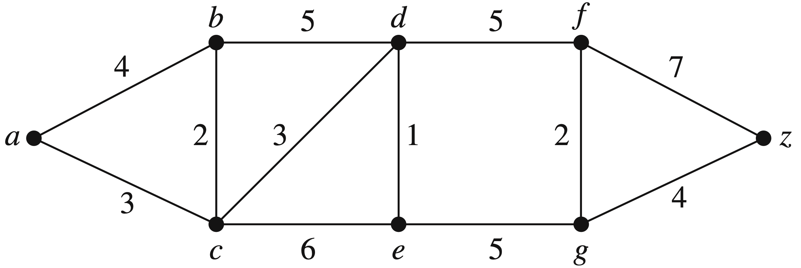
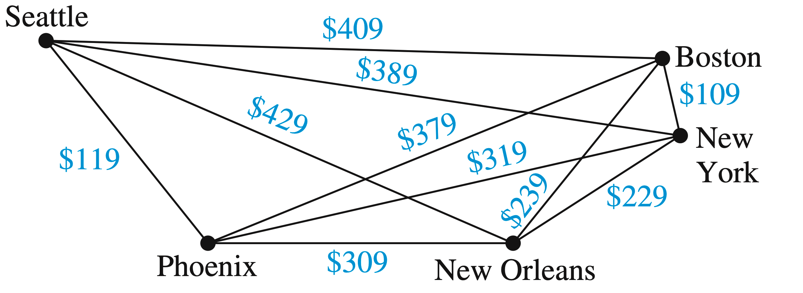

# Assignment 3

<h5 align="right">张志恒 202100202072</h5>

<h6 align="right">地空21.1/自动22.4 跨专业选修</h6>

#### § 10.5

> *Theorem 1*  A connected multigraph with at least two vertices has an Euler circuit if and only if each of its vertices has even degree.
>
> *Theorem 2*  A connected multigraph has an Euler path but not an Euler circuit if and only if it has exactly two vertices of odd degree.

26. For which values of $n$ do these graphs have an Euler circuit?

    *a)* $K_n$    

    ​	The degree of each vertex are $(n-1)$ in $K_n$. According to theorem 1, $(n-1)$ is even, so  $n$ is odd, and also, $n ≥ 1$.

    *b)* $C_n$    

    ​	For $n≥3$, a circle is an Ruler circuit obviously.

    *c)* $W_n$    

    ​	The degrees of the vertices in outer circle are all odd, so it is impossible for wheel to have an Euler circuit.
    
    *d)* $Q_n$    
    
    ​	The degrees of the vertices are all $n$, so $n$ should be even, and also, $n > 0$.
    
    
    
28. For which values of $m$ and $n$ does the complete bipartite graph $K_{m,n}$ have an

    *a)* Euler circuit?    

    ​	The degree of each vertex is $m$ or $n$, $m$ and $n$ both should be even.

    *b)* Euler path?       
    
    ​	According to theorem 2, there ara exactly $2$ vertices with odd degree in the graph, which leads to the situation that, $K_{2,n}$ with odd $n$, or, $K_{m,2}$ with odd $m$. Additionally, $K_{1,1}$ has a Euler path as well.	

55. Show that a bipartite graph with an odd number of vertices does not have a Hamilton circuit.

    Suppose the bipartite $G = (V, E)$ can be devided into $V_1, V_2$ with $V_1 \cap V_2 = \empty$, and no edge connecting two vertices in the same part. Without loss of generality, we suppose $|V_1|$ is odd and $|V_2|$ is even, due to the requirement that $|V|$ is odd.

    Suppose that there is an Euler circuit in $G$, and it should be in form of $a_1, b_1, a_2, b_2,...,a_k, b_k, a_1$, where $a_i$ is in $V_1$ and $b_i$ is in $V_2$. To form a circuit we link $b_k$ back to $a_1$ and due to bipartition, it is guaranted that $a_i$ and $b_i$ appear alternately. Therefore, $|V|=2k$ which contradicts to the truth that $|V|$ is odd. Hence, a bipartite graph with an odd number of vertices does not have a Hamilton circuit.

#### § 10.6

3. Find the length of a shortest path between $a$ and $z$ in the given weighted graph.

    

    	
    

    
    
    The shortest path is $a \to c \to d \to e \to g \to z$, whose length is $16$.

28. Find a route with the least total airfare that visits each of the cities in this graph, where the weight on an edge is the least price available for a flight between the two cities.

    

    	
    

    The shortest circuit is "Seattle - New York - Boston - New Orleans - Phoenix - Seattle", whose length is $1165$.