# **Discrete Mathematics**

[TOC]

# **Chapter 10	Graphs**

##  **10.1	Introduction to Graph**

### Undirected Graph

- A **simple graph** $G=(V,E)$ consists of vertices, $V$, and edges, $E$, connecting distinct elements of $V$.

​		no loops, can't have multiple edges joining vertices

- A **multigraph** allows multiple edges for two vertices.
- A **pseudograph** is a multigraph which permits loops.

### Directed Graph

- A **directed graph** $G=(V,E)$ consists of  vertices, $V$, and directed edges, $E$, associated with an ordered pair of vertices. (not necessarily distinct) 

    allow loops, can't have multiple directed edges joining vertices

- A **simple directed graph**  requires no-loops.

- A **directed multigraph** allows loops and multiple such edges.

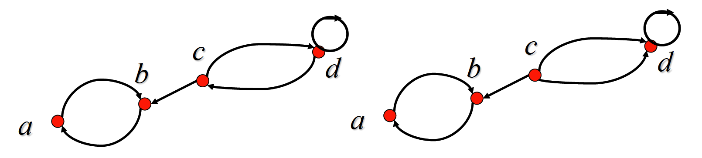

###  Questions

**Question 12**	Let $G$ be an undirected graph with a loop at every vertex. Show that the relation $R$ on the set of vertices of G such that $uRv$ if and only if there is an edge associated to ${u, v}$ is a symmetric, reflexive relation on $G$.

- $uRv$ means there is an edge joining vertices $u$ and $v$ , as it is an undirected graph, we can also say there is an edge, respectively, joining vertices $v$ and $u$ , which means $vRu$ . It turns out that the relation is symmetric.

    Because of the loop at every vertex, $uRu$ is constantly correct, which means reflexive relation.

## **10.2	Graph Terminology**

### Basic Terminology

#### Undirected Graph

- **vertex, edge**
- **adjacent** (or neighbors) : $\{u, v\}$ is an edge of $G$.
- **incident** with vertices $u$ and $v$ : connect $u$ and $v$
- **endpoints**
- **loop** : an edge with two same endpoints
- **degree** of a vertex : the number of edges incident with it, except that a loop contributes twice
    - isolated : $\deg(v)=0$
    - pendant : $\deg(v)=1$

> ***Theorem 1* *(The Handshaking Theorem)* : Let $G=(V,E)$ be an undirected graph $G$ with $e$ edges.**
> $$
> \sum\limits_{v \in V} \deg(v) = 2e
> $$
> *proof* : Each edge contributes twice to the degree count of all vertices.

> ***Theorem 2* : An undirected graph has an even number of vertices of odd degree.**
>
> *proof* : Let $V_1, V_2$ be the set of vertices of even degree and odd degree, respectively.
> $$
> \sum\limits_{v \in V_1} \text d (v) + \sum\limits_{v \in V_2} \text d (v) = 2m
> $$

#### Directed Graph

Let $(u, v)$ be an edge in $G$ .

- **initial** vertex : $u$, which is adjacent to $v$
- **terminal** vertex : $v$, which is adjacent from $u$
- **in degree** of a vertex $v$ ---- $\deg^-(v)$ : the number of edges which terminate at $v$
- **out degree** of a vertex $v$ ---- $\deg^+(v)$ : the number of edges which initiate at $v$

$$
\deg(v) = \deg^-(v) + \deg^+(v)
$$

- **underlying** undirected graph

> ​	***Theorem 3* : Let $G = (V, E)$ be a graph with direct edges.**
> $$
> \sum\limits_{v \in V} \text d ^+ (v) = \sum\limits_{v \in V} \text d ^- (v) = |E|
> $$

### Some Special Simple Graphs

- **Complete** Graphs ---- $K_n$

    $n$ vertices

    exactly one edge between every pair of distinct vertices

    $|E| = C_n^2$

    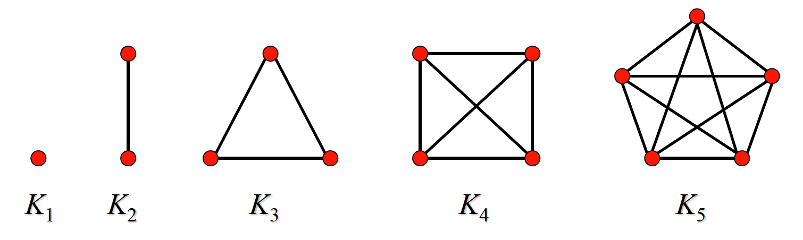

- **Cycles** ---- $C_n~~(n > 2)$

    $n$ vertex graph which is a cycle

    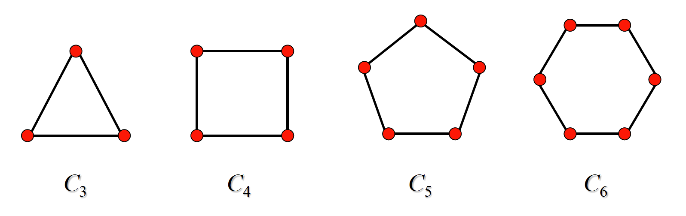

- **Wheels** ---- $W_n~~(n > 2)$

    Add one additional vertex to the cycle $C_n$ and add an edge from each vertex to the new vertex

    $|V| = n+1$

    $|E| = 2n$

    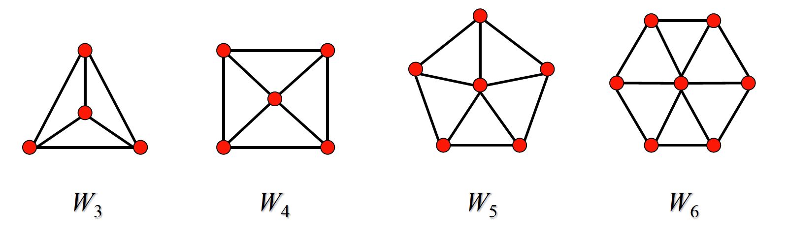

- **n-Cubes** ---- $Q_n~~(n >0)$

    vertices representing bit strings of length $n$

    An edge exists between two vertices that differ by one bit position.

    $|V| = 2^n$

    $|E| = \cfrac{2^{n} \cdot n}{2} = 2^{n-1} \cdot n$

    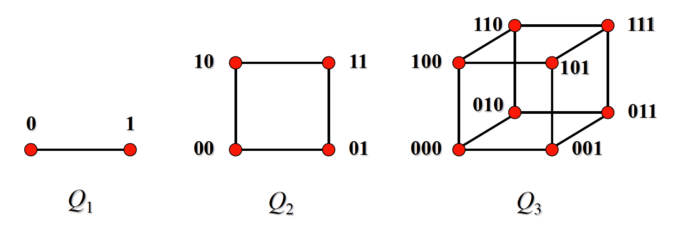

- **Bipartite** Graphs

    $V$ can be partitioned into two disjoint subsets $V_1$ and $V_2$ 

    such that every edge connects a vertex in $V_1$ and a vertex in $V_2$

    That is to say there are no edges which connect vertices in $V_1$ or $V_2$

    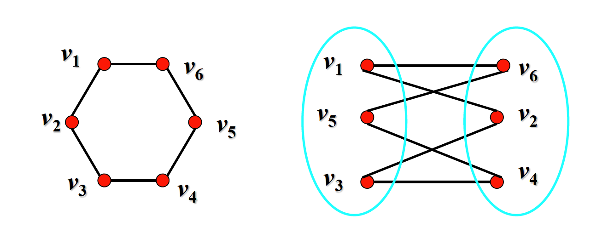

- **Complete** **Bipartite** Graph ---- $K_{m,n}$

    every vertex  in $V_1$ is connected to every vertex in $V_2$

    $m=|V_1|$ ,  $n=|V_2|$

    $|V| = m + n$

    $|E| = mn$

    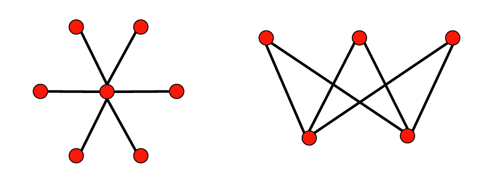

- **Regular** Graph

    every vertex has the same degree

    $n$-regular : the same degree is $n$

### Some New Graphs From Old

​	$G=(V,E),~H=(W,F)$

- **Subgraph**

    $W \subseteq V,~F \subseteq E$

    > Example : #subgraphs with a.l. one vertex of $W_3$ ?
    >
    > Solution : $C_4^1 + 2C_4^2 + 2^3C_4^3 + 2^6C_4^4$

    - **Induced** Subgraph **by Edges** ---- $G(E_1)$

        A subgraph composed of $E_1$ as the edge set and all the endpoints of the edges in $E_1$ as the vertex set, where $E_1 \subseteq E(G)$

    - **Induced** Subgraph **by Vertices** ---- $G(V_1)$

        A subgraph composed of $V_1$ as the vertex set and all edges with both two endpoints in $V_1$ as edge sets, where $V_1 \subseteq V(G)$

    顶点导出子图不一定是一个边导出子图：孤立点无法由边导出

    边导出子图不一定是顶点导出子图：边导出子图可能缺边

- **Spanning** Subgraph

    $W = V,~ F \subseteq E$

- **Complement** Graph ---- $\sim G$

    $V = V(G),~ E = E(K_n) - E(G)$

- **Union** ---- $G_1 \cup G_2$ 

    $V = V_1 \cup V_2,~E = E_1 \cup E_2$

    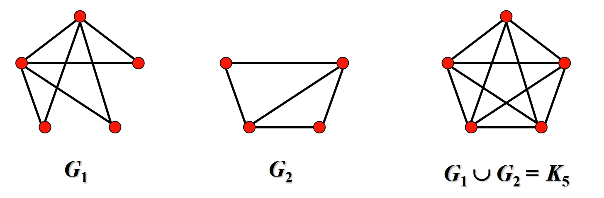

### Questions

**Question 5**	Can a simple graph exist with 15 vertices each of degree five?

- No.   Each edge contributes twice to the degree count of all vertices, thus the sum of each vertex's degree must be even, which contradicts the  $15 \times 5 = 75$ degree in the problem.

**Question 18**	Show that in a simple graph with at least two vertices there must be two vertices that have the same degree.

- The possible values for $\deg(v_i)$ are $0,1,...,n−1$ , where $n≥2$ is the number of vertices. 

    However, it is impossible for both $0$ and $n − 1$ to be in the range of degree concurrently, since if one vertex is adjacent to any other vertices, then no vertex can has $\deg = 0$ . 

    Thus the range of $\deg$ has at most n − 1 values, whereas the the number of vertices is $n$ , so there must be one deg value corresponding to two or more vertices according to Pigeonhole Principle. 

    It turns out that there must be two vertices that have the same degree.

**Question 26**	For which values of $n$ are these graphs bipartite?

- $K_n$

    $n = 2$ .   

    $K_1$ doesn't have more than two vertices to be bipartite. $K_2$ is bipartite apparently. For $n > 2$ $K_n$ has a $C_3$ subgraph which couldn't be bipartite.

- $C_n$

    $n ≥ 4 ,~n\text{ is  even}$ . 

    For a circle, $n ≥ 3$ primarily. Then we represent each vertex as a part of $V_1$ or $V_2$ one by one till the end, and the n-th vertex and the 1-st vertex must belong to different sets, which requires $n$ should be even.

- $W_n$

    NULL . 

    Wheel couldn't be bipartite because $W_n$ always contains triangles.

- $Q_n$

    $n ≥ 1$ . 

    As the bit string of each vertex of $Q_n$ has the different parity of the number of 1 with all its neighbors', we can divide the vertices into two classes, those with an odd number of 1 and those with an even number of 1.

**Question 52**	Let $G$ be a graph with $v$ vertices and $e$ edges. Let $M$ be the maximum degree of the vertices of $G$, and let $m$ be the minimum degree of the vertices of $G$. Show that,

-  $\Large \frac{2e}{v} \normalsize \geqslant m$

    The sum of the degrees of the vertices is $2e$ , which is at least $mv$ if and only if each vertex has the same minimum degree $m$ , thus $2e \geqslant mv ~\Rightarrow~ \Large \frac{2e}{v} \normalsize \geqslant m$ .

- $\Large \frac{2e}{v} \normalsize \leqslant M$

    The sum of the degrees of the vertices is $2e$ , which is at most be $Mv$ if and only if each vertex has the same maximum degree $M$ , thus $2e \leqslant Mv ~\Rightarrow~ \Large \frac{2e}{v} \normalsize \leqslant M$ .

**Question 64**	Show that if $G$ is a bipartite simple graph with $v$ vertices and $e$ edges, then $e \leqslant \Large \frac {v^2}{4}$

- Suppose the bipartite graph is divided into two part, $V_1$ and $V_2$ , and $|V_1|=a,~|v_2|=b$ , then $v = a + b$ . 

    To maximize $e$ , we connect each vertex in $V_1$ to every vertex in $V_2$ to get $e = ab$ , thus $e \leqslant ab$ .

    According to $\sqrt{ab} \leqslant \cfrac{a+b}{2}$ , we have $ab \leqslant \cfrac{(a+b)^2}{4}$ , and then $e \leqslant ab \leqslant \cfrac{(a+b)^2}{4} = \cfrac{v^2}{4}$ .

## **10.3	Representing Graphs and Graph Isomorphism**

### Representing Graphs

#### Adjacency Lists

The lists that specify all the **vertices** which are adjacent **to each vertex**.

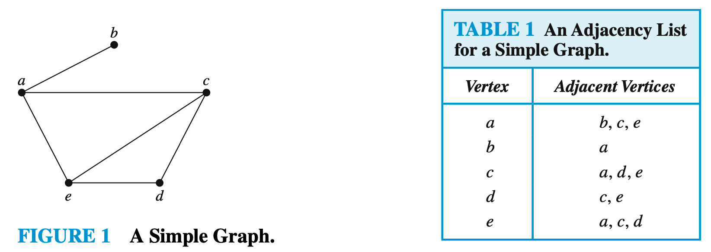

#### Adjacency Matrices

- **Undirected** Graph

    The adjacency matrix $A$ of **simple graph** $G$ is a **0-1** matrix of $n\times n$, which satisfies
    $$
    a_{ij} = \left\{\begin{array}{ll}1 & \text{if } \{a_i,a_j\} \text{ is an edge of } G\\ 0 & \text{otherwise}\end{array}\right.
    $$
    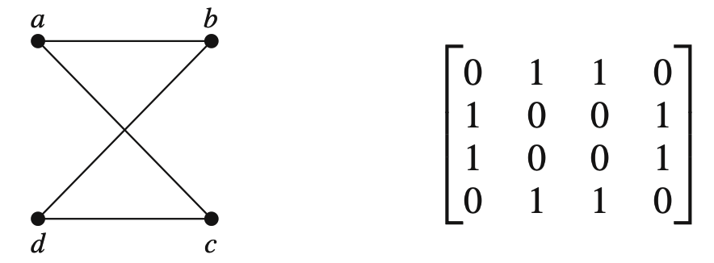

    For a **multigraph** or **pseudograph**, $a_{ij}$ indicates the **number** of edges associated with $a_i,a_j$
    $$
    a_{ij} = \text{\# edges }\{a_i,a_j\}
    $$

    $$
    \text{sum of a row}:~~\sum\limits_{j = 1}^n a_{ij} = \deg(v_i) - \text{\# loops at }v_i
    $$

    Adjacency matrices of undirected graphs are always **symmetric**.

- **Directed** Graph

    The adjacency matrix $A$ of $G$, with respect to this listing of the vertices, is the $n\times n$ **0-1** matrix with $1$ as its $(i,j)$th entry when there is an edge from $v_i$ to $v_j$, and $0$ otherwise, that is
    $$
    a_{i,j} =a_{ij} = \left\{\begin{array}{ll}1 & \text{if } (a_i,a_j) \text{ is an edge of } G\\ 0 & \text{otherwise}\end{array}\right.
    $$

    $$
    \begin{align}
    \text{sum of a row}&:~~\sum\limits_{j = 1}^n a_{ij} = \deg^+(v_i) \\
    \text{sum of a column}&:~~\sum\limits_{i = 1}^n a_{ij} = \deg^-(v_j) \\
    \end{align}
    $$

#### Incidence Matrices

Incidence matrices of **undirected graphs** contain **two 1**s per column for edges connecting two vertices and **one 1** per column for **loops**.

$$
m_{ij} = \left\{\begin{array}{ll}1 & \text{when edge } e_j \text{ is incident with } v_i\\ 0 & \text{otherwise}\end{array}\right.
$$
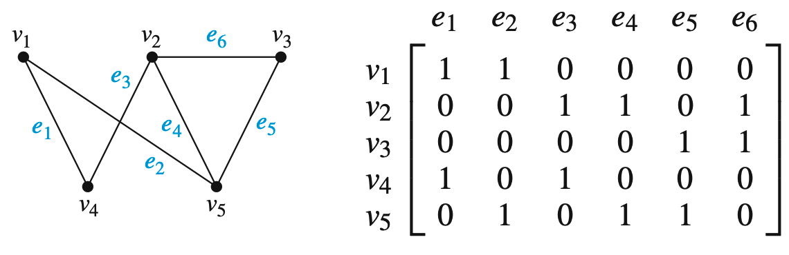

### Isomorphism of Graphs

When two **simple graphs** are isomorphic, there is a **one-to-one** correspondence between vertices of the two graphs that **preserves the adjacency relationship**.

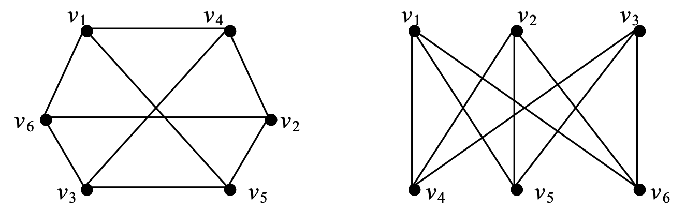

#### Invariants in Isomorphic Graphs

**Determine isomorphism** through the things that  $G_1$ and $G_2$ **must** have in common to be isomorphic.

- $\text{\# vertices}$,  $\text{\# edges}$
- $\deg(v_i)$
- If one is *bipartite*, *complete*, or a *wheel*, the other must be, respectively

### Question

57. Are the simple graphs with the following **adjacency matrices** isomorphic?

    

    a)  $\begin{bmatrix} 0 & 0 & 1 \\ 0 & 0 & 1 \\ 1 & 1 & 0 \end{bmatrix}$ , $\begin{bmatrix} 0 & 1 & 1 \\ 1 & 0 & 0 \\ 1 & 0 & 0 \end{bmatrix}$

    ​	Yes, they are isomorphic, because they are both in form of a line.

    

    b)  $\begin{bmatrix} 0 & 1 & 0 & 1 \\ 1 & 0 & 0 & 1 \\ 0 & 0 & 0 & 1 \\ 1 & 1 & 1 & 0 \end{bmatrix}$ , $\begin{bmatrix} 0 & 1 & 1& 1 \\ 1 & 0 & 0 & 1 \\ 1 & 0 & 0  & 1 \\ 1 & 1 & 1 & 0\end{bmatrix}$

    ​	No, they are not isomorphic, because $|E_1| = 4 \neq |E_2| = 5$.

     

    c)  $\begin{bmatrix} 0 & 1 & 1 & 0 \\ 1 & 0 & 0 & 1 \\ 1 & 0 & 0 & 1 \\ 0 & 1 & 1 & 0 \end{bmatrix}$ , $\begin{bmatrix} 0 & 1 & 0 & 1 \\ 1 & 0 & 0 & 0 \\ 0 & 0 & 0  & 1 \\ 1 & 0 & 1 & 0\end{bmatrix}$

    ​	No, they are not isomorphic, because $|E_1| = 4 \neq |E_2| = 3$.

58. Determine whether the graphs without loops with these **incidence matrices** are isomorphic.

     

    a) $\begin{bmatrix} 1 & 0 & 1 \\ 0 & 1 & 1 \\ 1 & 1 & 0 \end{bmatrix}$ , $\begin{bmatrix} 1 & 1 & 0 \\ 1 & 0 & 1 \\ 0 & 1 & 1 \end{bmatrix}$

    ​	They are isomorphic, because they are both in form of $K_3$.

     

    b) $\begin{bmatrix} 1 & 1 & 0 & 0 & 0 \\ 1 & 0 & 1 & 0 & 1 \\ 0 & 0 & 0 & 1 & 1 \\ 0 & 1 & 1 & 1 & 0 \end{bmatrix}$ , $\begin{bmatrix} 0 & 1 & 0 & 0 & 1 \\ 0 & 1 & 1 & 1 & 0 \\  1 & 0 & 0 & 1 & 0 \\ 1 & 0 & 1 & 0 & 1 \end{bmatrix}$

    ​	They are isomorphic, because their complements are both a single edge.

## **10.4	Connectivity**

### Paths in u.d.

#### Walk

**Walk (路径/通路)** is an **alternating sequence** of vertices and edges of a graph, where $v_i−1$ and $v_i$ are the endpoints of $e_i$ for $i = 1,2,...,n$
$$
W = v_0~e_1~v_1~e_2~v_2~...~e_k~v_k
$$

- Start point: $v_0$
- End point: $v_k$
- Inside point: $v_i~(1 \leqslant i \leqslant k-1)$
- Road length: $k$

The **inverse walk** of $W$, definitely exists, is denoted as $W^{-1}$
$$
W^{-1} = v_k~e_k~...~v_2~e_2~v_1~e_1~v_0
$$
The subsequences of $W$, definitely constituting a walk, is called the **section** of $G$
$$
v_i~e_i~v_{i+1}...e_j~v_j & & 0\leqslant i \leqslant j \leqslant k \\
$$
$W$ can be **joined** with another path $W^′ = v_k~e_{k+1}~v_{k+1}~...~e_l~v_l$ to obtain a new path, denoted as $WW^′$

In **simple graph**, a walk can be just represented as a sequence of vertices, briefly.

#### Trail and Path

**Trail (迹/简单通路)** is a walk that has **no repeated edge**

**Path (路)** is a walk that has **no repeated vertices**

- A path must to be a trail.

#### Closed/Open terms

**Closed Walk (闭路径/环路)** is a walk that begins and ends at the **same** vertex, otherwise, such walk is called **Open Walk (开路径)**

Specially, for a **trail**, they are called **Closed Trail / Circuit (闭迹/回路)** and **Open Trail (开迹)**, respectively.

#### Circle

For a **closed trail**, $v_0~e_1~v_1~e_2~v_2~...~e_k~v_0$, if $v_0~v_1~...~v_{k-1}$ has **no repeated vertices**, it's called **Circle**/**k-Circle**, and also **Even Circle** for even $k$, or **Odd Circle** for odd $k$.

- Both **loop** and **parallel edges** form a circle.

> **Theorem 1**:	If **each vertex** in the graph $G$ have **at least 2 degrees**, then $G$ must contain **circles**
>
> *proof*:	Using constructive proof. Take a point $v_1$, and for its degree at least 2, $v_1$ has at least one neighboring point $v_2$. Keep connecting, if the new point joining has an edge with the old point, the circle exists, otherwise until all points are taken, the circle is constructed as it must adjacent with one old point.

### Connectedness in u.d.

#### Connected Graph

Two points are connected if there is **path** between them.

An undirected graph is called **connected** if there is a **path** between **every pair of distinct vertices** of the graph. 

- The connectivity relation between vertices in a graph $G$ is an **equivalence** relation.

- According to such relation, $V(G)$ can be divided into some **equivalence classes** $V_1, V_2, ..., V_n$, and the subgraph $G(V_i)$ derived from each $V_i$ is called a **connected components** of G. 

    The **number of connected components** of $G$ is usually denoted by $\omega(G)$
    $$
    G \text{ is connected}~~ \Leftrightarrow~~ \omega(G)=1
    $$

If $u,v \in V(G)$, and $u,v$ is connected, the length of the **shortest** $(u, v)$ path is called the **distance** of $u, v$, noted as $d(u, v)$. When $u, v$ are not connected, the distance between $u, v$ is considered to be $∞$.

> **Theorem 2 :**
> $$
> G\text{ is bipartite} ~~\Leftrightarrow~~ \text{No Odd Circle in } G
> $$
> ***proof :***	*Only connected graphs are considered. For disconnected graphs, just look at each connected branch.*
>
> - Necessity
>
>     Let $\{X, Y\}$ be a bisection of $G$ and $C = v_0~v_1~...~ v_k~v_0$ be a $(k+1)$ - circle in $G$.
>
>     $v_{2i} ∈ X,~v_{2i+1}∈Y$，casue $v_0 ∈X,~v_k ∈Y$  $\Rightarrow~~ k$ is odd  $\Rightarrow$  $C$ is an even circle
>
> - Sufficiency
>
>     Assume that there are no odd circles in $G$. Take any fixed point $u ∈ V(G)$
>     $$
>     X = \{x | x ∈ V(G),  & d(u, x) \text{ is even}\} \\
>     Y = \{x | x ∈ V(G), & d(u, x) \text{ is odd}\}
>     $$
>     $V(G)$ is divided into two sets $X, Y$. Now prove that $\{X, Y\}$ is a bisection of $G$.
>
>     Suppose $v$ and $w$ are two points in $X$. $P$ is the shortest $(u, v)$-path and $Q$ is the shortest $(u, w)$-path, then the lengths of $P$ and $Q$ are both even, and the last common vertex of $P$ and $Q$ is written in terms of $u_1$. 
>
>     Since $P$ and $Q$ are shortest paths, the $(u, u1)$-section of both $P$ and $Q$ is also the shortest $(u, u1)$-path, so the lengths are the same, and now since the lengths of $P$ and $Q$ are both even, the $(u1, v)$-section $P_1$ of $P$ and the $(u1, w)$-section $Q_1$ of $Q$ must have the same parity. 
>
>     So the $(v, w)$-path $P_1^{-1}Q_1$ is even in length, and if $u$ and $w$ are adjacent, then $P_1^{-1}Q_1wv$ is an odd circle, which contradicts the hypothesis, so any two points in $X$ are not adjacent, and similarly, any two vertices in $Y$ are not adjacent.

Sometimes deleting a vertex and its associated edge produces a subgraph with more connected components than the original graph. Such vertices are called **cut points**.

Similarly, an edge that produces a subgraph with more connected components than the original graph once it is removed is called a **cut edge** or **bridge**

> **Theorem 3 :**
>
> Let $G$ be a simple graph with $n$ vertices, if $G$ has $\varepsilon$ edges and $\omega$ connected components, then
> $$
> n - \omega \leqslant \varepsilon \leqslant \frac 1 2 (n - \omega)(n - \omega + 1)
> $$
> ***proof :***
>
> - Left
>
>     Apply induction to the number of edges, $ε$.
>
>     $ε=0$, $G$ is a zero graph, $ω=n$, the conclusion holds
>
>     Assuming that the conclusion holds when $ε = k$,
>
>     Now examine the case $ε = k + 1$, where the graph $G$ is obtained by deleting one side from $G$ 
>
>     There are two possible cases
>
>     - There is no increase in the number of connected components due to the deletion of one side, then $$G^{'}$$ has $n$ vertices, $ω$ connected components and $k$ edges. By the induction hypothesis,
>         $$
>         n-ω\leqslant k, & & i.e. & &  n-ω\leqslant k+1\\
>         $$
>
>     - The deletion of one side leads to an additional connected branch, then $G'$ has $n$ vertices, $ω+1$ connected components, $k$ edges, and by induction hypothesis, 
>         $$
>         n-(ω+1)\leqslant k  & & i.e.  & & n-ω\leqslant k+1\\
>         $$
>
> - Right
>
>     Suppose that the $ω$ connected components of $G$ have $n_1, n_2, ... , n_ω$ vertices respectively.
>     $$
>     n_1+n_2+... +n_ω=n
>     $$
>     Since $G$ is a simple graph, the number of edges of the $i$-th connected components, $ε_i$ satisfies
>     $$
>     \varepsilon_i \leqslant C_{n_{i}}^2
>     $$
>     Then
>     $$
>     \varepsilon \leqslant C_{n_1}^2 + C_{n_2}^2 + ... + C_{n_\omega}^2
>     $$
>     Due to $C_s^2  + C_t^2 \leqslant C_{s+t-1}^2$, we have
>     $$
>     \begin{align*}
>     \varepsilon \leqslant 
>     C_{n_1}^2 + C_{n_2}^2 + ... + C_{n_\omega}^2
>     &\leqslant
>     C_{n_1 + n_2 + ... + n_\omega - (\omega - 1)}^2 \\
>     &= C_{n-\omega+1}^2 \\
>     &= \frac 1 2(n-\omega)(n - \omega + 1)
>     \end{align*}
>     $$

- How to **maximize** the number of edges when $G$ has $n$ vertices $ω$ components?

    One connected component is a **complete** graph of $n - ω + 1$ points, and the remaining $ω - 1$ connected components are all **isolated** points.

- A connected graph with $n$ vertices has at least $n - 1$ edges, which is called **minimal** connected graph

### Paths and Connectivity in d.

Connected Walk, Trail, Closed Trail, Circle
$$
W = v_0a_1v_1a_2v_2…a_kv_k = v_0v_1...v_k
$$
$a_i$ starts from $v_{i-1}$ to $v_i$

- If there exists a directed $(u, v)$-path, then $v$ is said to be **accessible** from $u$
- If $u, v$ are accessible to each other, then $u, v$ are said to be **bi-directionally connected**

A directed graph is **Strongly Connected / Biconnected** if there is a path from $a$ to $b$ and from $b$ to $a$ whenever $a$ and $b$ are vertices in the graph.

A directed graph is **Unilateral Connected** if at least one vertex is reachable from the other vertex for any two vertices in the graph.

A directed graph is **Weakly Connected** if there is a path between every two vertices in the underlying undirected graph.

- The bi-directional connectivity relation is an **equivalence** relation on the vertices set $V$ of $D$

- The maximal strongly connected subgraphs, are called the **Strongly Connected Components**
    $$
    D \text{ is strongly connected} ⇔ D \text{ has exactly one strongly connected component}
    $$

> **Theorem 3 :**	
>
> Let $G$ be a graph with adjacency matrix $A$ with respect to the ordering $v_1,v_2,...v_n$ of the vertices of the graph (with directed or undirected edges, with multiple edges and loops allowed). The **number** of different paths of **length** $r$ from $v_i$ to $v_j$ , where $r$ is a positive integer, equals the **$\bold{(i, j )}$-th entry** of $A^r$ .

### Paths and Isomorphism

- Some other **invariants**

    - The **number** and **size** of connected **components**

    - Path

        Two graphs are isomorphic only if they have simple **circuits** of the same **length**.

        Two graphs are isomorphic only if they contain paths that go through vertices so that the corresponding vertices in the two graphs have the same **degree**.

- We can also use **paths** to find mapping that are potential isomorphisms.

### Questions	10.4

30. Show that in every simple graph there is a path from every vertex of odd degree to some other vertex of odd degree.

    Choose a vertex $v$ of odd degree randomly, and due to its non-negative degree, it has to be in a connect component of the graph, which we called $G_v$. 

    As $G_v$ is a graph as well whose total degree is even, it turns out that there must be another vertex $w$ of odd degree in $G_v$, and the connectivity lead to that there should be a path go through $v$ and $w$, which means there is a path from every vertex of odd degree to some other vertex of odd degree.

45. Show that a simple graph G with $n$ vertices is connected if it has more than $(n − 1)(n − 2)/2$ edges.

    For a simple graph of a same number of vertices, more connected components means less edges. 

    We consider the situation leading to the most edges in an unconnected graph, that is dividing it to two components, whose $|V|$ is $k$ and $n-k$ respectively. The total edges of such two parts is
    $$
    C_k^2 + C_{n-k}^2 = \frac{k(k-1)}{2} + \frac{(n-k)(n-k-1)}{2} = k^2 -nk + \frac{n^2 - n}{2}
    $$
    The quadratic function is maximzed at $k = 1$ or $k = n - 1$, with maximum $(n − 1)(n − 2)/2$ , that is to say if a graph has more than $(n − 1)(n − 2)/2$ edges which go beyond the largest number of edges of unconnected graph, it has to be connected.

## **10.5	Euler and Hamilton Paths**

### **Euler Circuit and Paths**

An **Euler Circuit** in a graph $G$ is a **simple circuit** containing every edge of G.

An **Euler Path** in $G$ is a **simple path** containing every edge of G.

包含所有边的迹（即每条边恰好出现一次的路径）称为 Euler 迹

闭的 Euler 迹称为 Euler 闭迹或 Euler 回路，开的 Euler 迹称为 Euler 开迹

A graph with Euler **Circuit** is called an **Euler Graph**

A graph with Euler **Path** is called a **Semi-Euler Graph**

具有 Euler 回路的图称为 Euler 图，具有 Euler 开迹的图称为半 Euler 图

> **Theorem 1 :**	
>
> A **connected multigraph** with at least two vertices has an **Euler circuit** if and only if each of its vertices has **even degree**.
>
> 连通多重图具有欧拉回路当且仅当它的每个顶点都有偶数度
>
> ***proof:***
>
> - 必要性
>
>     对于任意一个点，每次在序列中或端点出现时，必然连接两条不同的边，总度数为偶数
>
> - 充分性
>
>     构造性证明，偶数度不断延伸直到成回路，因为连通性补图与该回路存在公共点，在公共点继续延伸，形成的新的回路加入总回路，直到包含所有边

> **Theorem 2 :**	
>
> A **connected multigraph** has an **Euler path** but not an Euler circuit if and only if it has exactly **two** vertices of **odd degree**.
>
> 连通多重图具有欧拉通路而无欧拉回路， 当且仅当它恰有两个奇数度顶点
>
> ***proof:***
>
> - 必要性
>
>     对于任意一个点，每次在序列中出现时，必然连接两条不同的边，度数为偶数
>
>     而在端点出现的两个点，具有奇数度
>
> - 充分性
>
>     补上两个奇数度点之间的边，构造欧拉回路，再删去该边形成欧拉通路
>

### **Euler c.&p. in d. graph**

A **directed multigraph** having no isolated vertices has an **Euler circuit** if and only if

- the graph is **weakly** connected
- the **in-degree** and **out-degree** of each vertex are **equal**

A **directed multigraph** having no isolated vertices has an **Euler path** but not an Euler circuit if and only if

- the graph is **weakly** connected

- the **in-degree** and **out-degree** of each vertex are equal for all **but two vertices**, one that has in-degree 1 larger than its out-degree and the other that has out-degree 1 larger than its in-degree.

### **Hamilton Circuit and Paths**

A **Hamilton Path** in a graph $G$ is a simple path which visits ever vertex in $G$ exactly once. 

哈密顿通路是一个访问图 G 中每个顶点次数有且仅有一次的通路

A **Hamilton Circuit** (or Hamilton cycle) is a simple circuit which visits every vertex exactly once, except for the first vertex, which is also visited at the end of the cycle.

哈密顿回路，仅访问每个顶点一次，但除去始点，这个始点同样也是终点

If a connected graph $G$ has a Hamilton circuit, then G is called a **Hamilton Graph**.

如果一个连通图 G 含有哈密顿回路，那么 G 是哈密顿图

> **Theorem 3 (Dirac's Theorem) (Sufficiency):**	
>
> If $G$ is a **simple graph** with $n$ vertices with $n \geqslant 3$ such that the **degree** of every vertex in $G$ is **at least** $n/2$, then $G$ has a **Hamilton circuit**.
>
> 如果 G 是带 n 个顶点的连通简单图，其中 $n\geqslant 3$，则 G 有哈密顿回路的充分条件是每个顶点的度都至少为 $n/2$
>
> ***proof:***
>
> - 反证法
>
>     假设 *G* 不是 Hamilton 图，由于在 *G* 的任意两个不相邻顶点间加入一边，得到的图仍满足定理条件，且完全图必为 Hamilton 图，因此，通过加边，总可以使 *G* 变成一个满足定理条件的极大非 Hamilton 图 (所谓极大非 Hamilton 图，它不是 Hamilton 图，但在该图的任意两不相邻顶点间加入一边，必定成为 Hamilton 图)
>
>     不妨设 *G* 是极大非 Hamilton 图，因为 *G* 不可能是完全图，故可从中取两个不 相邻顶点 *u*，*v*，由于 *G* 是极大非 Hamilton 图，故 *G*+*uv* 必是 Hamilton 图，且 *G*+*uv* 的 每个 Hamilton 圈必然包含边 *uv*，于是，在 *G* 中存在起点为 $u=v_1$，终点为 $v=v_v$ 的 Hamilton 路 $v_1v_2...v_v$
>     $$
>     S = \{ v_i|v_1v_{i+1} \in E(G)\} & & & 
>     T=\{v_i | v_iv_v \in E(G)\} 
>     \\
>     $$
>     由于 $v_v \notin S\cup T$，故 $|S \cup T < n|$，若 $S \cap T \not= \large\varnothing$，则可取 $v_i \in S \cap T$，则包含 Hamilton 圈
>     $$
>     v_1v_2 ...v_iv_v...v_{i+1}v_1
>     $$
>     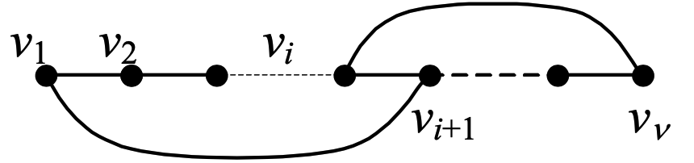
>
>     与非 Hamilton 图矛盾，故 $S \cap T = \large \varnothing$，所以
>     $$
>     d (u) + d (v) = |S| + |T| = |S \cup T| < n
>     $$
>     与 $\deg(v_i) \geqslant n/2$ 矛盾，所以 G 必是 Hamilton 图

> **Lemma :**	
>
> 设 $G$ 是简单图，顶点 $u$ 和 $v$ 一对不相邻的顶点，且满足
> $$
> d(u)+d(v) \geqslant n
> $$
> 则 $G$ 是哈密顿图当且仅当 $G+uv$ 是哈密顿图
>
> ***proof:***
>
> 若 *G* 是 Hamilton 图，则显然 *G*+*uv* 也是 Hamilton 图
>
> 反之，若 *G*+*uv* 是 Hamilton 图，与 Theorem 2 完全类似可以证明，若 *G* 不是 Hamilton 图则
> $$
> d (u) + d (v) = |S| + |T| = |S \cup T| < n
> $$
> 与 $\deg(u)+\deg(v) \geqslant n$ 矛盾，因而知 *G* 必是 Hamilton 图

**Closure :**	设 *G* 是一个图，反复连接满足 $d(u)+d(v)\geqslant v$ 的不相邻顶点 $u$，$v$，直到没有这样的顶点对为止，这样得到的图称作图 *G* 的闭包，记为 $C(G)$

> **Theorem 4 :**	
>
> 简单图 *G* 是 Hamilton 图当且仅当 *C*(*G*)是 Hamilton 图
>
> ***proof:***
>
> 在不断添加边的过程中，每次连接的 $u,v$ 都满足 $d(u) + d(v) \geqslant n$，由 Lemma 可知
> $$
> \begin{align*}
> G~~\text{is a Hamilton graph} ~~&\Leftrightarrow~~ G+e_1~~\text{is a Hamilton graph} \\
> &\Leftrightarrow~~ G+\{e_1+e_2 + ...+e_n\}~~\text{is a Hamilton graph} \\
> G~~\text{is a Hamilton graph} ~~&\Leftrightarrow~~ C(G)~~\text{is a Hamilton graph} \\
> \end{align*}
> $$

> **Theorem 5 (Ore's Theorem) :**	
>
> If $G$ is a **simple graph** with $n$ vertices with $n ≥ 3$  such that $\deg(u) + \deg(v) ≥ n$ for every pair of nonadjacent vertices $u$ and $v$ in $G$, then $G$ has a Hamilton circuit.
>

> **Theorem 6 (Necessity):**	
>
> 设 $G$ 是 Hamilton 图，$G-S$ 表示从图 $G$ 中删去 $S$ 中的所有顶点以及所关联的边，则对于顶点集 $V$ 的任一非空真子集 $S$，均有
> $$
> \omega(G-S) \leqslant |S|
> $$
> ***proof :***
>
> 设 $C$ 是图 $G$ 的一个 Hamilton 圈，则对 $V$ 的任一非空真子集 $S$，必有 
> $$
> ω(C-S)\leqslant |S|
> $$
> 由于 $G$ 是由 $C$ 中再加入一些边构成的，故 $G-S$ 也必是由 $C-S$ 加入一些边构成，因而
> $$
> \omega(G-S) \leqslant \omega(C-S) \leqslant |S|
> $$

### **Hamilton c.&p. in d.graph**

设 *D* 是有向图，*D* 中包含所有顶点的有向圈称为 Hamilton 有向圈，含有 Hamilton 有向圈的有向图称为Hamilton有向图

*D* 中包含所有 顶点的有向路，称为 Hamilton 有向路，含有 Hamilton 有向路的有向图称为半 Hamilton 有向图

- Hamilton 有向图必定是强连通的

若有向图 *D* 中每两个顶点之间恰有一条弧，则称 *D* 为竞赛图

- *D*是竞赛图  $\Leftrightarrow$  *D* 是完全图的定向图
- 竞赛图必是半 Hamilton 有向图
- 强连通的竞赛图必是 Hamilton 有向图

### Question 10.5

> *Theorem 1*  A connected multigraph with at least two vertices has an Euler circuit if and only if each of its vertices has even degree.
>
> *Theorem 2*  A connected multigraph has an Euler path but not an Euler circuit if and only if it has exactly two vertices of odd degree.

26. For which values of $n$ do these graphs have an Euler circuit?

    *a)* $K_n$    

    ​	The degree of each vertex are $(n-1)$ in $K_n$. According to theorem 1, $(n-1)$ is even, so  $n$ is odd, and also, $n ≥ 1$.

    *b)* $C_n$    

    ​	For $n≥3$, a circle is a circuit obviously.

    *c)* $W_n$    

    ​	The degrees of the vertices in outer circle are all odd, so it is impossible for wheel to have an Euler circuit.

    *d)* $Q_n$    

    ​	The degrees of the vertices are all $n$, so $n$ should be even, and also, $n > 0$.

    

27. For which values of $m$ and $n$ does the complete bipartite graph $K_{m,n}$ have an

    *a)* Euler circuit?    

    ​	The degree of each vertex is $m$ or $n$, $m$ and $n$ both should be even.

    *b)* Euler path?       

    ​	According to theorem 2, there ara exactly $2$ vertices with odd degree in the graph, which leads to the situation that, $K_{2,n}$ with odd $n$, or, $K_{m,2}$ with odd $m$. Additionally, $K_{1,1}$ has a Euler path as well.	

55. Show that a bipartite graph with an odd number of vertices does not have a Hamilton circuit.

    Suppose the bipartite $G = (V, E)$ can be devided into $V_1, V_2$ with $V_1 \cap V_2 = \large\varnothing$, and no edge connecting two vertices in the same part. 

    Without loss of generality, we suppose $|V_1|$ is odd and $|V_2|$ is even, due to the requirement that $|V|$ is odd.
    
    Suppose that there is an Euler circuit in $G$, and it should be in form of $a_1, b_1, a_2, b_2,...,a_k, b_k, a_1$, where $a_i$ is in $V_1$ and $b_i$ is in $V_2$. To form a circuit we link $b_k$ back to $a_1$ and due to bipartition, it is guaranted that $a_i$ and $b_i$ appear alternately. 
    
    Therefore, $|V|=2k$ which contradicts to the truth that $|V|$ is odd. Hence, a bipartite graph with an odd number of vertices does not have a Hamilton circuit.

