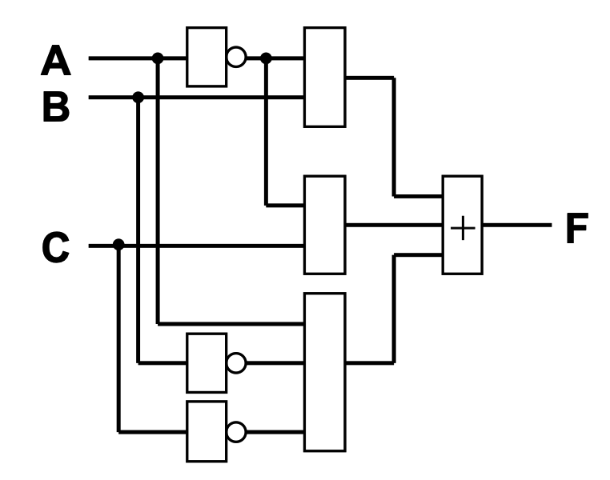

# 计算机组织与结构

## 0	前记

## 1	计算机系统概论

计算机硬件组成框图：

计算机硬件组成框图中各部件的作用：

- CPU 包括运算器和控制器两个部分：

    ALU 是运算器的核心器件，用来完成算术和逻辑运算

    CU是控制器的核心器件，用来解释存储器中的指令，并发出各种操作命令来执行指令

- 主存储器用来存放程序和数据，它可以直接与 CPU 交换信息

- I/O 设备受 CPU 控制，用来完成相应的输入输出操作

**Q1:  冯 · 诺依曼计算机的特点**

1. 计算机由运算器、控制器、存储器、输入设备、输出设备五大部件组成

2. 指令和数据以同等地位存于存储器，可按地址寻访

3. 指令和数据均用二进制数表示

4. 指令由操作码和地址码组成

5. 采用存储程序思想。指令在存储器内顺序存放，通常自动顺序取出执行

6. 机器以运算器为中心

**Q2:  计算机硬件的主要技术指标**

- 机器字长：CPU 一次能处理的数据的位数，通常与 CPU 寄存器的位数有关

- 存储容量：存储器中存放二进制代码的总位数，包含主存容量和辅存容量

    - 主存：存储单元个数$\times$存储字长 或 字节数

    - 辅存：字节数

- 运算速度：通常用MIPS、MFLOPS 或 CPI 来衡量

**Q3:  计算机区分存储器中的指令和数据的方式** 

1. 通过不同的时间段区分：

    在指令的取指阶段访存取出的是指令

    在指令的执行阶段访存取来的即为操作数，也就是数据

2. 通过不同的地址来源和目的地址区分：

    由 PC 提供访存地址，取来的即为指令，送往指令寄存器IR

    由指令的地址码部分提供访存地址取来的是操作数（数据），送往数据寄存器

## 6	计算机的运算方法

### 6.1	无符号数和有符号数

#### 6.1.1	无符号数

没有符号的数，寄存器中的每一位均可用来存放数值，表示范围在非负数域内

#### 6.1.2	有符号数

真值：带 $+ ,-$ 符号的数

机器数：把符号数字化的数，用逗号或小数点将符号位和数值位分隔开

- 原码：符号位 0 表正，1 表负
    $$
    \begin{align}
    \text{整数：}~~~~[x]_{\text 原} &= 
    \left\{
    \begin{array}{ll}
    ~0,x & 2^n>x\geqslant0 \\
    ~2^n-x & 0\geqslant x > -2^n
    \end{array}
    \right. \\~\\
    \text{小数：}~~~~[x]_{\text 原} &= 
    \left\{
    \begin{array}{ll}
    ~x & 1>x\geqslant0 \\
    ~1-x & 0\geqslant x > -1
    \end{array}
    \right.
    \end{align}
    $$
    
- 反码：原反相互转换，数值位取反末尾加 1
    $$
    \begin{align}
    \text{整数：}~~~~[x]_{\text 原} &= 
    \left\{
    \begin{array}{ll}
    ~0,x & 2^n>x\geqslant0 \\
    ~(2^{n+1}-1) + x & 0\geqslant x > -2^n & ( \text{ mod } (2^{n+1}-1)~)
    \end{array}
    \right. \\~\\
    \text{小数：}~~~~[x]_{\text 原} &= 
    \left\{
    \begin{array}{ll}
    ~x & 1>x\geqslant0 \\
    ~(2-2^{-n})+x & 0\geqslant x > -1 & ( \text{ mod } (2-2^{-n})~)
    \end{array}
    \right.
    \end{align}
    $$
    
- 补码：原补相互转换，负数数值位取反末尾加 1（反码加 1）
    $$
    \begin{align}
    \text{整数：}~~~~[x]_{\text 原} &= 
    \left\{
    \begin{array}{ll}
    ~0,x & 2^n>x\geqslant0 \\
    ~2^{n+1} + x & 0\geqslant x > -2^n & ( \text{ mod } 2^{n+1}~)
    \end{array}
    \right. \\~\\
    \text{小数：}~~~~[x]_{\text 原} &= 
    \left\{
    \begin{array}{ll}
    ~x & 1>x\geqslant0 \\
    ~2+x & 0\geqslant x \geqslant -1 & ( \text{ mod } 2~)
    \end{array}
    \right.
    \end{align}
    $$
    相反数的补码 $=$ 原数补码所有位按位取反吗末位加 1
    
- 移码：把负数映射到非负数域
    $$
    [x]_{\text{移}} = 2^n + x ~~~~(2^n > x \geqslant -2^n)
    $$
    移码和补码仅符号位相反

**Q1:  设机器字长为8位（含1位符号位在内），写出对应下列真值的原码、补码、反码**

- $-\cfrac{13}{64}$ 
    $$
    -\cfrac{13}{64} = - \cfrac{13}{2^6} = -(13)_{10} / 2^{6} = -(1101)_2/2^6=-0.001101 = x
    $$
    先移动小数点再算原反补
    $$
    [x]_原=1.0011010  ,~~  [x]_反=1.1100101 ,~~ [x]_补=1.1100110
    $$

- $\cfrac{29}{128}$
    $$
    \cfrac{29}{128} = \cfrac{29}{2^7} = (29)_{10} / 2^{7} = (11101)_2/2^7=0.0011101=x
    $$
    正数原反补相同
    $$
    [x]_原 = [x]_反 = [x]_补 = 0.0011101
    $$

- $-87$
    $$
    -87=-(87)_{10}=-(1010111)_2=- 1010111 = x
    $$
    同理可得
    $$
    [x]_原=1,1010111  ,~~  [x]_反=1,0101000 ,~~ [x]_补=1,0101001
    $$

**Q2:  当十六进制数 $\text{9BH}$ 和 $\text{FFH}$ 分别表示为原码、补码、反码、移码和无符号数时，所对应的十进制数各为多少（设机器数采用一位符号位）?**

- $(9B)_{16} = (10011011)_2$

    - 为原码

        $$
        x=(-11011)_2=(-27)_{10}
        $$

    - 为补码

        补码以 0 开头，说明真值是负数，补码数值位按位取反末尾加 1 得到原码
        $$
        [x]_原 = 1,1100101 \to x = (-1100101)_2=(-101)_{10}
        $$
    
    - 为反码
    
        反码以 0 开头，说明真值是负数，反码数值位按位取反得到原码
        $$
        [x]_原 = 1,1100100 \to x = (-1100100)_2=(-100)_{10}
        $$

    - 为移码

        移码符号位取反得到补码
        $$
        [x]_补 = 0,0011011
        $$
        补码以 0 开头，说明真值是正数，原反补相同
        $$
        [x]_原 = 0,0011011 \to x = (11011)_2 = (+27)_{10}
        $$
    
    - 为无符号数
    
        $$
        x = (10011011)_2 = (155)_{10}
        $$
    
- $(FF)_{16} = (11111111)_2$

    - 为原码

        $$
        x=(-1111111)_2=(-127)_{10}
        $$

    - 为补码

        补码以 0 开头，说明真值是负数，补码数值位按位取反末尾加 1 得到原码
        $$
        [x]_原 = 1,0000001 \to x = (-1)_2=(-1)_{10}
        $$
    
    - 为反码
    
        反码以 0 开头，说明真值是负数，反码数值位按位取反得到原码
        $$
        [x]_原 = 1,0000000 \to x = (-0)_2=(-0)_{10}
        $$

    - 为移码

        移码符号位取反得到补码
        $$
        [x]_补 = 0,1111111
        $$
        补码以 0 开头，说明真值是正数，原反补相同
        $$
        [x]_原 = 0,1111111 \to x = (1111111)_2 = (+127)_{10}
        $$
    
    - 为无符号数
    
        $$
        x = (11111111)_2 = (255)_{10}
        $$
    

### 6.2	数的定点表示和浮点表示

#### 6.2.1	定点表示

小数点固定在某一位置的数称为定点数

数值范围

- 带符号定点整数

    |          | 原码         | 补码        |
    | -------- | ------------ | ----------- |
    | 最小负数 | $-(2^n - 1)$ | $-2^n$      |
    | 最大负数 | $-1$         | $-1$        |
    | 最小正数 | $+1$         | $+1$        |
    | 最大正数 | $+ (2^n-1)$  | $+ (2^n-1)$ |

- 带符号定点小数

    |          | 原码           | 补码             |
    | -------- | -------------- | ---------------- |
    | 最小负数 | $-(1-2^{-n})$  | $-1$             |
    | 最大负数 | $-2^{-n}$      | $-2^{-n}$        |
    | 最小正数 | $+2^{-n}$      | $+2^{-n}$        |
    | 最大正数 | $+ (1-2^{-n})$ | $+ (1 - 2^{-n})$ |

#### 6.2.2	浮点表示

小数点的位置可以浮动的数称为浮点数

$S$ 尾数为定点小数，$j$ 阶码为定点整数，$r$ 为基数
$$
N = S \times r^j \\
$$
数值范围
$$
\begin{align}
上溢&~~~~~~阶码 > 最大阶码 \\
下溢&~~~~~~阶码 \textcolor{red}\leqslant 最小阶码   按~ \textcolor{red}{机器零} ~处理
\end{align}
$$

浮点数的规格化形式

- 尾数应为纯小数
- 尾数的值不为 0 时，其绝对值应大于等于十进制的 0.5 而小于 1，即 $1/2 \leqslant|X|＜1$
    - 两种特殊情况
        - $X=-1/2$，$[X]_补=1.100…0$ 不是规格化的数
        - $X=-1$，$[X]_补=1.00…0$ 是规格化的数
    - 判读尾数是否规格化：符号位和数值位首位不同

浮点数的规格化

- 左规：尾数左移 1 位，阶码减 1
- 右规：尾数右移 1 位，阶码加 1

例：机器数为补码，尾数为规格化形式，阶符 2 位，阶码数值部分 7 位，数符 2 位，尾数 $$n$$  位

**Q1:  设浮点数字长为 $32$ 位，欲表示 $±6$ 万间的十进制数，在保证数的最大精度条件下，除阶符、数符各取 $1$ 位外，阶码和尾数各取几位？按这样分配，该浮点数溢出的条件是什么？**

除阶符、数符各取 $1$ 位外，还剩 30 位，由于 $32768(2^{15})<60000<65536(2^{16})$，且 $16D=10000B$，阶码数值位需要 5 位，则尾数数值位为 $30-2-5=25$ 位。

- 上溢条件：阶码 $>2^5 -1$
- 下溢条件
    - 原码：阶码 $\leq -(2^5 -1)$
    - 补码：阶码 $\leq -2^5$

**Q2:  设机器数字长为 $16$​ 位，浮点数阶码 $6$ 位（含 $1$ 位阶符），尾数 $10$ 位（含 $1$ 位数符），机器数采用补码规格化形式，分别写出其对应的正数和负数的真值范围，答案用十进制表示**

- 最大阶码 $2^5 - 1=31$，最小阶码 $-2^5+1=-31$

- 最大正尾数 $1-2^{-9}$，最小正尾数 $2^{-1}$

    最大负尾数 $-(2^{-1}+2^{-9})$（$-2^{-1}$ 不是规格化小数），最小负尾数 $-1$

- 最大正数 $2^{31} \times (1-2^{-9})$，最小负数 $2^{31} \times (-1)$

    最小正数 $2^{-31} \times 2^{-1}$，最大负数 $2^{-31} \times -(2^{-1}+2^{-9})$

正数取值范围：$2^{-31} \times 2^{-1} ~～~~ 2^{31} \times (1-2^{-9})$

负数取值范围：$2^{31} \times (-1) ~～~~ 2^{-31} \times -(2^{-1}+2^{-9})$

**Q3:  某规格化浮点数字长 $16$ 位，尾数在前、阶码在后，其中尾数 $10$ 位（含 $1$ 位数符），阶码 $6$ 位（含 $1$ 位阶符），阶码、尾数均用补码表示**

- 求此规格化浮点数表示的最大负数的编码（用十六进制数表示）

    同 Q2 得，最大负数为 $$2^{-31} \times -(2^{-1}+2^{-9})$$

    尾数 $$-(2^{-1}+2^{-9})$$ 的二进制补码为 $1.011111111$

    阶码 $$-31$$ 的二进制补码为 $$1,00001$$

    故其十六进制编码为
    $$
    \text{1011111111100001B = BFE1H}
    $$

- 若浮点数代码为 $$\text{C7F7H}$$，求其真值（用十进制数表示）
    $$
    \text{C7F7H = 1100011111110111B}
    $$
    尾数 $$1100011111$$ 即 $$1.100011111$$ 的真值为
    $$
    -0.011100001 \text B = -(11100001\text B/2^9)=-\frac{225}{512}
    $$
    阶码 $110111$ 即 $1,10111$ 的真值为
    $$
    -1001\text B = -9
    $$
    故其真值为
    $$
    -\frac{225}{512} \times 2^{-9}
    $$

### 6.*	逻辑代数

#### 6.*.1	逻辑关系

- 优先级：括号、非、与、异或/同或、或

- 基本代数规律：与/或运算均满足 交换律、结合律、分配律、摩根律

- 吸收规律：用于化简消项

    - $$AB + A\overline B = A$$

    - $$A + AB = A$$
    - $$A + \overline A B = A + B$$
    - $$AB + \overline AC + BC = AB + \overline AC$$

#### 6.*.2	最小项

最小项：输入变量的每一种组合

包含所有 n 个的变量，且都以原或反仅出现一次，可用二进制串来编号

由最小项的逻辑或的形式所构成的逻辑函数表达式，称为逻辑函数的最小项之和的标准形式

例如
$$
\begin{align}
F(A,B,C)&=A~B~\overline C + A~\overline B~ \overline C + \overline A~ B~C \\
&=m_6 + m_4 + m_3 =\sum m(3,4,6)
\end{align}
$$

#### 6.*.3	卡诺图化简

卡诺图：将输入变量的全部最小项用小方块阵列图表示，并且将逻辑相邻的最小项放在相邻的几何位置上

逻辑相邻：两个最小项中只有一个变量以原、反状态相区别，逻辑相邻的项可以合并，且消去一个变量

卡诺图化简规则

-  相邻单元的个数是 $$2^n$$ 个，并组成矩形时，可以合并
-  先找面积尽量大的组合进行化简，可以减少更多的因子
- 各最小项可以重复使用，可利用无关状态置为任意值
- 所有的 1 都被圈过后，化简结束，逻辑式是各化简项的逻辑和

例如：化简 $$F(A,B,C,D)=\sum m(0,2,3,5,6,8,9,10,11, 12,13,14,15)$$

$$
F=A +  C~\overline D + \overline B ~C + \overline B~ \overline D + B ~\overline C~ D
$$

**Q1:  利用公式法化简下列函数为最简与或式**

- $$F = \overline A~ \overline B~ \overline C + \overline A~ \overline B~ C + A ~\overline B~ \overline C + A ~\overline B ~C$$
    $$
    \begin{align}
    F &= \overline A ~\overline B ~(C + \overline C) + A ~\overline B~(C + \overline C) \\
    &= \overline A ~\overline B + A ~ \overline B \\
    &= \overline B
    \end{align}
    $$

- $$F = A~B~C + \overline A + \overline B + C$$
    $$
    F = (C + A~B~C) + \overline A + \overline B =C +\overline A + \overline B
    $$

**Q2:  将下列函数展开为最小项标准式**

- $$F = AB + \overline A ~\overline B + \overline C~\overline D$$

$$
\begin{align}
F &= AB(C + \overline C)(D + \overline D) + \overline A ~\overline B (C + \overline C)(D + \overline D)+ (A + \overline A)(B + \overline B)\overline C~\overline D \\
&= \sum m(0,1,2,3,6,10,12,13,14,15)
\end{align}
$$

- $$F = A \oplus B + \overline {AC}$$
    $$
    \begin{align}
    F &= A \overline B + \overline A B + \overline A + \overline C\\
    &= A \overline B(C + \overline C) + \overline A B(C + \overline C) + \overline A(B + \overline B)(C + \overline C) + (A + \overline A)(B + \overline B)\overline C\\
    &= \sum m(0,1,2,3,4,5,6)
    \end{align}
    $$

**Q3:  利用卡诺图法化简下列函数**

- $$F(ABCD)=\sum m(0,1,2,5,6,7,8,9,13,14)$$

    
    $$
    F = \overline C ~D + \overline B ~\overline C + \overline A ~B~D + B ~C~ \overline D + \overline A ~\overline B ~ \overline D
    $$

- $$F(ABCD)=A + \overline {\overline B~\overline C ~\overline D + B~C~D}$$

    画出真值表，如下

    

    
    $$
    F = A + B \overline C + \overline B D + C \overline D
    $$

**Q4:  用卡诺图法化简下列函数，画出化简后的逻辑电路图**
$$
F(ABCD)=\sum m(0,1,5,6,7,8,9,14,15)
$$

$$
F = B~C + \overline B ~\overline C + \overline A ~ B ~ D
$$

**Q5:  设 $$X=ABCD$$ 是一个四位二进制整数 $$(0 \leqslant X \leqslant 1111)$$，设计电路判断 $$2 \leqslant X < 10$$**

$$
F = \overline A ~C + \overline A ~B + A~ \overline B~\overline C
$$

### 6.3	定点运算

#### 6.3.1	移位运算

- 算术移位：移位时需要做算术方面的考虑，即考虑到符号位

    

- 逻辑移位：仅做最纯粹的移位操作，空位补 0

**Q:  设机器数字长为 8 位（包括一位符号位），对 $$[x]补=1.1101 000$$ 进行算术左移一位、两位，算术右移一位、两位**

- 算术左移一位： $$[x]_补=1.101 ~0000$$
- 算术左移两位： $$[x]_补=1.010 ~0000$$
- 算术右移一位：$$[x]_补=1.111 ~0100$$
- 算术右移两位：$$[x]_补=1.111 ~1010$$

#### 6.3.2	加法与减法运算

- 加法
    $$
    \begin{align}
    \text{整数：}~~[A+B]_补 &= [A]_补+[B]_补~~~(\text{mod}~2^{n+1})\\
    \text{小数：}~~[A+B]_补 &= [A]_补+[B]_补 ~~~(\text{mod}~2)
    \end{align}
    $$

- 减法
    $$
    \begin{align}
    \text{整数：}~~[A-B]_补 &= [A]_补+[-B]_补 ~~~(\text{mod}~2^{n+1})\\
    \text{小数：}~~[A-B]_补 &= [A]_补+[-B]_补 ~~~(\text{mod}~2)
    \end{align}
    $$

溢出判断

- 单符号位：两个操作数符号相同，但结果符号与原操作数符号不同，即溢出
    $$
    \text{Overflow}=\overline{S_A}~\overline{S_B}~S_F + S_A~S_B~\overline{S_F}
    $$

- 双符号位：若两个符号位不一致时表明溢出
    $$
    \text{Overline}=S_{f1} \oplus S_{f2}
    $$
    其中，$$S_{f1}  S_{f2}=01$$ 为正溢，$$S_{f1} S_{f2} = 10$$ 为负溢

    不论是否产生溢出，高位符号位即真正的符号位

**Q:  设机器数字长为 8 位（含1位符号位），用补码运算规则计算下列各题，并说明运算结果是否溢出（要求用双符号位）**

- **$$A=9/64$$，$$B=-13/32$$，求 $$A+B$$**
    $$
    A = \frac 9 {64}= 0.0010010,~~~~~B= -\frac {13} {32} =-0.011 0100
    $$
    用双符号位方案，求得补码为
    $$
    [A]_补=00.001 0010,~~~~~[B]_补=11.100 1100
    $$
    计算得
    $$
    [A+B]_补=00.0010010 + 11.1001100 = 11.1011110
    $$
    运算结果的符号位为 11，无溢出

- **$$A=-87$$，$$B=53$$，求 $$A-B$$**
    $$
    A=-87=-1010111,~~~~~B=53=+110101
    $$
    用双符号位方案，求得补码为
    $$
    [A]_补=11,0101001,~~~~~[B]_补=00,0110101,~~~~~[-B]_补=11,1001011
    $$
    计算得
    $$
    [A-B]_补=[A]_补+ [-B]_补=11,0101001+11,1001011=10,1110100 
    $$
    运算结果的符号位为 10，负溢出

硬件电路

减法需要求补，体现在操作数与减法控制器（减法为 1）异或，若减法则操作数取反，同时加法器的进位输入端为 1（接减法控制器），用于末尾加一

#### 6.3.3	乘法运算

符号位单独处理，乘法只考虑数值位（绝对值）
$$
[x]_原 = x_0.x_1x_2 ...x_n ,~~~~~~~~~
[y]_原 = y_0.y_1y_2...y_n \\
[x \cdot y]_原 = (x \oplus  y).x^* \cdot y^*
$$
原码乘法递推公式

例：已知 $$x=-0.1110$$，$$y=0.1101$$，求 $$[x\cdot y]_原$$

$$
x_0 \oplus y_0 = 1 \oplus 0 = 1 ,~~~~~~~~~ x^* \cdot y^* = 0.10110110 \\
[x \cdot y]_原 = 1.10110110
$$

- 用移位的次数判断乘法是否结束，加 $$n$$ 次，移 $$n$$ 次 

- 由乘数的末位决定被乘数是否与原部分积相加

- 右移 1 位形成新的部分积，同时乘数右移 1 位（末位移丢），空出高位存放部分积的低位
- 新的位积只与部分积的高位相加 

**Q:  用原码一位乘计算 $$x\cdot y$$，其中 $$x= 0.110 111,~~y= -0.101 110$$**
$$
x^* = 0.110111,~~~y^* = 0.101110 \\
x_0 = 0,~~~y_0 = 1,~~~z_0 = x_0 \oplus y_0 = 0 \oplus 1 = 1
$$
列竖式计算数值位

$$
x^* \cdot y^* = 0.100  111  100  010 ,~~~~~~~~~[x \cdot y]_原 = 1.100  111  100  010 \\
x \cdot y = - 0.100  111  100  010
$$

#### 6.3.4	除法运算

符号位单独处理，除法只考虑数值位（绝对值）
$$
[x]_原 = x_0.x_1x_2 ...x_n ,~~~~~~~~~[y]_原 = y_0.y_1y_2...y_n \\
\left[\frac x  y\right]_原 = (x \oplus  y).\frac {x^*}  {y^*}
$$

- 小数定点除法 $$0 < x^* < y^*$$，整数定点除法 $$x^* \geqslant y^* > 0$$
- 被除数和除数不等于 0
- 类比乘法，余数左移一位低位补 0，再减去被除数
- 在寄存器最末位上商，然后部分商左移

除法运算规则

例1：$$x = – 0.1011,~~  y = – 0.1101$$，求 $$[\cfrac x y]_原$$（恢复余数法）

$$
\frac{x^*}{y^*}=0.1101,~~~~~~~~~\left[\frac x y\right]_原 = 0.1101
$$
例2：$$x = – 0.1011,~~  y = – 0.1101$$，求 $$[\cfrac x y]_原$$（加减交替法）

$$
x_0 \oplus y_0 = 1 \oplus 1 = 0,~~~~~~~~~ \frac{x^*}{y^*}=0.1101\\
\left[\frac x y\right]_原 = 0.1101
$$

- 上商 $$n+1$$ 次，加法 $$n+1$$ 次，第一次上商判溢出
- 逻辑左移 $$n$$ 次，用移位的次数判断除法是否结束

**Q:  用原码加减交替法计算 $$\cfrac x y$$，其中 $$x=-0.10101,~~y= 0.11011$$**
$$
[x]_原 = 1.10101&& x^* = 0. 10101 & \\
[y]_原 = 0.11011&& y^* = 0. 11011 && [-y^*]_补 = 1.00101
$$

|                                        操作 | 被除数（余数）                                    |                               商 |
| ------------------------------------------: | :------------------------------------------------ | -------------------------------: |
|                                  $$+$$ | $$0.10101$$ $$1.00101$$                      |                                  |
|       $$1 \leftarrow$$ $$+ ~y^*$$ | $$1.11010 < 0$$ $$1.10100$$ $$0.11011$$ |         $$0$$ $$0~~$$  |
|  $$1 \leftarrow$$ $$+~[-y^*]_补$$ | $$0.01111>0$$ $$0.11110$$ $$1.00101$$   |       $$01$$ $$01~~$$  |
|  $$1 \leftarrow$$ $$+~[-y^*]_补$$ | $$0.00011>0$$ $$0.00110$$ $$1.00101$$   |     $$011$$ $$011~~$$  |
|        $$1 \leftarrow$$ $$+~y^*$$ | $$1.01011<0$$ $$0.10110$$ $$0.11011$$   |   $$0110$$ $$0110~~$$  |
|        $$1 \leftarrow$$ $$+~y^*$$ | $$1.10001<0$$ $$1.00010$$ $$0.11011$$   | $$01100$$ $$01100~~$$  |
|                                             | $$1.11101<0$$                                     |                       $$011000$$ |

$$
x_0 \oplus y_0 = 1 \oplus 0 = 1 & & \frac {x^*}{y^*}=0.11000\\
\left[\frac x y \right]_原 =1.11000 & & \frac x y = - 0.11000
$$

### 6.4	浮点四则运算

#### 6.4.1	浮点加减运算

$$
x =  S_x\cdot 2^{j_x} & & y = S_y \cdot 2^{j_y}\\
$$

- 对阶

    - 求阶差
        $$
        \Delta j = j_x - j_y = \left\{
        \begin{array}{llcl}
        =0 & j_x = j_y & \text{已对齐}\\
        >0 & j_x > j_y & y\text{ 向 }x\text{ 看齐} & S_y\to1,j_y + 1 \\
        <0 & j_x < j_y & x\text{ 向 }y\text{ 看齐} & S_x\to1,j_x + 1 \\
        \end{array}
        \right.
        $$
    - 对阶原则：小阶向大阶看齐，求得对阶后的 $$[S]_补$$
    
- 尾数求和
    $$
    \begin{align}
    [S_{x+y}]_补&=[S_x]_补 + [S_y]_补 \\
    [S_{x-y}]_补&=[S_x]_补 + [-S_y]_补
    \end{align}
    $$

- 规格化

    - 规格化数的定义
        $$
        r = 2 & &  \frac 1 2 \leqslant |S| < 1 \\
        $$

    - 规格化数的判断

        - 原码：不论正负数，第一数位为 1
        - 补码：符号位和第一数位不同 

    - 左规

        尾数出现 $$00.0\cdots,~~11.1\cdots$$ 时需要左规

        尾数左移一位，阶码减 1，直到数符和第一数位不同为止

    - 右规

        尾数出现 $$01.\cdots,~~10.\cdots$$ 时需要右规

        尾数右移一位，阶码加 1

- 舍入：在对阶和右规过程中，可能出现尾数末位丢失引起误差，需考虑舍入
    - 0 舍 1 入法
    - 恒置 1 法
- 判阶码是否溢出

**Q:  按机器补码浮点运算步骤计算 $$[x-y]_补$$，其中 $$x=2^{-011}× 0.101100$$，$$y=2^{-010}×(-0.011100)$$，最后结果小数点之后保留 5 位，做舍入处理**
$$
[x]_补=11,101; & 00.101100 & & [y]_补=11,110; & 11.100100 \\
$$

- 对阶
    $$
    [\Delta j]_补=[j_x]补+[-j_y]补=11,101+ 00,010=11,111 \\
          [\Delta j]_补<0 ~~~~~ j_x \text{ 向 } j_y \text{ 看齐}\\
          [j_x]_补+1=11,101+00,001=11,110 \\
          [x]_补=11,110;~~00.010110
    $$

- 尾数求差
    $$
    [S_x]_补-[S_y]_补= 00.010110+00.011100=00.110010
    $$

- 结果规格化
    $$
    [x-y]_补=11,110;~~00.110010
    $$
    已符合规格化要求

- 舍入

    - 采用恒置 1 法：尾数为 $$00.11001$$
    - 采用 0舍 1 入法：尾数为 $$00.11001$$

- 判阶码是否溢出：无

则，得出计算结果
$$
x-y = 2^{-010}×0.11001
$$

## 4	存储器

### 4.1	概述

#### 4.1.1	存储器的分类

|         分类方式 | 类内元素                                                     |
| ---------------: | ------------------------------------------------------------ |
|         存储介质 | （易失）半导体存储器 （非易失）磁表面存储器、磁芯存储器、光盘存储器 |
|         存取方式 | （随机访问）随机存储器、只读存储器 （串行访问）顺序存取存储器、直接存取存储器 |
| 在计算机中的作用 |  |

#### 4.1.2	存储器的层次结构

**Q1:  存储器的层次结构及分层原因**

存储器的层次结构主要体现在下述两个存储层次上： 

1. Cache — 主存层次

    Cache — 主存层次主要解决 CPU 和主存速度不匹配的问题，在存储系统中主要对 CPU 访存起加速作用。从 CPU 的角度看，该层次的速度接近于 Cache，而容量和每位价格却接近于主存。这就解决了存储器的高速度和低成本之间的矛盾

2. 主存—辅存层次

    主存—辅存层次主要解决存储系统的容量问题，在存储系统中主要起扩容作用。从程序员的角度看，其所使用的存储器的容量和每位价格接近于辅存，而速度接近于主存。该层次解决了大容量和低成本之间的矛盾。

**Q2:  计算机管理存储器多级层次结构的方式**

主存 — Cache 之间的数据调度是由硬件自动完成的，对程序员是透明的

主存 — 辅存之间的数据调度，是由硬件和操作系统（采用虚拟存储技术）共同完成的

### 4.2	主存储器

#### 4.2.1	概述

主存的基本组成：

主寸和CPU的联系：

主存中存储单元地址的分配：大端法（大型机、小型机）、小端法（微机）

主存的技术指标：

- 存储容量：主存放二进制代码的总位数
    $$
    \begin{align}
    \text{存储容量} &= \text{存储单元个数} \times \text{存储字长} \\
    &= \text{存储单元个数} \times \text{存储字长／8} 	~\text{（用字节表示）}
    \end{align}
    $$

- 存储速度：由存取时间和存取周期来表示，一般存取周期大于存取时间
- 存储器带宽：单位时间内存储器存取的信息量

#### 4.2.2	半导体存储芯片简介

半导体存储芯片的基本结构

半导体存储芯片的译码驱动方式

|                            线选法                            |                            重合法                            |
| :----------------------------------------------------------: | :----------------------------------------------------------: |
|  |  |

#### 4.2.3	随机存取存储器

基本单元电路

| 静态RAM                                                      | 单管MOS动态RAM                                               |
| ------------------------------------------------------------ | ------------------------------------------------------------ |
|  |  |

**Q1:  比较静态RAM和动态RAM的特点**

- 静态RAM

    依靠双稳态触发器保存二进制代码，只要不断电，信息就不会丢失

    功耗较大，集成度较低，速度快，每位价格高，适合于作Cache或存取速度要求较高的小容量主存

- 动态RAM：

    依靠电容存储电荷来保存二进制代码，需刷新电路进行动态刷新，存取速度较慢

    功耗小，集成度高，每位价格低，适合于作大容量主存。

**Q2:  为什么要刷新**

- 主要原因是，由于电容极板漏抗的存在，存储于电容中的电荷存在泄漏的情况，这会导致动态RAM存储单元中的原存信息丢失。
- 此外，最常用的单管动态RAM的读出为破坏性读出。

**Q3:  动态RAM的几种不同刷新方式及特点**

- 集中式刷新

    在最大刷新间隔时间内，集中安排一段时间进行刷新。

    其缺点是进行刷新时必须停止读、写操作，这对主机而言是个“死区“ 

- 分散式刷新

    刷新工作安排在系统的存取周期内进行，对主机而言不再有“死区”。

    但该方式加长了系统的存取周期，存在无谓刷新，降低了整机运行效率。

    因此，分散方式刷新不适用于高速存储器。 

- 异步式刷新

    结合了上述两种方式的优点，充分利用了最大刷新间隔。

    相对于分散式刷新而言，它减少了刷新次数；相对于集中方式来说，主机的“死区”又缩短很多。

    因此，这种方式使用得比较多。

- 透明式刷新（可不答）

    该方式不占用CPU时间，对CPU而言是透明的操作；但控制线路复杂。

#### 4.2.5	存储器与CPU的连接

存储器的拓展：

- 位拓展：增加存储字长（例：2片 1K$\times$4 $\to$ 1K$\times$8）
- 字拓展：增加存储器字的数量（例：2片 1K$\times$8 $\to$ 2K$\times$8）
- 字、位拓展：既增加存储字的数量，又增加存储字长

**Q1:  某8位微型机地址码为18位，若使用4K×4位的RAM芯片组成模块板结构的存储器，试问：**

- **该机所允许的最大主存空间是多少？**
    $$
    2^{18} \times 8 \text{ bit} = 256\text{ KB}
    $$

- **若每个模块板为32K×8位，共需几个模块板？**
    $$
    \frac{256\text{ KB}}  {32\text{ KB}} = 8
    $$

- **每个模块板内共有几片RAM芯片？**
    $$
    \frac{32\text{ K} \times 8}  {4\text{ K} \times 4} = 16
    $$

- **共有多少片RAM？**
    $$
    8 \times 16 = 128
    $$

- **CPU如何选择各模块板？**

    $2^3$ 个模块板，需要最高 3 位地址译码选模板，板内 $2^3$ 组 $4 \text{K}\times 8$ RAM 需要次高 3 位地址译码选择 RAM 组，片内地址最高位译码选择两片 $4\text K \times 4$ 中的一片。

存储器与 CPU 的连接：

- 地址线 $\small A_0 -A_n$：低位接存储芯片，高位用于片选
- 数据线 $\small D_0 - D_m$：注意位拓展，数据位数应与数据线数相等
- 读/写命令线 $\small R/\overline W$
- 片选线 $\small \overline {CS}$：受到高位地址线、访存控制信号 $\small \overline{MREQ}$ 的控制

**Q2:  设 CPU 有 16 根地址线，8 根数据线，用 $\small \overline{MREQ}$（低电平有效）作访存控制信号，$\small R/\overline W$ 作读写控制信号（高电平为读，低电平为写），现有 1K×4 位、4K×8 位的 RAM 芯片，2K×8 位，4K×4 位的 ROM 芯片，以及 74138 译码器和各种门电路，画出 CPU 与存储器连接图，图中标明信号线的方向、种类和条数；并写出每片RAM芯片的地址范围（用十六进制描述)，要求：主存地址空间分配：A000H — A7FFH 为系统程序区； A800H — AFFFH为用户程序区。**

- 系统程序区用 ROM，A7FFH - A000H + 1 = 800H = 1000 0000 0000 = 2K，故选用 1 片 2K×8 ROM

    $2\text K= 2 ^{11}~~\longrightarrow~~$需要 11 根地址线连接

    1010 0|000 0000 0000

    1010 0|111 1111 1111

    CBA = 100 = 4 故接 $\overline {Y_4}$

- 用户程序区用 RAM，AFFFH - A800H + 1 = 800H = 1000 0000 0000 = 2K，故选用 4 片 1K×4 RAM

    每 2 个 1K×4 位拓展为 1K×8，两组 RAM 再字拓展为 2K×8

    $1\text K= 2 ^{10}~~\longrightarrow~~$各需要 10 根地址线连接

    RAM 芯片的地址范围：

    - RAM 1-2：A800H~ABFFH

        1010 1|0|00 0000 0000

        1010 1|0|11 1111 1111

        $A_{10}$ 为 0

    - RAM 3-4：AC00H~AFFFH

        1010 1|1|00 0000 0000

        1010 1|1|11 1111 1111

        $A_{10}$ 为 1

    CBA = 100 = 5 故接 $\overline {Y_5}$

注意点：

1. $\small \overline{MREQ}$ 要作为 74138 的其中一个控制信号输入
2. 对于 RAM，只接 10 根地址线，$A_{10}$ 参与片选
3. ROM 只读，RAM 双向读写

**Q3:  设 CPU 有 18 根地址线 (A17—A0)，8 根数据线 (D7—D0)，用 $\small \overline{MREQ}$ 做访存控制信号（低电平有效)，$\small R/\overline W$ 作读写控制信号（高电平为读，低电平为写)。现有下列芯片： 4K×8 位 RAM、2K×8 位 ROM 及 3 - 8 译码器和各种门电路。主存地址空间为：28800H 开始为 2K ROM，2E000H 开始为 8K RAM。要求：补充完成CPU与存储器连线图。**

- 8K RAM 选用 2 片 4K×8 芯片，各需要 12 根地址线

    2E000H + 8K - 1 = 2E000H + 2000H - 1 = 2FFFFH

    - RAM 1：2E000H~2EFFFH

        10 1110 | 0000 0000 0000

        10 1110 | 1111 1111 1111

        CBA = 110 = 6，故接 $\overline {Y_6}$

    - RAM 2：2F000H~2FFFFH

        10 1111 | 0000 0000 0000

        10 1111 | 1111 1111 1111

        CBA = 111 = 7，故接 $\overline {Y_7}$

- 2K ROM 选用 1 片 2K×8 芯片，需要 11 根地址线

    28800H + 2K - 1 = 28800H + 800H - 1 = 28FFFH

    10 1000 | 1|000 0000 0000

    10 1000 | 1|111 1111 1111

    CBA = 000 = 0，故接 $\overline {Y_0}$，同时要求 $A_{11}$ 为 1

注意点：

1. $\small \overline{MREQ}$ 仍要与高位地址线作与运算，作为 74138 的其中一个控制信号输入
2. 对于 ROM，只接 11 根地址线，$A_{11}$ 参与片选

#### 4.2.7	提高访存速度的措施

- 单体多字系统：增加存储器的带宽

    

- 多体并行系统

    - 高位交叉：各个体并行工作，不同的请求源同时访问不同的体

        

    - 低位交叉：各个体轮流编址 

        

        在不改变存取周期的前提下，增加存储器的带宽，实现流水线方式存取

        

### 4.3	高速缓冲存储器

#### 4.3.1	概述

Cache 存储器的理论依据：程序（或数据）访问的局部性原理

- 在一个较短的时间间隔内，CPU 对局部范围的存储器空间频繁访问，而对此地址范围之外的存储空间访问很少，这称为程序（或数据）访问的局部性。
- 设置 Cache 就是为了将主存的局部性数据块提前调度到 Cache 中，在较大命中率保证下，被CPU直接访问，而节省了访问主存的时间。

主存和缓存的编址：主存和缓存按块存储，块的大小相同

Cache 的命中率：CPU 欲访问的信息在 Cache 中的比率
$$
h = \frac {N_c} {N_c + N_m}
$$
$N_c$ 为访问 Cache 的总命中次数，$N_m$ 为访问主存的总次数

Cache — 主存系统的效率
$$
\begin{align}
e &= \frac {\text{访问 Cache 的时间}} {\text{平均访问时间}} \times 100\% \\
&= \frac {t_c}{h \times t_c + (1-h) \times t_m} \times 100\%
\end{align}
$$
$t_c$ 为命中时的 Cache 访问时间，$t_m$ 为未命中时的主存访问时间

Cache 的基本结构原理框图：由硬件自动完成，对用户透明

Cache 的读写操作：

- 读

    

- 写

    - 写直达法：写操作时数据既写入 Cache 又写入主存
    - 写回法：写操作时只把数据写入 Cache 而不写入主存，当 Cache 数据被替换出去时才写回主存

#### 4.3.2	Cache—主存地址映射

- 直接映射：某一主存块只能固定映射到某一缓存块，简单但不够灵活
    $$
    i = j ~~\text {mod}~~ C    ~~~~\text{or}~~~~    i = j ~~\text {mod}~~ {2^c}
    $$
    

    

- 全相连映射：某一主存块能映射到任一缓存块，灵活性大，结构复杂成本高

    

    

- 组相连映射：某一主存块只能映射到某一缓存组中的任一块，性能与复杂性介于上述两种方式之间

    Cache 组数 Q，每组内有 $2^r$ 块，Cache 组号为 $j ~~\text{mod}~~Q$，组内编号 $k~(0 \leqslant k \leqslant 2^r - 1)$
    $$
    i = (j ~~\text {mod}~~ Q) \times 2^r + k
    $$
    

**Q1:  设主存容量为 256K 字，Cache 容量为 2K 字，块长为 4。**

- **设计 Cache 地址格式，Cache 中可装入多少块数据？**
    $$
    \frac {2\text K} 4 = 2^9 = 512
    $$
    Cache 中可装入 512 个字块，需要 9 位地址，块内 $2^2$ 个字需要 2 位块内字地址，故 Cache 地址格式为

    

    
    
- **在直接映射方式下，设计主存地址格式。**
    $$
    \frac {256\text{K}} {4} = 64 \text K = 2^{16}
    $$
    主存内共有 $2^{16}$ 个字块
    $$
    \frac {2^{16}}{2^9} = 2^7
    $$
    1 个 Cache 字块对应 $2^7$ 个主存字块，用于区分这 $2^7$ 个不同的主存字块的主存字块标记应为 7 位

    Cache 地址同上一小题，在前面增加主存字块标记，故主存地址格式为

    
    
    
    
- **在四路组相联映射方式下，设计主存地址格式。**
    $$
    \frac {512} {4} = 128 = 2^7
    $$
    Cache 字块按 4 块一组分为 $2^7$ 组，共需要 7 位作为组地址
    $$
    \frac {2^{16}} {2^7} = 2^9
    $$
    1 个组对应 $2^9$ 个主存字块，同理主存字块标记应为 9 位，块内字地址 2 位，故主存地址格式为

    

- **在全相联映射方式下，设计主存地址格式。**

    主存内共有 $2^{16}$ 个字块，1 个 Cache 字块可能对应 $2^{16}$ 个主存字块中的一个

    同理，主存字块标记应为 16 位，块内字地址 2 位，故主存地址格式为

    

    

- **若存储字长为 32 位，存储器按字节寻址，写出八路组相联映射方式下主存的地址格式。**
    $$
    \frac {512} {8} = 64 = 2^6
    $$
    Cache 字块按 8 块一组分为 $2^6$ 组，共需要 6 位作为组地址
    $$
    \frac {2^{16}} {2^6} = 2^{10}
    $$
    1 个组对应 $2^{10}$ 个主存字块，同理主存字块标记应为 10 位
    $$
    \frac {4 \times 32} {8} = 16 = 2^4
    $$
    块内 4 个字对应 $2^4$ 个字节，按字节寻址需要 4 位作为块内字节地址，故主存地址格式为

    

**Q2:  设主存容量为 1MB，采用直接映射方式的 Cache 容量为 16KB，块长为 4，每字 32 位。试问主存地址为 ABCDEH 的存储单元在 Cache 中的什么位置？**
$$
16 \text {K} = 2^{14} \\
4 \times \frac{32}8 = 16 = 2^4
$$
采用字节编址，Cache 的地址为 14 位，其中字块内地址为 4 位，Cache 字块地址为 $14-4=10$ 位

采用直接映射方式，主存地址后 14 位地址与 Cache 的 14 位地址相同

ABCDEH = 1010 1011 1100 1101 1110

后 14 位地址用十六进制描述为 3CDEH，这就是指定的主存单元在 Cache 中的位置

**Q:  设某机主存容量为 4MB，Cache 容量为 16KB，每字块有 8 个字，每字 32 位，设计一个四路组相联映射（即 Cache 每组内共有 4 个字块）的 Cache 组织。**

- **画出主存地址字段中各段的位数**
    $$
    \frac {16 \text K}  {4 \times 8} = 2 ^{9} \\
    \frac {2^9}{4} = 2^7
    $$
    1 个字 4 个 Byte，一个字块 8 个字，一组一共 4 个字块，Cache 共计 $2^7$ 组需要 7 位 Cache 组地址
    $$
    \frac {4 \text M}{4 \times 8} = 2^{17}
    $$
    同理，主存一共 $2^{17}$ 个字块，一个 Cache 组对应 $2^{10}$ 个主存字块，需要 10 位主存字块标记

    块内 $2^3$ 个字，需要 3 位块内字地址，故主存地址各字段位数为

    

    

- **设 Cache 的初态为空，CPU 依次从主存第 0、1、2 …… 89 号单元读出 90 个字（主存一次读出一个字），并重复按此次序读 8 次，问命中率是多少？**
    $$
    \left\lceil \frac {90}{8}\right\rceil = 12 
    $$
    CPU 一次调出 1 个字块到 Cache，共有 12 次未命中，而后 7 次循全部命中，故命中率为
    $$
    \frac {90 \times 8 - 12}{90 \times 8} = 0.983
    $$
    
- **若 Cache 的速度是主存的 6 倍，试问有 Cache 和无 Cache 相比，速度约提高多少倍？**
    $$
    \text{速度比 =} \frac{1}{\text{时间比}}
    $$
	设 Cache 的存取周期为 t，则根据题意，主存的存取周期为 6t，则速度之比为

    $$
    \frac {6t \times 90 \times 8} {6t \times 12 + t \times (90 \times 8 - 12)} = 5.54
    $$
    

**Q4:  以全相联映射技术为例，说明在带有 Cache 的存储系统中，“读”操作是怎样完成的**

当 CPU 发出主存地址后，地址映射机构按照全相联映射方式将主存地址标记与 Cache 所有字块的标记进行比较，以判断出所访主存字（主存地址的内容）是否已在 Cache 中。

- 若命中，直接访问Cache，将该字送至CPU
- 若未命中
    - 一方面要访问主存，将该字传送给CPU
    - 与此同时，要按照全相联映射方式转换的 Cache 地址将该字所在的主存块装入 Cache
        - 如果此时 Cache 已装满，就要执行替换算法，腾出空位才能将新的主存块调入

某 Cache 共 32 个字块，每个字块有 32 个字，每个字为 32 位，采用 4 路组相联映射；存储器按字节编址，内存地址为 16 位，回答下述问题。

- Cache 地址各字段如何划分（各需多少位）
    $$
    \frac {32 \times 32}{8} = 2^7
    $$
    块内字节数为 $2^7$，需要 7 位块内字节地址
    $$
    32 = 2^5
    $$
    需要 5 位 Cache 字块地址

    

- 写出内存地址 375FH 可能映射成的 Cache 地址（用16进制表示）
    $$
    \frac {32}{4} = 2^3
    $$
    Cache 内一共有 $2^3$ 个组，主存地址需要 3 位 Cache 组地址
    $$
    16 - 7 - 3 = 6
    $$
    由主存 16 位地址计算得到主存字块标记为 6 位

    375FH = 0011 0111 0101 1111

    Cache 组地址为 110，组内地址 $5-3=2$ 位，故可能映射的 Cache 地址为

    ① 110 00 101 1111（十六进制：0C5FH ）

    ② 110 01 101 1111（十六进制：0CDFH ）

    ③ 110 10 101 1111（十六进制：0D5FH ）

    ④ 110 11 101 1111（十六进制：0DDFH ）

    

- 如果是二路组相联映射，计算主存 87 号（十进制）单元所在主存块应装入到的 Cache 组号
    $$
    \frac {32}{2} = 2^4
    $$
    Cache 内一共有 $2^4$ 个组，主存地址需要 4 位 Cache 组地址
    $$
    \left\lfloor\frac {87}{128}\right\rfloor = 0
    $$
    主存 87 号单元位于第 0 号字块
    $$
    i = j \text{ mod } Q = 0 \text{ mod } 16 = 0
    $$
    故主存 87 号单元映射到 Cache 的第 0 组

