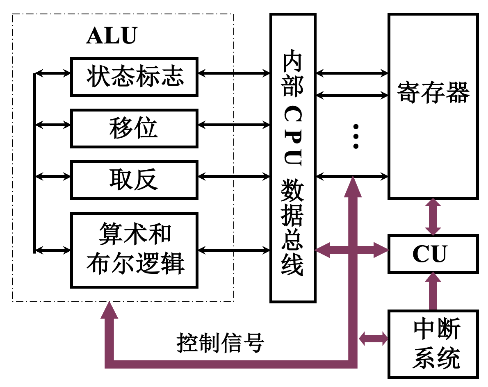
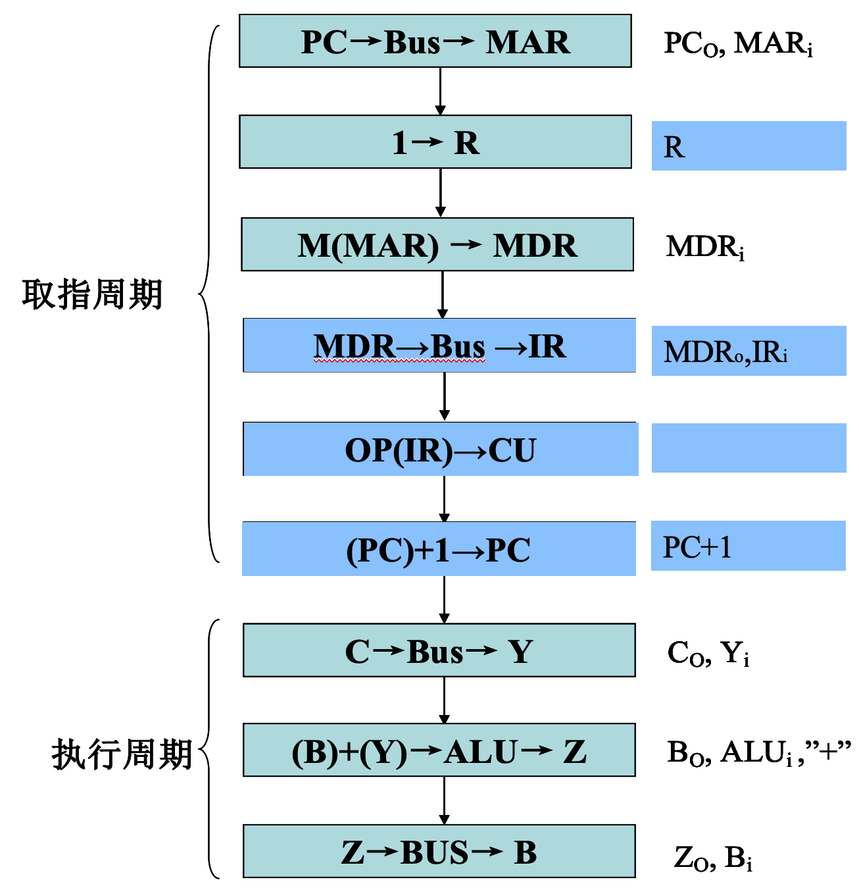
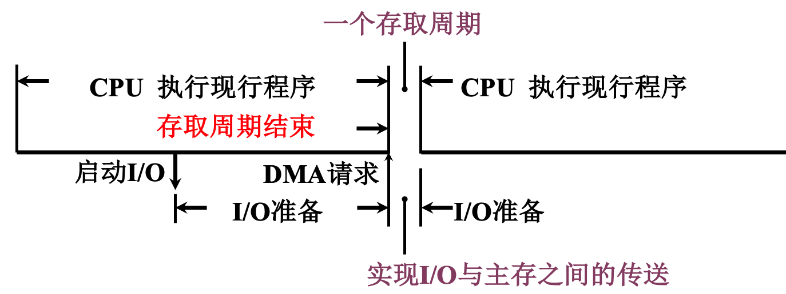
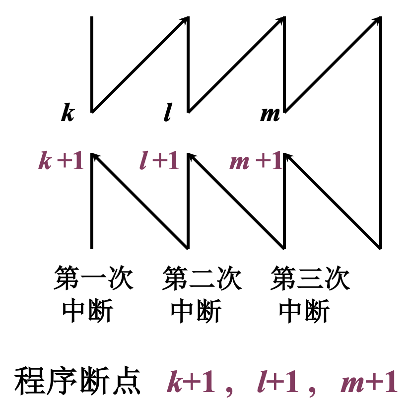
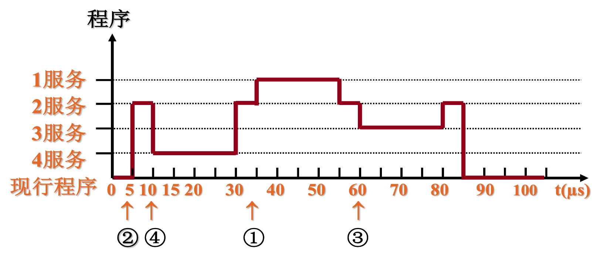

# 计算机组织与结构

## 前记

- 待写
- [Github Pages](../index.html)

## 0    目录

> - 按照 2022 - 2023 学年软件学院软件工程专业计算机组织与结构期末考试范围整理编写
> - 大部分素材来源于陈志勇老师班级的幻灯片和课后作业
> - 本文内容包括考试范围要求的知识点及辅助知识点记忆的非考试要求记忆点
> - 章节或小章节末尾的 Question 部分为课后作业，对考试题型参考意义极大

[TOC]

## 1    计算机系统概论

计算机硬件组成框图：

计算机硬件组成框图中各部件的作用：

- CPU 包括运算器和控制器两个部分：

    ALU 是运算器的核心器件，用来完成算术和逻辑运算

    CU是控制器的核心器件，用来解释存储器中的指令，并发出各种操作命令来执行指令

- 主存储器用来存放程序和数据，它可以直接与 CPU 交换信息

- I/O 设备受 CPU 控制，用来完成相应的输入输出操作

**Q1:  冯 · 诺依曼计算机的特点**

1. 计算机由运算器、控制器、存储器、输入设备、输出设备五大部件组成

2. 指令和数据以同等地位存于存储器，可按地址寻访

3. 指令和数据均用二进制数表示

4. 指令由操作码和地址码组成

5. 采用存储程序思想。指令在存储器内顺序存放，通常自动顺序取出执行

6. 机器以运算器为中心

**Q2:  计算机硬件的主要技术指标**

- 机器字长：CPU 一次能处理的数据的位数，通常与 CPU 寄存器的位数有关

- 存储容量：存储器中存放二进制代码的总位数，包含主存容量和辅存容量

    - 主存：存储单元个数$\times$存储字长 或 字节数

    - 辅存：字节数

- 运算速度：通常用MIPS、MFLOPS 或 CPI 来衡量

**Q3:  计算机区分存储器中的指令和数据的方式** 

1. 通过不同的**时间段**区分：

    在指令的**取指阶段**访存取出的是指令

    在指令的执行阶段访存取来的即为操作数，也就是数据

2. 通过不同的地址来源和**目的地址**区分：

    由 **PC** 提供访存地址，取来的即为指令，送往指令寄存器 IR

    由指令的**地址码**部分提供访存地址取来的是操作数（数据），送往**数据寄存器**

---

---

## 6    计算机的运算方法

### 6.1    无符号数和有符号数

#### 6.1.1    无符号数

没有符号的数，寄存器中的每一位均可用来存放数值，表示范围在非负数域内

#### 6.1.2    有符号数

真值：带 $+ ,-$ 符号的数

机器数：把符号数字化的数，用逗号或小数点将符号位和数值位分隔开

- 原码：符号位 0 表正，1 表负
    $$
    \begin{align}
    \text{整数：}~~~~[x]_{\text 原} &= 
    \left\{
    \begin{array}{ll}
    ~0,x & 2^n>x\geqslant0 \\
    ~2^n-x & 0\geqslant x > -2^n
    \end{array}
    \right. \\~\\
    \text{小数：}~~~~[x]_{\text 原} &= 
    \left\{
    \begin{array}{ll}
    ~x & 1>x\geqslant0 \\
    ~1-x & 0\geqslant x > -1
    \end{array}
    \right.
    \end{align}
    $$
    
- 反码：原反相互转换，**负数数值位**取反
    $$
    \begin{align}
    \text{整数：}~~~~[x]_{\text 原} &= 
    \left\{
    \begin{array}{ll}
    ~0,x & 2^n>x\geqslant0 \\
    ~(2^{n+1}-1) + x & 0\geqslant x > -2^n & ( \text{ mod } (2^{n+1}-1)~)
    \end{array}
    \right. \\~\\
    \text{小数：}~~~~[x]_{\text 原} &= 
    \left\{
    \begin{array}{ll}
    ~x & 1>x\geqslant0 \\
    ~(2-2^{-n})+x & 0\geqslant x > -1 & ( \text{ mod } (2-2^{-n})~)
    \end{array}
    \right.
    \end{align}
    $$
    
- 补码：原补相互转换，**负数数值位**取反末尾加 1（ = 反码加 1）
    $$
    \begin{align}
    \text{整数：}~~~~[x]_{\text 原} &= 
    \left\{
    \begin{array}{ll}
    ~0,x & 2^n>x\geqslant0 \\
    ~2^{n+1} + x & 0\geqslant x > -2^n & ( \text{ mod } 2^{n+1}~)
    \end{array}
    \right. \\~\\
    \text{小数：}~~~~[x]_{\text 原} &= 
    \left\{
    \begin{array}{ll}
    ~x & 1>x\geqslant0 \\
    ~2+x & 0\geqslant x \geqslant -1 & ( \text{ mod } 2~)
    \end{array}
    \right.
    \end{align}
    $$
    相反数的补码 $=$ 原数补码**所有位**按位取反吗末位加 1
    
- 移码：把负数映射到非负数域
    $$
    [x]_{\text{移}} = 2^n + x ~~~~(2^n > x \geqslant -2^n)
    $$
    移码和补码仅符号位相反

**Q1:  设机器字长为8位（含1位符号位在内），写出对应下列真值的原码、补码、反码**

- $-\cfrac{13}{64}$ 
    $$
    -\cfrac{13}{64} = - \cfrac{13}{2^6} = -(13)_{10} / 2^{6} = -(1101)_2/2^6=-0.001101 = x
    $$
    先移动小数点再算原反补
    $$
    [x]_原=1.0011010  ,~~  [x]_反=1.1100101 ,~~ [x]_补=1.1100110
    $$

- $\cfrac{29}{128}$
    $$
    \cfrac{29}{128} = \cfrac{29}{2^7} = (29)_{10} / 2^{7} = (11101)_2/2^7=0.0011101=x
    $$
    正数原反补相同
    $$
    [x]_原 = [x]_反 = [x]_补 = 0.0011101
    $$

- $-87$
    $$
    -87=-(87)_{10}=-(1010111)_2=- 1010111 = x
    $$
    同理可得
    $$
    [x]_原=1,1010111  ,~~  [x]_反=1,0101000 ,~~ [x]_补=1,0101001
    $$

**Q2:  当十六进制数 $\text{9BH}$ 和 $\text{FFH}$ 分别表示为原码、补码、反码、移码和无符号数时，所对应的十进制数各为多少（设机器数采用一位符号位）?**

- $(9\text B)_{16} = (10011011)_2$

    - 为原码

        $$
        x=(-11011)_2=(-27)_{10}
        $$

    - 为补码

        补码以 1 开头，说明真值是负数，补码数值位按位取反末尾加 1 得到原码
        $$
        [x]_原 = 1,1100101 \to x = (-1100101)_2=(-101)_{10}
        $$
    
    - 为反码
    
        反码以 1 开头，说明真值是负数，反码数值位按位取反得到原码
        $$
        [x]_原 = 1,1100100 \to x = (-1100100)_2=(-100)_{10}
        $$

    - 为移码

        移码符号位取反得到补码
        $$
        [x]_补 = 0,0011011
        $$
        补码以 0 开头，说明真值是正数，原反补相同
        $$
        [x]_原 = 0,0011011 \to x = (11011)_2 = (+27)_{10}
        $$
    
    - 为无符号数
    
        $$
        x = (10011011)_2 = (155)_{10}
        $$
    
- $(\text F\text F)_{16} = (11111111)_2$

    - 为原码

        $$
        x=(-1111111)_2=(-127)_{10}
        $$

    - 为补码

        补码以 1 开头，说明真值是负数，补码数值位按位取反末尾加 1 得到原码
        $$
        [x]_原 = 1,0000001 \to x = (-1)_2=(-1)_{10}
        $$
    
    - 为反码
    
        反码以 1 开头，说明真值是负数，反码数值位按位取反得到原码
        $$
        [x]_原 = 1,0000000 \to x = (-0)_2=(-0)_{10}
        $$

    - 为移码

        移码符号位取反得到补码
        $$
        [x]_补 = 0,1111111
        $$
        补码以 0 开头，说明真值是正数，原反补相同
        $$
        [x]_原 = 0,1111111 \to x = (1111111)_2 = (+127)_{10}
        $$
    
    - 为无符号数
    
        $$
        x = (11111111)_2 = (255)_{10}
        $$
    

### 6.2    数的定点表示和浮点表示

#### 6.2.1    定点表示

小数点固定在某一位置的数称为定点数

数值范围

- 带符号定点整数

    |          | 原码         | 补码        |
    | -------- | ------------ | ----------- |
    | 最小负数 | $-(2^n - 1)$ | $-2^n$      |
    | 最大负数 | $-1$         | $-1$        |
    | 最小正数 | $+1$         | $+1$        |
    | 最大正数 | $+ (2^n-1)$  | $+ (2^n-1)$ |

- 带符号定点小数

    |          | 原码           | 补码             |
    | -------- | -------------- | ---------------- |
    | 最小负数 | $-(1-2^{-n})$  | $-1$             |
    | 最大负数 | $-2^{-n}$      | $-2^{-n}$        |
    | 最小正数 | $+2^{-n}$      | $+2^{-n}$        |
    | 最大正数 | $+ (1-2^{-n})$ | $+ (1 - 2^{-n})$ |

#### 6.2.2    浮点表示

小数点的位置可以浮动的数称为浮点数

$S$ 尾数为定点小数，$j$ 阶码为定点整数，$r$ 为基数
$$
N = S \times r^j \\
$$
数值范围
$$
\begin{align}
上溢&~~~~~~阶码 > 最大阶码 \\
下溢&~~~~~~阶码 \textcolor{red}\leqslant 最小阶码   按~ \textcolor{red}{机器零} ~处理
\end{align}
$$

浮点数的规格化形式

- 尾数应为纯小数
- 尾数的值不为 0 时，其绝对值应大于等于十进制的 0.5 而小于 1，即 $1/2 \leqslant|X|＜1$
    - 两种特殊情况
        - $X=-1/2$，$[X]_补=1.100…0$ 不是规格化的数
        - $X=-1$，$[X]_补=1.00…0$ 是规格化的数
    - 判读尾数是否规格化：符号位和数值位首位不同

浮点数的规格化

- 左规：尾数左移 1 位，阶码减 1
- 右规：尾数右移 1 位，阶码加 1

**例：机器数为补码，尾数为规格化形式，阶符 2 位，阶码数值部分 7 位，数符 2 位，尾数 $$n$$  位**

**Q1:  设浮点数字长为 $32$ 位，欲表示 $±6$ 万间的十进制数，在保证数的最大精度条件下，除阶符、数符各取 $1$ 位外，阶码和尾数各取几位？按这样分配，该浮点数溢出的条件是什么？**

除阶符、数符各取 $1$ 位外，还剩 30 位，由于 $32768(2^{15})<60000<65536(2^{16})$，且 $16D=10000B$，阶码数值位需要 5 位，则尾数数值位为 $30-2-5=25$ 位。

- 上溢条件：阶码 $>2^5 -1$
- 下溢条件
    - 原码：阶码 $\leq -(2^5 -1)$
    - 补码：阶码 $\leq -2^5$

**Q2:  设机器数字长为 $16$​ 位，浮点数阶码 $6$ 位（含 $1$ 位阶符），尾数 $10$ 位（含 $1$ 位数符），机器数采用补码规格化形式，分别写出其对应的正数和负数的真值范围，答案用十进制表示**

- 最大阶码 $2^5 - 1=31$，最小阶码 $-2^5+1=-31$

- 最大正尾数 $1-2^{-9}$，最小正尾数 $2^{-1}$

    最大负尾数 $-(2^{-1}+2^{-9})$（$-2^{-1}$ 不是规格化小数），最小负尾数 $-1$

- 最大正数 $2^{31} \times (1-2^{-9})$，最小负数 $2^{31} \times (-1)$

    最小正数 $2^{-31} \times 2^{-1}$，最大负数 $2^{-31} \times -(2^{-1}+2^{-9})$

正数取值范围：$2^{-31} \times 2^{-1} ~～~~ 2^{31} \times (1-2^{-9})$

负数取值范围：$2^{31} \times (-1) ~～~~ 2^{-31} \times -(2^{-1}+2^{-9})$

**Q3:  某规格化浮点数字长 $16$ 位，尾数在前、阶码在后，其中尾数 $10$ 位（含 $1$ 位数符），阶码 $6$ 位（含 $1$ 位阶符），阶码、尾数均用补码表示**

- 求此规格化浮点数表示的最大负数的编码（用十六进制数表示）

    同 Q2 得，最大负数为 $$2^{-31} \times -(2^{-1}+2^{-9})$$

    尾数 $$-(2^{-1}+2^{-9})$$ 的二进制补码为 $1.011111111$

    阶码 $$-31$$ 的二进制补码为 $$1,00001$$

    故其十六进制编码为
    $$
    \text{1011111111100001B = BFE1H}
    $$

- 若浮点数代码为 $$\text{C7F7H}$$，求其真值（用十进制数表示）
    $$
    \text{C7F7H = 1100011111110111B}
    $$
    尾数 $$1100011111$$ 即 $$1.100011111$$ 的真值为
    $$
    -0.011100001 \text B = -(11100001\text B/2^9)=-\frac{225}{512}
    $$
    阶码 $110111$ 即 $1,10111$ 的真值为
    $$
    -1001\text B = -9
    $$
    故其真值为
    $$
    -\frac{225}{512} \times 2^{-9}
    $$

### 6.*    逻辑代数

#### 6.*.1    逻辑关系

- 优先级：括号、非、与、异或/同或、或

- 基本代数规律：与/或运算均满足 交换律、结合律、分配律、摩根律

- 吸收规律：用于化简消项

    - $$AB + A\overline B = A$$

    - $$A + AB = A$$
    - $$A + \overline A B = A + B$$
    - $$AB + \overline AC + BC = AB + \overline AC$$

#### 6.*.2    最小项

最小项：输入变量的每一种组合

包含所有 n 个的变量，且都以原或反仅出现一次，可用二进制串来编号

由最小项的逻辑或的形式所构成的逻辑函数表达式，称为逻辑函数的最小项之和的标准形式

例如
$$
\begin{align}
F(A,B,C)&=A~B~\overline C + A~\overline B~ \overline C + \overline A~ B~C \\
&=m_6 + m_4 + m_3 =\sum m(3,4,6)
\end{align}
$$

#### 6.*.3    卡诺图化简

卡诺图：将输入变量的全部最小项用小方块阵列图表示，并且将逻辑相邻的最小项放在相邻的几何位置上

逻辑相邻：两个最小项中只有一个变量以原、反状态相区别，逻辑相邻的项可以合并，且消去一个变量

卡诺图化简规则

-  相邻单元的个数是 $$2^n$$ 个，并组成矩形时，可以合并
-  先找面积尽量大的组合进行化简，可以减少更多的因子
- 各最小项可以重复使用，可利用无关状态置为任意值
- 所有的 1 都被圈过后，化简结束，逻辑式是各化简项的逻辑和

例如：化简 $$F(A,B,C,D)=\sum m(0,2,3,5,6,8,9,10,11, 12,13,14,15)$$

$$
F=A +  C~\overline D + \overline B ~C + \overline B~ \overline D + B ~\overline C~ D
$$

**Q1:  利用公式法化简下列函数为最简与或式**

- $$F = \overline A~ \overline B~ \overline C + \overline A~ \overline B~ C + A ~\overline B~ \overline C + A ~\overline B ~C$$
    $$
    \begin{align}
    F &= \overline A ~\overline B ~(C + \overline C) + A ~\overline B~(C + \overline C) \\
    &= \overline A ~\overline B + A ~ \overline B \\
    &= \overline B
    \end{align}
    $$

- $$F = A~B~C + \overline A + \overline B + C$$
    $$
    F = (C + A~B~C) + \overline A + \overline B =C +\overline A + \overline B
    $$

**Q2:  将下列函数展开为最小项标准式**

- $$F = AB + \overline A ~\overline B + \overline C~\overline D$$

$$
\begin{align}
F &= AB(C + \overline C)(D + \overline D) + \overline A ~\overline B (C + \overline C)(D + \overline D)+ (A + \overline A)(B + \overline B)\overline C~\overline D \\
&= \sum m(0,1,2,3,6,10,12,13,14,15)
\end{align}
$$

- $$F = A \oplus B + \overline {AC}$$
    $$
    \begin{align}
    F &= A \overline B + \overline A B + \overline A + \overline C\\
    &= A \overline B(C + \overline C) + \overline A B(C + \overline C) + \overline A(B + \overline B)(C + \overline C) + (A + \overline A)(B + \overline B)\overline C\\
    &= \sum m(0,1,2,3,4,5,6)
    \end{align}
    $$

**Q3:  利用卡诺图法化简下列函数**

- $$F(ABCD)=\sum m(0,1,2,5,6,7,8,9,13,14)$$

    
    $$
    F = \overline C ~D + \overline B ~\overline C + \overline A ~B~D + B ~C~ \overline D + \overline A ~\overline B ~ \overline D
    $$

- $$F(ABCD)=A + \overline {\overline B~\overline C ~\overline D + B~C~D}$$

    画出真值表，如下

    

    
    $$
    F = A + B \overline C + \overline B D + C \overline D
    $$

**Q4:  用卡诺图法化简下列函数，画出化简后的逻辑电路图**
$$
F(ABCD)=\sum m(0,1,5,6,7,8,9,14,15)
$$

$$
F = B~C + \overline B ~\overline C + \overline A ~ B ~ D
$$

**Q5:  设 $$X=ABCD$$ 是一个四位二进制整数 $$(0 \leqslant X \leqslant 1111)$$，设计电路判断 $$2 \leqslant X < 10$$**

$$
F = \overline A ~C + \overline A ~B + A~ \overline B~\overline C
$$

### 6.3    定点运算

#### 6.3.1    移位运算

- 算术移位：移位时需要做算术方面的考虑，即考虑到符号位

    

- 逻辑移位：仅做最纯粹的移位操作，空位补 0

**Q:  设机器数字长为 8 位（包括一位符号位），对 $$[x]补=1.1101 000$$ 进行算术左移一位、两位，算术右移一位、两位**

- 算术左移一位： $$[x]_补=1.101 ~0000$$
- 算术左移两位： $$[x]_补=1.010 ~0000$$
- 算术右移一位：$$[x]_补=1.111 ~0100$$
- 算术右移两位：$$[x]_补=1.111 ~1010$$

#### 6.3.2    加法与减法运算

- 加法
    $$
    \begin{align}
    \text{整数：}~~[A+B]_补 &= [A]_补+[B]_补~~~(\text{mod}~2^{n+1})\\
    \text{小数：}~~[A+B]_补 &= [A]_补+[B]_补 ~~~(\text{mod}~2)
    \end{align}
    $$

- 减法
    $$
    \begin{align}
    \text{整数：}~~[A-B]_补 &= [A]_补+[-B]_补 ~~~(\text{mod}~2^{n+1})\\
    \text{小数：}~~[A-B]_补 &= [A]_补+[-B]_补 ~~~(\text{mod}~2)
    \end{align}
    $$

溢出判断

- 单符号位：两个操作数符号相同，但结果符号与原操作数符号不同，即溢出
    $$
    \text{Overflow}=\overline{S_A}~\overline{S_B}~S_F + S_A~S_B~\overline{S_F}
    $$

- 双符号位：若两个符号位不一致时表明溢出
    $$
    \text{Overline}=S_{f1} \oplus S_{f2}
    $$
    其中，$$S_{f1}  S_{f2}=01$$ 为正溢，$$S_{f1} S_{f2} = 10$$ 为负溢

    不论是否产生溢出，高位符号位即真正的符号位

**Q:  设机器数字长为 8 位（含1位符号位），用补码运算规则计算下列各题，并说明运算结果是否溢出（要求用双符号位）**

- **$$A=9/64$$，$$B=-13/32$$，求 $$A+B$$**
    $$
    A = \frac 9 {64}= 0.0010010,~~~~~B= -\frac {13} {32} =-0.011 0100
    $$
    用双符号位方案，求得补码为
    $$
    [A]_补=00.001 0010,~~~~~[B]_补=11.100 1100
    $$
    计算得
    $$
    [A+B]_补=00.0010010 + 11.1001100 = 11.1011110
    $$
    运算结果的符号位为 11，无溢出

- **$$A=-87$$，$$B=53$$，求 $$A-B$$**
    $$
    A=-87=-1010111,~~~~~B=53=+110101
    $$
    用双符号位方案，求得补码为
    $$
    [A]_补=11,0101001,~~~~~[B]_补=00,0110101,~~~~~[-B]_补=11,1001011
    $$
    计算得
    $$
    [A-B]_补=[A]_补+ [-B]_补=11,0101001+11,1001011=10,1110100 
    $$
    运算结果的符号位为 10，负溢出

硬件电路

减法需要求补，体现在操作数与减法控制器（减法为 1）异或，若减法则操作数取反，同时加法器的进位输入端为 1（接减法控制器），用于末尾加一

#### 6.3.3    乘法运算

符号位单独处理，乘法只考虑数值位（绝对值）
$$
[x]_原 = x_0.x_1x_2 ...x_n ,~~~~~~~~~
[y]_原 = y_0.y_1y_2...y_n \\
[x \cdot y]_原 = (x \oplus  y).x^* \cdot y^*
$$
原码乘法递推公式

例：已知 $$x=-0.1110$$，$$y=0.1101$$，求 $$[x\cdot y]_原$$

$$
x_0 \oplus y_0 = 1 \oplus 0 = 1 ,~~~~~~~~~ x^* \cdot y^* = 0.10110110 \\
[x \cdot y]_原 = 1.10110110
$$

- 用移位的次数判断乘法是否结束，加 $$n$$ 次，移 $$n$$ 次 

- 由乘数的末位决定被乘数是否与原部分积相加

- 右移 1 位形成新的部分积，同时乘数右移 1 位（末位移丢），空出高位存放部分积的低位
- 新的位积只与部分积的高位相加 

**Q:  用原码一位乘计算 $$x\cdot y$$，其中 $$x= 0.110 111,~~y= -0.101 110$$**
$$
x^* = 0.110111,~~~y^* = 0.101110 \\
x_0 = 0,~~~y_0 = 1,~~~z_0 = x_0 \oplus y_0 = 0 \oplus 1 = 1
$$
列竖式计算数值位

$$
x^* \cdot y^* = 0.100  111  100  010 ,~~~~~~~~~[x \cdot y]_原 = 1.100  111  100  010 \\
x \cdot y = - 0.100  111  100  010
$$

#### 6.3.4    除法运算

符号位单独处理，除法只考虑数值位（绝对值）
$$
[x]_原 = x_0.x_1x_2 ...x_n ,~~~~~~~~~[y]_原 = y_0.y_1y_2...y_n \\
\left[\frac x  y\right]_原 = (x \oplus  y).\frac {x^*}  {y^*}
$$

- 小数定点除法 $$0 < x^* < y^*$$，整数定点除法 $$x^* \geqslant y^* > 0$$
- 被除数和除数不等于 0
- 类比乘法，余数左移一位低位补 0，再减去被除数
- 在寄存器最末位上商，然后部分商左移

除法运算规则

例1：$$x = – 0.1011,~~  y = – 0.1101$$，求 $$[\cfrac x y]_原$$（恢复余数法）

$$
\frac{x^*}{y^*}=0.1101,~~~~~~~~~\left[\frac x y\right]_原 = 0.1101
$$
例2：$$x = – 0.1011,~~  y = – 0.1101$$，求 $$[\cfrac x y]_原$$（加减交替法）

$$
x_0 \oplus y_0 = 1 \oplus 1 = 0,~~~~~~~~~ \frac{x^*}{y^*}=0.1101\\
\left[\frac x y\right]_原 = 0.1101
$$

- 上商 $$n+1$$ 次，加法 $$n+1$$ 次，第一次上商判溢出
- 逻辑左移 $$n$$ 次，用移位的次数判断除法是否结束

**Q:  用原码加减交替法计算 $$\cfrac x y$$，其中 $$x=-0.10101,~~y= 0.11011$$**
$$
[x]_原 = 1.10101&& x^* = 0. 10101 & \\
[y]_原 = 0.11011&& y^* = 0. 11011 && [-y^*]_补 = 1.00101
$$

|                                        操作 | 被除数（余数）                                    |                               商 |
| ------------------------------------------: | :------------------------------------------------ | -------------------------------: |
|                                  $$+$$ | $$0.10101$$ $$1.00101$$                      |                                  |
|       $$1 \leftarrow$$ $$+ ~y^*$$ | $$1.11010 < 0$$ $$1.10100$$ $$0.11011$$ |         $$0$$ $$0~~$$  |
|  $$1 \leftarrow$$ $$+~[-y^*]_补$$ | $$0.01111>0$$ $$0.11110$$ $$1.00101$$   |       $$01$$ $$01~~$$  |
|  $$1 \leftarrow$$ $$+~[-y^*]_补$$ | $$0.00011>0$$ $$0.00110$$ $$1.00101$$   |     $$011$$ $$011~~$$  |
|        $$1 \leftarrow$$ $$+~y^*$$ | $$1.01011<0$$ $$0.10110$$ $$0.11011$$   |   $$0110$$ $$0110~~$$  |
|        $$1 \leftarrow$$ $$+~y^*$$ | $$1.10001<0$$ $$1.00010$$ $$0.11011$$   | $$01100$$ $$01100~~$$  |
|                                             | $$1.11101<0$$                                     |                       $$011000$$ |

$$
x_0 \oplus y_0 = 1 \oplus 0 = 1 & & \frac {x^*}{y^*}=0.11000\\
\left[\frac x y \right]_原 =1.11000 & & \frac x y = - 0.11000
$$

### 6.4    浮点四则运算

#### 6.4.1    浮点加减运算

$$
x =  S_x\cdot 2^{j_x} & & y = S_y \cdot 2^{j_y}\\
$$

- 对阶

    - 求阶差
        $$
        \Delta j = j_x - j_y = \left\{
        \begin{array}{llcl}
        =0 & j_x = j_y & \text{已对齐}\\
        >0 & j_x > j_y & y\text{ 向 }x\text{ 看齐} & S_y\to1,j_y + 1 \\
        <0 & j_x < j_y & x\text{ 向 }y\text{ 看齐} & S_x\to1,j_x + 1 \\
        \end{array}
        \right.
        $$
    - 对阶原则：小阶向大阶看齐，求得对阶后的 $$[S]_补$$
    
- 尾数求和
    $$
    \begin{align}
    [S_{x+y}]_补&=[S_x]_补 + [S_y]_补 \\
    [S_{x-y}]_补&=[S_x]_补 + [-S_y]_补
    \end{align}
    $$

- 规格化

    - 规格化数的定义
        $$
        r = 2 & &  \frac 1 2 \leqslant |S| < 1 \\
        $$

    - 规格化数的判断

        - 原码：不论正负数，第一数位为 1
        - 补码：符号位和第一数位不同 

    - 左规

        尾数出现 $$00.0\cdots,~~11.1\cdots$$ 时需要左规

        尾数左移一位，阶码减 1，直到数符和第一数位不同为止

    - 右规

        尾数出现 $$01.\cdots,~~10.\cdots$$ 时需要右规

        尾数右移一位，阶码加 1

- 舍入：在对阶和右规过程中，可能出现尾数末位丢失引起误差，需考虑舍入
    - 0 舍 1 入法
    - 恒置 1 法
- 判阶码是否溢出

**Q:  按机器补码浮点运算步骤计算 $$[x-y]_补$$，其中 $$x=2^{-011}× 0.101100$$，$$y=2^{-010}×(-0.011100)$$，最后结果小数点之后保留 5 位，做舍入处理**
$$
[x]_补=11,101; & 00.101100 & & [y]_补=11,110; & 11.100100 \\
$$

- 对阶
    $$
    [\Delta j]_补=[j_x]补+[-j_y]补=11,101+ 00,010=11,111 \\
          [\Delta j]_补<0 ~~~~~ j_x \text{ 向 } j_y \text{ 看齐}\\
          [j_x]_补+1=11,101+00,001=11,110 \\
          [x]_补=11,110;~~00.010110
    $$

- 尾数求差
    $$
    [S_x]_补-[S_y]_补= 00.010110+00.011100=00.110010
    $$

- 结果规格化
    $$
    [x-y]_补=11,110;~~00.110010
    $$
    已符合规格化要求

- 舍入

    - 采用恒置 1 法：尾数为 $$00.11001$$
    - 采用 0舍 1 入法：尾数为 $$00.11001$$

- 判阶码是否溢出：无

则，得出计算结果
$$
x-y = 2^{-010}×0.11001
$$

---

---

## 4    存储器

### 4.1    概述

#### 4.1.1    存储器的分类

|         分类方式 | 类内元素                                                     |
| ---------------: | ------------------------------------------------------------ |
|         存储介质 | （易失）半导体存储器 （非易失）磁表面存储器、磁芯存储器、光盘存储器 |
|         存取方式 | （随机访问）随机存储器、只读存储器 （串行访问）顺序存取存储器、直接存取存储器 |
| 在计算机中的作用 |  |

#### 4.1.2    存储器的层次结构

**Q1:  存储器的层次结构及分层原因**

存储器的层次结构主要体现在下述两个存储层次上： 

1. Cache — 主存层次

    Cache — 主存层次主要解决 CPU 和主存速度不匹配的问题，在存储系统中主要对 CPU 访存起加速作用。从 CPU 的角度看，该层次的速度接近于 Cache，而容量和每位价格却接近于主存。这就解决了存储器的高速度和低成本之间的矛盾

2. 主存—辅存层次

    主存—辅存层次主要解决存储系统的容量问题，在存储系统中主要起扩容作用。从程序员的角度看，其所使用的存储器的容量和每位价格接近于辅存，而速度接近于主存。该层次解决了大容量和低成本之间的矛盾。

**Q2:  计算机管理存储器多级层次结构的方式**

主存 — Cache 之间的数据调度是由硬件自动完成的，对程序员是透明的

主存 — 辅存之间的数据调度，是由硬件和操作系统（采用虚拟存储技术）共同完成的

### 4.2    主存储器

#### 4.2.1    概述

主存的基本组成：

主寸和CPU的联系：

主存中存储单元地址的分配：大端法（大型机、小型机）、小端法（微机）

主存的技术指标：

- 存储容量：存放二进制代码的总位数
    $$
    \begin{align}
    \text{存储容量} &= \text{存储单元个数} \times \text{存储字长} \\
    &= \text{存储单元个数} \times \text{存储字长／8} 	~\text{（用字节表示）}
    \end{align}
    $$

- 存储速度：由存取时间和存取周期来表示，一般存取周期大于存取时间
- 存储器带宽：单位时间内存储器存取的信息量

#### 4.2.2    半导体存储芯片简介

半导体存储芯片的基本结构

半导体存储芯片的译码驱动方式

|                            线选法                            |                            重合法                            |
| :----------------------------------------------------------: | :----------------------------------------------------------: |
|  |  |

#### 4.2.3    随机存取存储器

基本单元电路

| 静态RAM                                                      | 单管MOS动态RAM                                               |
| ------------------------------------------------------------ | ------------------------------------------------------------ |
|  |  |

**Q1:  比较静态 RAM 和动态 RAM 的特点**

- 静态 RAM

    依靠双稳态触发器保存二进制代码，只要不断电，信息就不会丢失

    功耗较大，集成度较低，存取速度快，每位价格高，适合于作 Cache 或存取速度要求较高的小容量主存

- 动态 RAM：

    依靠电容存储电荷来保存二进制代码，电路需要进行动态刷新

    功耗小，集成度高，存取速度较慢，每位价格低，适合于作大容量主存

**Q2:  为什么要刷新**

- 主要原因是，由于电容极板漏抗的存在，存储于电容中的电荷存在泄漏的情况，这会导致动态 RAM 存储单元中的原存信息丢失
- 此外，最常用的单管动态 RAM 的读出为破坏性读出

**Q3:  动态RAM的几种不同刷新方式及特点**

- 集中式刷新

    在最大刷新间隔时间内，集中安排一段时间进行刷新。

    其缺点是进行刷新时必须停止读、写操作，这对主机而言是个“死区“ 

- 分散式刷新

    刷新工作安排在系统的存取周期内进行

    对主机而言不再有“死区”，但该方式加长了系统的存取周期，存在无谓刷新，降低了整机运行效率。

    因此，分散方式刷新不适用于高速存储器。 

- 异步式刷新

    结合了上述两种方式的优点，充分利用了最大刷新间隔。

    相对于分散式刷新而言，它减少了刷新次数；相对于集中方式来说，主机的“死区”又缩短很多。

    因此，这种方式使用得比较多。

- 透明式刷新（可不答）

    该方式不占用CPU时间，对CPU而言是透明的操作；但控制线路复杂。

#### 4.2.5    存储器与CPU的连接

存储器的拓展：

- 位拓展：增加存储字长（例：2片 1K$\times$4 $\to$ 1K$\times$8）
- 字拓展：增加存储器字的数量（例：2片 1K$\times$8 $\to$ 2K$\times$8）
- 字、位拓展：既增加存储字的数量，又增加存储字长

**Q1:  某 8 位微型机地址码为 18 位，若使用 4K×4 位的 RAM 芯片组成模块板结构的存储器，试问：**

- **该机所允许的最大主存空间是多少？**
    $$
    2^{18} \times 8 \text{ bit} = 256 \text K \times 8 \text{ bit}= 256\text{ KB}
    $$

- **若每个模块板为 32K×8 位，共需几个模块板？**
    $$
    \frac{256\text{ KB}}  {32\text{ KB}} = 8
    $$

- **每个模块板内共有几片 RAM 芯片？**
    $$
    \frac{32\text{ K} \times 8}  {4\text{ K} \times 4} = 16
    $$

- **共有多少片RAM？**
    $$
    8 \times 16 = 128
    $$

- **CPU如何选择各模块板？**

    $2^3$ 个模块板，需要最高 3 位地址译码选模板，板内 $2^3$ 组 $4 \text{K}\times 8$ RAM 需要次高 3 位地址译码选择 RAM 组，片内地址最高位译码选择两片 $4\text K \times 4$ 中的一片。

存储器与 CPU 的连接：

- 地址线 $\small A_0 -A_n$：低位接存储芯片，高位用于片选
- 数据线 $\small D_0 - D_m$：注意位拓展，数据位数应与数据线数相等
- 读/写命令线 $\small R/\overline W$
- 片选线 $\small \overline {CS}$：受到高位地址线、访存控制信号 $\small \overline{MREQ}$ 的控制

**Q2:  设 CPU 有 16 根地址线，8 根数据线，用 $\small \overline{MREQ}$（低电平有效）作访存控制信号，$\small R/\overline W$ 作读写控制信号（高电平为读，低电平为写），现有 1K×4 位、4K×8 位的 RAM 芯片，2K×8 位，4K×4 位的 ROM 芯片，以及 74138 译码器和各种门电路，画出 CPU 与存储器连接图，图中标明信号线的方向、种类和条数；并写出每片RAM芯片的地址范围（用十六进制描述)，要求：主存地址空间分配：A000H — A7FFH 为系统程序区； A800H — AFFFH为用户程序区。**

- 系统程序区用 ROM，A7FFH - A000H + 1 = 800H = 1000 0000 0000 = **2K**，故选用 1 片 **2K**×8 ROM

    $2\text K= 2 ^{11}~~\longrightarrow~~$需要 11 根地址线连接

    1010 0|000 0000 0000

    1010 0|111 1111 1111

    CBA = 100 = 4 故接 $\overline {Y_4}$

- 用户程序区用 RAM，AFFFH - A800H + 1 = 800H = 1000 0000 0000 = 2K，故选用 4 片 1K×4 RAM

    每 2 个 1K×4 位拓展为 1K×8，两组 RAM 再字拓展为 **2K**×8

    $1\text K= 2 ^{10}~~\longrightarrow~~$各需要 10 根地址线连接

    RAM 芯片的地址范围：

    - RAM 1-2：A800H~ABFFH

        1010 1|0|00 0000 0000

        1010 1|0|11 1111 1111

        $A_{10}$ 为 0

    - RAM 3-4：AC00H~AFFFH

        1010 1|1|00 0000 0000

        1010 1|1|11 1111 1111

        $A_{10}$ 为 1

    CBA = 101 = 5 故接 $\overline {Y_5}$

注意点：

1. $\small \overline{MREQ}$ 要作为 74138 的其中一个控制信号输入
2. 对于 RAM，只接 10 根地址线，$A_{10}$ 参与片选
3. ROM 只读，RAM 双向读写

**Q3:  设 CPU 有 18 根地址线 (A17—A0)，8 根数据线 (D7—D0)，用 $\small \overline{MREQ}$ 做访存控制信号（低电平有效)，$\small R/\overline W$ 作读写控制信号（高电平为读，低电平为写)。现有下列芯片： 4K×8 位 RAM、2K×8 位 ROM 及 3 - 8 译码器和各种门电路。主存地址空间为：28800H 开始为 2K ROM，2E000H 开始为 8K RAM。要求：补充完成CPU与存储器连线图。**

- 8K RAM 选用 2 片 4K×8 芯片，各需要 12 根地址线

    2E000H + 8K - 1 = 2E000H + 2000H - 1 = 2FFFFH

    - RAM 1：2E000H~2EFFFH

        10 1110 | 0000 0000 0000

        10 1110 | 1111 1111 1111

        CBA = 110 = 6，故接 $\overline {Y_6}$

    - RAM 2：2F000H~2FFFFH

        10 1111 | 0000 0000 0000

        10 1111 | 1111 1111 1111

        CBA = 111 = 7，故接 $\overline {Y_7}$

- 2K ROM 选用 1 片 2K×8 芯片，需要 11 根地址线

    28800H + 2K - 1 = 28800H + 800H - 1 = 28FFFH

    10 1000 | 1|000 0000 0000

    10 1000 | 1|111 1111 1111

    CBA = 000 = 0，故接 $\overline {Y_0}$，同时要求 $A_{11}$ 为 1

注意点：

1. $\small \overline{MREQ}$ 仍要与高位地址线作与运算，作为 74138 的其中一个控制信号输入
2. 对于 ROM，只接 11 根地址线，$A_{11}$ 参与片选

#### 4.2.7    提高访存速度的措施

- 单体多字系统：增加存储器的带宽

    

- 多体并行系统

    - 高位交叉：各个体并行工作，不同的请求源同时访问不同的体

        

    - 低位交叉：各个体轮流编址 

        

        在不改变存取周期的前提下，增加存储器的带宽，实现流水线方式存取

        

### 4.3    高速缓冲存储器

#### 4.3.1    概述

Cache 存储器的理论依据：程序（或数据）访问的**局部性原理**

- 在一个较短的时间间隔内，CPU 对局部范围的存储器空间频繁访问，而对此地址范围之外的存储空间访问很少，这称为程序（或数据）访问的局部性。
- 设置 Cache 就是为了将主存的局部性数据块提前调度到 Cache 中，在较大命中率保证下，被CPU直接访问，而节省了访问主存的时间。

主存和缓存的编址：主存和缓存**按块存储**，块的**大小相同**

Cache 的命中率：CPU 欲访问的信息在 Cache 中的比率
$$
h = \frac {N_c} {N_c + N_m}
$$
$N_c$ 为访问 Cache 的总命中次数，$N_m$ 为访问主存的总次数

Cache — 主存系统的效率
$$
\begin{align}
e &= \frac {\text{访问 Cache 的时间}} {\text{平均访问时间}} \times 100\% \\
&= \frac {t_c}{h \times t_c + (1-h) \times t_m} \times 100\%
\end{align}
$$
$t_c$ 为命中时的 Cache 访问时间，$t_m$ 为未命中时的主存访问时间

Cache 的基本结构原理框图：由硬件自动完成，对用户透明

Cache 的读写操作：

- 读

    

- 写

    - 写直达法：写操作时数据既写入 Cache 又写入主存
    - 写回法：写操作时只把数据写入 Cache 而不写入主存，当 Cache 数据被替换出去时才写回主存

#### 4.3.2    Cache—主存地址映射

- 直接映射：某一主存块只能固定映射到某一缓存块，简单但不够灵活
    $$
    i = j ~~\text {mod}~~ C    ~~~~\text{or}~~~~    i = j ~~\text {mod}~~ {2^c}
    $$
    

    

- 全相连映射：某一主存块能映射到任一缓存块，灵活性大，结构复杂成本高

    

    

- 组相连映射：某一主存块只能映射到某一缓存组中的任一块，性能与复杂性介于上述两种方式之间

    Cache 组数 Q，每组内有 $2^r$ 块，Cache 组号为 $j ~~\text{mod}~~Q$，组内编号 $k~(0 \leqslant k \leqslant 2^r - 1)$
    $$
    i = (j ~~\text {mod}~~ Q) \times 2^r + k
    $$
    

**Q1:  设主存容量为 256K 字，Cache 容量为 2K 字，块长为 4。**

- **设计 Cache 地址格式，Cache 中可装入多少块数据？**
    $$
    \frac {2\text K} 4 = 2^9 = 512
    $$
    Cache 中可装入 512 个字块，需要 9 位地址，块内 $2^2$ 个字需要 2 位块内字地址，故 Cache 地址格式为

    

    
    
- **在直接映射方式下，设计主存地址格式。**
    $$
    \frac {256\text{K}} {4} = 64 \text K = 2^{16}
    $$
    主存内共有 $2^{16}$ 个字块
    $$
    \frac {2^{16}}{2^9} = 2^7
    $$
    1 个 Cache 字块对应 $2^7$ 个主存字块，用于区分这 $2^7$ 个不同的主存字块的主存字块标记应为 7 位

    Cache 地址同上一小题，在前面增加主存字块标记，故主存地址格式为

    
    
    
    
- **在四路组相联映射方式下，设计主存地址格式。**
    $$
    \frac {512} {4} = 128 = 2^7
    $$
    Cache 字块按 4 块一组分为 $2^7$ 组，共需要 7 位作为组地址
    $$
    \frac {2^{16}} {2^7} = 2^9
    $$
    1 个组对应 $2^9$ 个主存字块，同理主存字块标记应为 9 位，块内字地址 2 位，故主存地址格式为

    

- **在全相联映射方式下，设计主存地址格式。**

    主存内共有 $2^{16}$ 个字块，1 个 Cache 字块可能对应 $2^{16}$ 个主存字块中的一个

    同理，主存字块标记应为 16 位，块内字地址 2 位，故主存地址格式为

    

    

- **若存储字长为 32 位，存储器按字节寻址，写出八路组相联映射方式下主存的地址格式。**
    $$
    \frac {512} {8} = 64 = 2^6
    $$
    Cache 字块按 8 块一组分为 $2^6$ 组，共需要 6 位作为组地址
    $$
    \frac {2^{16}} {2^6} = 2^{10}
    $$
    1 个组对应 $2^{10}$ 个主存字块，同理主存字块标记应为 10 位
    $$
    \frac {4 \times 32} {8} = 16 = 2^4
    $$
    块内 4 个字对应 $2^4$ 个字节，按字节寻址需要 4 位作为块内字节地址，故主存地址格式为

    

**Q2:  设主存容量为 1MB，采用直接映射方式的 Cache 容量为 16KB，块长为 4，每字 32 位。试问主存地址为 ABCDEH 的存储单元在 Cache 中的什么位置？**
$$
16 \text {K} = 2^{14} \\
4 \times \frac{32}8 = 16 = 2^4
$$
采用字节编址，Cache 的地址为 14 位，其中块内字节地址为 4 位，Cache 字块地址为 $14-4=10$ 位

采用直接映射方式，主存地址后 14 位地址与 Cache 的 14 位地址相同

ABCDEH = 1010 1011 1100 1101 1110

后 14 位地址用十六进制描述为 3CDEH，这就是指定的主存单元在 Cache 中的位置

**Q3:  设某机主存容量为 4MB，Cache 容量为 16KB，每字块有 8 个字，每字 32 位，设计一个四路组相联映射（即 Cache 每组内共有 4 个字块）的 Cache 组织。**

- **画出主存地址字段中各段的位数**
    $$
    \frac {16 \text K}  {4 \times 8} = 2 ^{9} \\
    \frac {2^9}{4} = 2^7
    $$
    1 个字 4 个 Byte，一个字块 8 个字，一组一共 4 个字块，Cache 共计 $2^7$ 组需要 7 位 Cache 组地址
    $$
    \frac {4 \text M}{4 \times 8} = 2^{17}
    $$
    同理，主存一共 $2^{17}$ 个字块，一个 Cache 组对应 $2^{17}/2^{7}=2^{10}$ 个主存字块，需要 10 位主存字块标记

    块内 $2^3$ 个字，需要 3 位块内字地址，故主存地址各字段位数为

    

    

- **设 Cache 的初态为空，CPU 依次从主存第 0、1、2 …… 89 号单元读出 90 个字（主存一次读出一个字），并重复按此次序读 8 次，问命中率是多少？**
    $$
    \left\lceil \frac {90}{8}\right\rceil = 12 
    $$
    CPU 一次调出 1 个字块到 Cache，共有 12 次未命中，而后 7 次循全部命中，故命中率为
    $$
    \frac {90 \times 8 - 12}{90 \times 8} = 0.983
    $$
    
- **若 Cache 的速度是主存的 6 倍，试问有 Cache 和无 Cache 相比，速度约提高多少倍？**
    $$
    \text{速度比 =} \frac{1}{\text{时间比}}
    $$
	设 Cache 的存取周期为 t，则根据题意，主存的存取周期为 6t，则速度之比为

    $$
    \frac {6t \times 90 \times 8} {6t \times 12 + t \times (90 \times 8 - 12)} = 5.54
    $$
    

**Q4:  以全相联映射技术为例，说明在带有 Cache 的存储系统中，“读” 操作是怎样完成的**

当 CPU 发出**主存地址**后，**地址映射机构**按照<u>全相联映射方式</u>将**主存地址标记**与 Cache 所有字块的标记进行比较，以判断出所访主存字（主存地址的内容）是否已在 Cache 中。

- 若命中，直接访问 Cache，将该字送至 CPU
- 若未命中
    - 一方面要访问主存，将该字传送给 CPU
    - 与此同时，要按照全相联映射方式转换的 Cache 地址将**该字所在的主存块**装入 Cache
        - 如果此时 Cache 已装满，就要**执行替换算法**，腾出空位才能将新的主存块调入

**Q5:  某 Cache 共 32 个字块，每个字块有 32 个字，每个字为 32 位，采用 4 路组相联映射；存储器按字节编址，内存地址为 16 位，回答下述问题。**

- **Cache 地址各字段如何划分（各需多少位）**
    $$
    \frac {32 \times 32}{8} = 2^7
    $$
    块内字节数为 $2^7$，需要 7 位块内字节地址
    $$
    32 = 2^5
    $$
    需要 5 位 Cache 字块地址

    

    
    
- **写出内存地址 375FH 可能映射成的 Cache 地址（用16进制表示）**
    $$
    \frac {32}{4} = 2^3
    $$
    Cache 内一共有 $2^3$ 个组，主存地址需要 3 位 Cache 组地址
    $$
    16 - 7 - 3 = 6
    $$
    由主存 16 位地址计算得到主存字块标记为 6 位

    375FH = 0011 0111 0101 1111

    Cache 组地址为 110，组内地址 $5-3=2$ 位，故可能映射的 Cache 地址为

    ① 110 **00** 101 1111（十六进制：0C5FH ）

    ② 110 **01** 101 1111（十六进制：0CDFH ）

    ③ 110 **10** 101 1111（十六进制：0D5FH ）

    ④ 110 **11** 101 1111（十六进制：0DDFH ）

    

- **如果是二路组相联映射，计算主存 87 号（十进制）单元所在主存块应装入到的 Cache 组号**
    $$
    \frac {32}{2} = 16
    $$
    Cache 内一共有 $16$ 个组，$Q = 16$
    
    每个字块的字节数 $= 32×32/8=128$ bytes
    $$
    \left\lfloor\frac {87}{128}\right\rfloor = 0
    $$
    主存 87 号单元 (byte) 位于主存第 0 号字块
    $$
    i ~=~ j \text{ mod } Q ~=~  0 \text{ mod } 16  ~=~  0 \\
    $$
    故主存 87 号单元映射到 Cache 的第 0 组

---

---

## 7    指令系统

### 7.1    机器指令

#### 7.1.1    指令的一般格式

- 指令字长：取决于操作码的长度、操作数地址个数、操作数地址长度

    - 指令字长固定：指令字长等于存储字长
    - 指令字长可变：按字节的倍数变化
    
- 操作码：用来指明该指令所要完成的操作，字长可固定可不固定

- 地址码：用来指出该指令的源操作数的地址、结果的地址以及下一条指令的地址

- 拓展操作码技术：操作码的位数随地址数的减少而增加，固定高位的操作码作为拓展标志

    

**Q1:  某指令系统字长为 16 位，地址码取 4 位，试提出一种方案，使该指令系统有 8 条三地址指令、16 条二地址指令、100 条一地址指令**

- 8 条三地址指令
    $$
    \begin{array}{cccc}
    0\color{red}000 & A_1 & A_2 & A_3 \\
    \vdots & & & \\
    0\color{red}111 & A_1 & A_2 & A_3
    \end{array}
    $$

- 16 条二地址指令：拓展标志 $\color{orange} 1000$
    $$
    \begin{array}{cccc}
    \color{orange}1000 & \color{red}0000 & A_2 & A_3 \\
    \vdots & & & \\
    \color{orange}1000 & \color{red}1111 & A_2 & A_3
    \end{array}
    $$

- 100 条一地址指令：拓展标志 $\color{orange} 1001\\$
    $$
    \begin{array}{cccc}
    \color{orange}1001 & \color{red}0000 & \color{red}0000 & A_3 \\
    \vdots & & & \\
    \color{orange}1001 & \color{red}0110 & \color{red}0011 & A_3
    \end{array}
    $$

- 其余指令作为冗余

**Q2:  某机指令字长 16 位，每个操作数的地址码为 6 位，设操作码长度固定，指令分为零地址、一地址和二地址三种格式，若零地址指令有 M 种，一地址指令有 N 种**

- **二地址指令最多有几种？**

    **固定**的操作码长度为
    $$
    16-6 \times 2 = 4
    $$
    共可表示的操作数量（包含零、一、二地址指令）为
    $$
     2^4 = 16
    $$
    故二地址指令条数为
    $$
    16 - M - N
    $$

- **若操作码位数可变，则二地址指令最多允许有几种？**

    采用操作码拓展技术，二、一、零地址码的操作码长度分别为 $4,~10,~16$

    每减少一种一地址指令作为拓展标记，就增加 $2^6$ 个零地址指令

    零地址指令需要的 10 位标记数量为
    $$
    \left\lceil \frac{M}{2^6}\right\rceil
    $$
    **一地址指令和零地址指令的标记** 总数为
    $$
    N + \left\lceil \frac{M}{2^6}\right\rceil
    $$
    同理，上述需要的 4 位标记数量为
    $$
    \left\lceil \frac{N + \left\lceil \Large \frac{M}{2^6}\right\rceil}{2^6} 
    \right\rceil= \left\lceil  \frac{N}{2^6} + \frac{M}{2^{12}}\right\rceil
    $$
    4 位操作码最多 $2^4 = 16$ 种指令，则二地址指令最多为
    $$
    16 - \left\lceil  \frac{N}{2^6} + \frac{M}{2^{12}}\right\rceil
    $$

### 7.3    寻址方式

#### 7.3.1    指令寻址

- 顺序
    $$
    (\text{PC}) + 1 \longrightarrow \text{PC}
    $$

- 跳跃：由转移指令指出

    

    - PC (Program Counter)：为计算机内的程序计数器，用来存储指向下一条指令的地址

#### 7.3.2    数据寻址

- 形式地址：指令字中的地址
- 有效地址：操作数的真实地址

约定：指令字长 = 存储字长 = 机器字长

1. 立即寻址：形式地址就是操作数

    立即数可正可负，采用补码

    

    - 指令执行阶段不访存
    - A 的位数限制了立即数的取值范围

    

2. 直接寻址：有效地址由形式地址直接给出（绝对地址）

    
    $$
    EA = A
    $$

    - 执行阶段访问一次存储器
    - A 的位数决定了该指令操作数的寻址范围
    - 操作数的地址不易修改

    

3. 隐含寻址：操作数地址隐含在操作码或某个寄存器中

    

    - 指令字中少了一个地址字段，可缩短指令字长

    

4. 间接寻址（间址方式）：有效地址由形式地址间接提供

    
    $$
    EA = (A)
    $$

    - 执行指令阶段 2 次访存
    - 可扩大寻址范围 
    - 便于编制程序 

    

5. 寄存器寻址：有效地址即为寄存器编号

    
    $$
    EA = R_i
    $$

    - 执行阶段不访存，只访问寄存器，执行速度快
    - 寄存器个数有限，可缩短指令字长

    

6. 寄存器间接寻址：有效地址在寄存器中

    
    $$
    EA = (R_i)
    $$

    - 有效地址在寄存器中，操作数在存储器中，执行阶段访存
    - 有利于在指令字长有限的情况下，扩大寻址范围

    

7. 基址寻址

    采用专用寄存器作为基址寄存器

    
    $$
    EA = (BR) + A
    $$

    - 可扩大寻址范围
    - 有利于多道程序
    - BR 内容由操作系统或管理程序确定（掉入内存时）
    - 在程序的执行过程中 BR 内容不变

    ---

    采用通用寄存器作基址寄存器

    
    $$
    EA = (R_0)+A
    $$

    - 用户指定由哪个通用寄存器作为基址寄存器
    - 基址寄存器的内容由操作系统确定
    - 在程序的执行过程中 $R_0$ 内容不变

    

8. 变址寻址

    IX 为变址寄存器（专用），通用寄存器也可以作为变址寄存器

    
    $$
    EA = (IX) + A
    $$

    - 可扩大寻址范围
    - IX 的内容由用户给定
    - 在程序的执行过程中 IX 内容可变，形式地址 A 不变
    - 便于处理数组问题

    

9. 相对寻址

    A 是相对于当前指令的位移量（可正可负，采用补码），当前PC 的值，已完成取指

    
    $$
    EA = (PC) + A
    $$

    - A 的位数决定操作数（或目标指令）的寻址范围
    - 有利于程序的浮动
    - 广泛用于转移指令

**例：按字节寻址的相对寻址，当前指令地址 PC = 2000H，转移后的目的地址为 2008H**

因为 取出 JMP * + 8 后 PC = 2002H（PC自动加1），故 JMP * + 8 指令的第二字节为 2008H - 2002H = 06H

10. 堆栈寻址

    后进先出（LIFO,一个出入口），栈顶地址由 SP 指出
    $$
    \text{进栈：}~(SP)-1\to SP \\
    \text{出栈：}~(SP)+1\to SP \\
    $$
    

    SP 的修改与主存编址方法有关

    

**Q1:  试比较基址寻址和变址寻址**

- **相同点**

    二者都可有效地扩大**指令寻址范围**

- **不同点**

    - 二者的**使用方式**不同

        变址寻址方式：在程序的执行过程中，指令字提供的基准量不变，寄存器提供的修改量可变
    
        基址寻址方式：在程序的执行过程中，寄存器提供的基准量不变，指令字提供的位移量可变 
    
    - 二者的**应用目的**不同
    
        变址寻址方式：面向用户，用于对一维数组等**成批数据连续的便捷访问**
    
        基址寻址方式：面向系统，用来解决程序在实际主存中**重定位**问题（为程序分配存储空间）及扩大有限字长指令的访存空间

**Q2:  设相对寻址的转移指令占两个字节，第一个字节是操作码，第二个字节是相对位移量，用补码表示。假设当前转移指令第一字节所在的地址为 2000H，且 CPU 每取出一个字节便自动完成 $(PC)+1 \to PC$ 的操作。试问当执行 “JMP *+8” 和 “JMP *-9” 指令时，转移指令第二字节的内容各为多少？转移到的目标指令地址（操作数的有效地址）是多少？**

- **JMP *+8**

    取指后 PC 的值为
    $$
    2000 \text H +02\text H=2002\text H
    $$
    转移目标地址为
    $$
    2000 \text H+08\text H=2008 \text H
    $$
    则相对位移量（补码）
    $$
    A=2008\text H-2002\text H=06\text H
    $$
    
- **JMP *-9**

    取指后 PC 的值为
    $$
    2000 \text H +02\text H=2002\text H
    $$
    转移目标地址为
    $$
    2000\text H-09\text H=1\text F\text F7\text H
    $$
    则相对位移量（补码）
    $$
    A=1\text F\text F7\text H-2002\text H = \text F5\text H
    $$

**Q3:  某机器指令格式如下所示**

|  寻址特征位  |              寻址类型               |
| :----------: | :---------------------------------: |
| $\text X=00$ |              直接寻址               |
| $\text X=01$ | 寄存器间接寻址，用寄存器 $R_1$ 寻址 |
| $\text X=10$ |    变址寻址，用寄存器 $R_2$ 寻址    |
| $\text X=11$ |        $\text{PC}$ 相对寻址         |

**设取指后 (PC) = 5431H，(R1) = 3525H，(R2) = 6783H（H代表十六进制数），请确定下列指令的寻址方式和有效地址**

- **83B1H**

    83B1H = 1000 0011 1011 0001		X = 11  PC 相对寻址

    EA = (PC) + 位移量 D = 5431H + FFB1H = 53E2H

- **1468H**

    1468H = 0001 0100 0110 1000		X = 00  直接寻址

    EA = 0068H

- **8100H**

    8100H = 1000 0001 0000 0000		X = 01  寄存器间接寻址，用寄存器 R1 寻址

    EA = (R1) = 3525H

- **6264H**

    6264H = 0110 0010 0110 0100		X = 10  变址寻址，用寄存器 $R_2$ 寻址

    EA = D + (R2) = 0064H + 6783H = 67E7H

---

---

## 8    CPU 结构和功能 · 上

### 8.1    CPU 的结构

#### 8.1.1    CPU 的功能

- 控制器的功能

    取指令

    分析指令

    执行指令，发出各种操作的控制信号

    控制程序输入及结果的输出

    总线管理

    处理异常情况和特殊情况

- 运算器的功能

    实现算数运算和逻辑运算

- 指令控制、操作控制、时间控制、数据加工

#### 8.1.2    CPU 结构框图

使用系统总线的 CPU：

CPU 的内部结构：

### 8.2    指令周期

#### 8.2.1    指令周期的基本概念

- 指令周期：取出并执行一条指令所需的全部时间

    
    
    
    
- 每条指令的指令周期不同

    
    
- 具有间接寻址的指令周期

    
    
- 带有中断周期的指令周期

    
    
- CPU 访存的四种性质

    
    
- CPU 工作周期的标志

    

**Q1:  什么是指令周期？指令周期是否有一个固定值？为什么？**

- 指令周期是指 CPU 每取出并执行一条指令所需的全部时间
- 由于计算机中各种指令执行所需的时间差异很大，为了提高 CPU 运行效率，即使在同步控制的机器中，指令周期对于不同的指令来说不是一个固定值
- 指令周期长度不一致的根本原因在于设计人员，为了提高 CPU 运行效率而这样安排的，指令功能不同，需完成的微操作复杂程度亦不同，因此，不同指令的指令周期也不同

#### 8.2.2    指令周期的数据流

- 取指周期数据流

    

- 间址周期数据流

    

- 执行周期数据流：不同指令的执行周期数据流不同

- 中断周期数据流

    

**Q2:  画出指令周期的流程图，分别说明图中每个子周期的作用**

- 流程图如下

    

- 子周期作用

    - 取指周期：完成取指令和分析指令的操作
    - 间址周期：取操作数的有效地址
    - 执行周期：执行指令的操作
    - 中断周期：将程序断点保存到存储器，转向中断服务程序入口

**Q3:  中断周期前是什么阶段？中断周期后又是什么阶段？在中断周期 CPU 应完成什么操作？**

- 中断周期前是指令的执行阶段（处于执行周期）
- 中断周期后是取指令阶段（处于取指周期）
- 在中断周期中，CPU 应完成关中断、保存断点和转中断服务程序入口三个操作

---

---

## 9    控制单元的功能

### 9.1    微操作命令的分析

#### 9.1.1    取指周期

| $\text{PC} \to \text{MAR} $ $1 \to \text{R}$ $\text{M(MAR)}\to\text{MDR}$ $\text{MDR}\to\text{IR}$ $\text{OP(IR)}\to\text{CU}$ $\text{(PC)}+1\to\text{PC}$ |  |
| :----------------------------------------------------------: | :----------------------------------------------------------: |

#### 9.1.2    间址周期

| $\text{Ad(IR)} \to \text{MAR} $ $1 \to \text{R}$ $\text{M(MAR)}\to\text{MDR}$ $\text{MDR}\to\text{Ad(IR)}$ |  |
| :----------------------------------------------------------: | :----------------------------------------------------------: |

#### 9.1.3    执行周期

- 非访存指令

    |       指令        |                            微操作                            |      |
    | :---------------: | :----------------------------------------------------------: | ---- |
    | CLA           清A |                      $0 \to \text{ACC}$                      |      |
    | COM         取反  |            $\overline{\text{ACC}} \to \text{ACC}$            |      |
    |  SAR   算术右移   | $\text{L(ACC)}\to\text{R(ACC)},~~\text{ACC}_0 \to \text{ACC}_0$ |      |
    |  CSL   循环左移   | $\text{R(ACC)}\to\text{L(ACC)},~~\text{ACC}_0 \to \text{ACC}_n$ |      |
    |  STP   停机指令   |                       $0 \to \text{G}$                       |      |

- 访存指令

    |     指令     |                            微操作                            |
    | :----------: | :----------------------------------------------------------: |
    | ADD X   加法 | $\text{Ad(IR)} \to \text{MAR} $ $1 \to \text{R}$ $\text{M(MAR)}\to\text{MDR}$ $\text{(ACC)}+\text{(MDR)}\to\text{ACC}$ |
    | STA X   存数 | $\text{Ad(IR)} \to \text{MAR} $ $1 \to \text{W}$ $\text{ACC}\to\text{MDR}$ $\text{MDR}\to\text{M(MAR)}$ |
    | LDA X   取数 | $\text{Ad(IR)} \to \text{MAR} $ $1 \to \text{R}$ $\text{M(MAR)}\to\text{MDR}$ $\text{MDR}\to\text{ACC}$ |

- 转移指令

    |      指令      |                            微操作                            |
    | :------------: | :----------------------------------------------------------: |
    | JMP X   无条件 |                $\text{Ad(IR)} \to \text{PC} $                |
    | BAN X   负则转 | $\text{A}_0 \cdot \text{Ad(IR)}+\overline{\text{A}_0}\cdot \text{(PC)}\to\text{PC}$ |
    
- 三类指令的指令周期

    

#### 9.1.4    中断周期

### 9.2    控制单元的功能

#### 9.2.1    控制单元的外特性

- 输入信号

    

- 输出信号

    

#### 9.2.2    控制信号举例

采用 CPU 内部总线方式的数据通路和控制信号：

**例：ADD B, C**

#### 9.2.3    多级时序系统

- 机器周期

    - 概念：所有指令执行过程中的一个基准时间

    - 确定因素：每条指令的执行步骤、每一步骤所需的时间

    - 基准时间的确定

        - 以完成最复杂指令功能的时间为准
        - 以访问一次存储器的时间为基准

        若指令字长 = 存储字长，取指周期 = 机器周期

- 时钟周期（节拍、状态）

    - 一个机器周期内可完成若干个微操作，每个微操作需一定的时间，将一个机器周期分成若干个时间相等的时间段（节拍、状态、时钟周期）

    - 时钟周期是控制计算机操作的最小单位时间，用时钟周期控制产生一个或几个微操作命令

    

- 多级时序系统：机器周期、节拍（状态）组成多级时序系统

    一个指令周期包含若干个机器周期，一个机器周期包含若干个时钟周期

    

- 机器速度与机器主频的关系

    - 机器的主频 $f$ 越快 机器的速度也越快

        在机器周期所含时钟周期数相同的前提下，两机平均指令执行速度之比等于两机主频之比
        $$
        \frac{\text{MIPS}_1}{\text{MIPS}_2} = 
        \frac{f_1}{f_2}
        $$

    - 机器速度不仅与主频有关，还与机器周期中所含时钟周期数以及指令周期中所含的机器周期数有关

### Question    9

**Q1:  什么是指令周期、机器周期和时钟周期？三者有何关系？**

- 指令周期：CPU每取出并执行一条指令所需的全部时间叫指令周期

- 机器周期（也叫 CPU 工作周期）：是在同步控制的机器中，所有指令执行过程中（执行一步相对完整的操作）的一个基准时间，通常以访问一次存储器所需的时间作为一个机器周期

- 时钟周期（又叫节拍）：是 CPU 工作时钟的周期时间（主频的倒数），它是控制计算机操作的最小时间单位
- 三者之间的关系：一个指令周期包含若干个机器周期，而一个机器周期又包含若干个时钟周期。

**Q2:  某 CPU 的主频为 10 MHz ，若已知每个机器周期平均包含 4 个时钟周期，该机的平均指令执行速度为 1 MIPS。**

- **试求该机的平均指令周期及每个指令周期含几个机器周期**

    平均指令周期：$1/10^6 s= 1 \mu s$

    时钟周期：$1/10^7 s= 0.1\mu s$

    机器周期时间跨度：$4 \times 0.1\mu s = 0.4 \mu s$

    每个指令周期含机器周期数：$1/0.4 = 2.5$

- **若改用时钟周期为 $0.4 \mu s$ 的 CPU 芯片，则计算机的平均指令执行速度为多少 MIPS?**

    在不改变其他条件的情况下，时钟周期变为 4 倍，指令执行速度降为原来的 $1/4$

    平均指令执行速度为：$1/4 = 0.25$ MIPS

- **若要得到平均每秒 80 万次的指令执行速度，则应采用主频为多少的 CPU 芯片?**

    平均指令速度缩减为原来的 $80/100 = 4/5$，则主频也降为原来的 $4/5$

    采用主 CPU 芯片的主频为：$10 \times 4/5 = 8$ MHz

**Q3:  设 CPU 内部结构下图所示，此外还设有 $R_1\sim R_4$ 4 个寄存器，它们各自的输入和输出端都与内部总线相通，并分别受控制信号控制（如 $R_{2i}$ 为寄存器 $R_2$ 的输入控制；$R_{20}$ 为寄存器 $R_2$ 的输出控制）。要求从取指令开始，写出指令 SUB R1, @mem   $\mathbf{(R_1)-((mem))\to R_1}$（存储器间接寻址）所需的全部微操作和控制信号**

**Q4:  设单总线计算机结构如下图所示，其中 M 为主存， XR 为变址寄存器， EAR 为有效地址寄存器，LATCH 为锁存器。假设指令地址已存于 PC 中，画出指令 “LDA * D” （*表示相对寻址， D 为相对位移量）周期信息流程图，并列出相应的控制信号序列**

---

---

## 10    控制单元的设计

### 10.1    组合逻辑设计

#### 10.1.1    组合逻辑控制单元框图

CU 外特性：

#### 10.1.2    微操作的节拍安排

采用规整的同步控制方式，一个机器周期内有 3 个节拍（时钟周期）

安排微操作时序的原则：

1. 注意微操作的先后顺序

2. 被控对象不同的微操作（硬件资源不冲突）尽量安排在一个节拍内完成，节省时间

3. 占用时间较短的微操作尽量安排在一个节拍内完成并允许有先后顺序

- 取指周期

    

- 间址周期

    

- 执行周期

    

    

    

- 中断周期

    

CPU 内部结构框图：

**例：指令字长 = 2 倍存储字长的情况，ADD Addr（第1个字中包含操作码，第2个字中包含地址码）**

#### 10.1.3    组合逻辑设计步骤

1. 安排每条指令中微操作的节拍

2. 列出微操作命令的操作时间表

    具体列出：每个微操作命令和哪些指令的哪些机器周期以及哪些节拍有关

    

    

    

3. 写出每一个微操作命令的逻辑表达式并化简

    

4. 画出相应的组合逻辑电路图

    

- 特点
    - 思路清晰，简单明了
    - 庞杂，调试困难，修改困难
    - 速度快（RISC采用）

### 10.2    微程序设计

#### 10.2.2    微程序控制单元框图及工作原理

**基本思想**

- 采用了“存储逻辑”的设计思想

    将控制器需要产生的微操作命令，以微代码的形式编成微指令，存在专门的存储器中，执行机器指令时，从该存储器中取出微指令，产生执行机器指令所需的微操作命令序列

- 采用了“程序设计”的技术

    把一条机器指令所需要的微操作命令序列，以微指令的形式编成一段微程序，整个指令系统就编出一整套微程序，采用“顺序、转移、多分支”等程序设计的技术进行微程序的设计

**微程序控制器的基本概念**

若干微命令编制成一条微指令，控制实现一步微操作

- 微（操作）命令：构成控制信号序列的最小单位
- 微操作：由若干微命令控制实现的最基本操作
- 微指令：若干个微命令的组合
- 微周期：指从控制存储器中读取一条微指令并执行相应的微操作所需的时间

若干微指令组成一段微程序，解释执行一条机器指令

- 微程序：一系列微指令的有序集合

微程序事先存放在控制存储器中，执行机器指令时再取出

- 控制存储器：存放微程序的只读存储器

**微程序控制单元**

**微指令基本格式**

**工作原理**

一条机器指令的读取与执行就是其对应的一段微程序的读取与执行

1. 从CM中读取“取指微程序”并执行，该微程序的执行就完成从主存取出一条机器指令（公操作）

2. 由取出的机器指令的操作码，经“微地址形成部件”，产生该指令对应的微程序的入口微地址

3. 由该入口微地址，逐条取出微指令执行，产生该机器指令的执行所需要的微命令序列

4. 该段微程序执行结束，使微地址指向取指微程序入口，又回到“取指微程序”，开始下一条机器指令的取指与执行

- 取指阶段：执行取指微程序

    

- 执行阶段：以执行 LDA 微程序为例

    

#### 10.2.3    微指令的编码方式

**直接编码（直接控制）方式**：在微指令的操作控制字段中，每一位代表一个微操作命令

- 某位为 “1” 表示该控制信号有效，该方法速度最快

**字段直接编码方式**：将微指令的控制字段分成若干 “段”，每段经译码后发出控制信号

- 每个字段中的命令是互斥的

- 缩短了微指令字长，增加了译码时间，微程序执行速度较慢

**字段间接编码方式**

**混合编码**：直接编码和字段编码（直接和间接）混合使用

#### 10.2.4    微指令序列地址的形成

1. 直接由微指令的下地址字段指出（断定方式）

2. 根据机器指令的操作码形成（重点）

    

3. 增量计数器

    $\text{(CMAR)}+1\longrightarrow\text{CMAR}$

4. 分支转移

    

5. 通过测试网络

    

6. 由硬件产生微程序入口地址

    第一条微指令地址：由专门硬件产生

    中断周期：由硬件产生中断周期微程序首地址

后续微指令地址形成方式原理图：

#### 10.2.5    微指令格式

- 水平型微指令：一次能定义并执行多个并行操作

    直接编码、字段直接编码、字段间接编码、直接和字段混合编码

- 垂直型微指令：类似机器指令操作码的方式，由微操作码字段规定微指令的功能

两种微指令格式的比较：

- 水平型微指令比垂直型微指令并行操作能力强，灵活性强
- 水平型微指令执行一条机器指令所要的微指令数目少，速度快
- 水平型微指令用较短的微程序结构换取较长的微指令结构
- 水平型微指令与机器指令差别大

微程序控制方式优缺点及应用

- 优点：
    1. 结构规整，设计效率高
    2. 易于修改，扩展指令系统功能
    3. 可靠性高
    4. 性价比高

- 缺点：
    1. 执行速度较慢
    2. 执行效率不高

- 应用：

    用于对速度要求不太高的、功能较复杂的机器中，特别适用于系列机

**组合逻辑控制与微程序控制比较**：

#### 10.2.6    微程序相关拓展

**静态微程序设计和动态微程序设计**：

- 静态：微程序无须改变，采用 ROM
- 动态：通过改变微指令和微程序改变机器指令，有利于仿真，采用 EPROM

**毫微程序设计**：

- 微程序设计用微程序解释机器指令，毫微程序设计用毫微程序解释微指令

- 毫微指令与微指令的关系好比微指令与机器指令的关系

- 毫微程序控制存储器的基本组成

    

**串行微程序控制和并行微程序控制**：

### Question    10

**Q1:  在单总线结构的计算机中，用该总线连接了指令寄存器 IR、程序计数器 PC、存储器地址寄存器 MAR、存储器数据寄存器 MDR、通用寄存器 $R_0 \sim R_7$ 的输入和输出端。 ALU 的两个输入端分别与总线和寄存器 Y 的输出端相连， ALU 的输出端与寄存器 Z 的输入端相连。 Y 的输入端与总线连接， Z 的输出端与总线连接。写出控制器执行下述指令的微操作及节拍安排。**

- **ADD	R1, R2, R3**

    - 取指周期

        T0		PC→Bus→MAR,	1→R

        T1		M(MAR)→MDR,	(PC)+1→PC

        T2		MDR→Bus→IR,	OP(IR)→微操作命令形成部件

    - 执行周期

        T0		R3→Bus→Y

        T1		(R2)+(Y)→ALU→Z

        T2		Z→Bus→R1

- **STORE	men, R2**

    - 取指周期

        T0		PC→Bus→MAR,	1→R

        T1		M(MAR)→MDR,	(PC)+1→PC

        T2		MDR→Bus→IR,	OP(IR)→微操作命令形成部件

    - 执行周期

        T0		Ad(IR)→Bus→MAR,	1→W

        T1		R2→Bus→MDR

        T2		MDR→M(MAR)

**Q2:  在如上图所示的数据通路上，若指令 SUB mem（另一操作数在 ACC 中，为隐含寻址方式）为两字指令, 第 1 个字中包含操作码，第 2 个字中包含地址码，写出其取指周期微操作流程**

- 取指周期

    T0		PC → Bus → MAR,	 1 → R

    T1		M(MAR) → MDR , 	(PC)+ 1 →PC

    T2		MDR → Bus →IR, 	OP(IR) →微操作命令形成部件

    T3		PC → Bus → MAR, 	1 → R

    T4		M(MAR) → MDR , 	(PC)+ 1 →PC

    T5		MDR → Bus →Ad（IR）

**Q3:  说明微程序控制器的基本工作原理**

- 将控制器所需要的微操作命令（控制信号），以微代码的形式编成微指令

    若干条微指令构成微程序，存在CPU的控制存储器中

- CPU执行机器指令时，找到微程序入口，从控制存储器中逐条取出构成微程序的微指令

- 对微指令中的操作控制字段进行解释，即产生执行机器指令所需的微操作命令序列

**Q4:  画图并说明微程序控制器中是如何根据操作码形成相应微程序入口地址的**

- 机器指令取至指令寄存器后，指令的操作码作为微地址形成部件的输入，来形成微指令的地址
- 微地址形成部件可以理解为一个编码器，可采用 PROM 实现，以指令的操作码作为 PROM 的地址，而相应的存储单元中就存放着对应该指令微程序的首地址

**Q5:  分析比较组合逻辑控制方式和微程序控制方式**

- 产生微命令的方法及核心器件

    组合逻辑控制器：由组合逻辑电路提供微命令，其核心器件是由各种门电路构成的复杂树形网络

    微程序控制器：由存储逻辑（微指令）提供微命令，其核心器件是控制存储器。

- 规整性

    组合逻辑控制器：设计不规整

    微程序控制器：设计规整；

- 可扩展性

    组合逻辑控制器：不易修改和扩充

    微程序控制器：易于修改和扩充；

- 速度

    组合逻辑控制器：执行指令快

    微程序控制器：执行指令速度慢

---

---

## 5    输入输出系统

### 5.1    I/O 设备与主机的信息传送

- 程序查询方式

    

    CPU 和 I/O 串行工作，CPU踏步等待，效率不高

    

- 程序中断方式

    

    CPU 和 I/O 并行工作，没有踏步等待现象，中断现行程序

    

- DMA 方式

    

    CPU 和 I/O 并行工作，主存和 I/O 之间有一条直接数据通道，不中断现行程序，周期挪用（周期窃取）

- 三种方式的 CPU 工作效率比较

    

- 三种信息交换方式的特点

    1. 程序查询方式
        - 特点：硬件开销小；无实时处理能力，CPU与外设为串行工作方式，系统效率较低
        - 适用场合：CPU不太忙且传送速度要求不太高的情况

    2. 程序中断方式
        - 特点：通过中断服务程序处理中断请求，CPU 与外设为并行工作方式，具备实时处理能力
        - 适用场合：用于中、低速 I/O 操作或处理复杂的随机事态。

    3. DMA方式
        - 特点：由硬件（DMA控制器）来实现内存和外设之间的直接数据交换，对高速大批量数据传送特别有用；但电路结构复杂，硬件开销大
        - 适用场合：应用于主存与高速 I/O 设备间的简单数据传送

### 5.3    I/O 接口

设置接口的理由

1. 实现设备的选择
2. 实现数据缓冲达到速度匹配
3. 实现数据串—并格式转换
4. 实现电平转换
5. 传送控制命令
6. 反映设备的状态（“忙”、“就绪”、“中断请求”）

### 5.4    程序查询方式

- 查询流程

    

- 程序流程（需先保存寄存器内容）

    

### 5.5    程序中断方式

#### 5.5.1    中断的概念

中断处理的全过程可分为五个阶段：

- 中断请求、中断判优、中断响应、中断服务、中断返回

#### 5.5.3    程序中断方式的接口电路

- 中断请求触发器和中断屏蔽触发器

    

- 排队器（硬件）

    

- 中断向量地址形成部件（硬件）

    由硬件产生向量地址：

    

    再由向量地址找到入口地址：

    

#### 5.5.4    I/O 中断处理过程

CPU 响应中断的条件和时间：

- 条件
    - 有中断请求
    - CPU允许中断，即中断允许状态IF=1（或EINT=1）
    - 一条指令执行结束
- 时间
    - 当 D = 1（随机）且 MASK = 0 时
    - 在每条指令执行阶段结束时刻，CPU 发中断查询信号（将 INTR 置“1”）

#### 5.5.5    中断服务程序流程

1. 保护现场：进栈指令
    - 程序断点的保护（在中断响应阶段完成）
    - 寄存器内容的保护
2. 中断服务：对不同的 I/O 设备具有不同内容的设备服务
3. 恢复现场：出栈指令
4. 中断返回：中断返回指令

单重中断和多重中断

- 单重中断：不允许中断现行的中断服务程序
- 多重中断：允许级别更高的中断源中断现行的中断服务程序

主程序和服务程序抢占 CPU 示意图：

- 宏观上 CPU 和 I/O 并行工作
- 微观上 CPU 中断现行程序为 I/O 服务

### 5.6    DMA 方式

#### 5.6.1    DMA 方式的特点

DMA 和程序中断两种方式的数据通路：

DMA 与主存交换数据的三种方式：

1. 停止 CPU 访问主存

    - 控制简单（适用于数据传输率很高的外设实现成组数据的传送）
    - CPU 处于不工作状态或保持状态
    - 未充分发挥 CPU 对主存的利用率（主存有空闲）

    

2. 周期挪用（或周期窃取）

    DMA 访问主存有三种可能：

    - CPU 此时不访存
    - CPU 正在访存，总线周期结束即可转让控制权
    - CPU 与 DMA 同时请求访存，此时 CPU 将总线控制权让给 DMA

    

3. DMA 与 CPU 交替访问

    - 条件：CPU 工作周期比主存存取周期长

        CPU 工作周期是所有指令执行过程中的一个基准时间

    

    不需要申请、建立和归还总线的使用权

    

#### 5.6.2    DMA 接口的功能和组成

#### 5.6.3    DMA 的工作过程

DMA 传送过程：预处理、数据传送、后处理

1. 预处理：CPU 通过几条输入输出指令预置如下信息
    - 指明 DMA 控制逻辑传送方向（入/出）
    - 设备地址 → DMA 的 DAR
    - 主存起始地址 → DMA 的 AR
    - 传送字数 → DMA 的 WC

2. 数据传送过程（输入）

    

3. 数据传送过程（输出）

    

4. 后处理

    - 校验送入主存的数是否正确
    - 是否继续用 DMA
    - 测试传送过程是否正确，错则转诊断程序
    - 由中断服务程序完成

DMA 接口与系统的连接方式

- 具有公共请求线的 DMA 请求

    

- 独立的 DMA 请求

    

DMA 方式与程序中断方式的比较：

### Question    5

**Q1:  I/O设备与主机交换信息时，共有哪几种控制方式？简述它们的特点**

- I/O 设备与主机交换信息时，共有 5 种控制方式：程序查询方式、程序中断方式、DMA方式、I/O 通道方式和 I/O 处理机方式，其中前 3 种方式是基本且仍然广泛应用的控制方式，各自特点为

- 程序查询方式

    控制简单，硬件开销小

    CPU与外设是串行工作的，系统效率低

    适用于CPU不太忙且传送速度要求不太高的场合。

- 程序中断方式

    CPU和外设可并行工作，提高了CPU的效率

    不仅适于主机和外设之间的数据交换，还特别适于对外界随机事件的处理

    适用于 CPU 较忙，传送速度不太高的系统中，尤其适合实时控制及紧急事件的处理

- DMA 方式

    完全由硬件（DMA控制器）负责完成信息交换

    信息传递从以 CPU 为中心，转为以内存为中心

    CPU 和外设可并行工作，对高速大批量数据传送特别有用

    但缺点是只能进行简单数据交换

    电路结构复杂，硬件开销大

**Q2:  CPU响应中断的条件是什么？在什么时间响应？**

- CPU 响应中断的条件
    1. 有中断请求
    2. CPU允许中断，即中断允许状态 IF=1（或EINT=1）
    3. 一条指令执行结束。

- CPU 响应中断的时间：每条指令执行阶段的结束时刻

**Q3:  程序中断方式中“保护现场”的含义是什么？“保护现场”是如何实现的？**

- 保护现场的含义有两重：一是保存程序的断点，二是保存通用寄存器和状态寄存器的内容

- 保存程序断点由中断隐指令通过压栈指令完成

    保存通用寄存器和状态寄存器的内容则由中断服务程序完成，通常也是由压栈指令压入堆栈保存

**Q4:  以硬盘读写为例，说明在主机和外设之间进行数据传送，为什么需要采用DMA方式？**

- 一些高速外设，如硬盘、光盘等 I/O 设备，经常需要和主存进行大批量的数据交换
- 若采用程序查询方式或程序中断方式来完成，即通过 CPU 执行程序来完成数据交换，数据交换都是以字或字节为单位，速度较慢，极可能造成数据的丢失，因而不能满足批量数据的高速传递需求
- 因此，需要借助于硬件，比如 DMA 控制器来实现主存和高速外设之间的直接数据传送

**Q5:  简述 DMA 方式和中断方式的异同点？请说明 DMA 方式不能取代程序中断方式的理由**

- 相同点
    1. 两种方式均为目前在微型机中主机与外设广泛采用的信息交换方式
    2. 两种方式下主机和外设之间均可实现一定程度的并行工作

- 不同点

    1. 数据传送

        程序中断方式：通过软件（中断服务程序）来完成信息交换

        DMA 方式：通过硬件（DMA控制器）来实现的

    2. 响应时间

        程序中断方式：在一条指令执行结束时响应

        DMA 方式：在一个存取周期结束时响应

    3. 随机事件处理能力

        中断传送方式：不仅适合于一般的信息交换，还适合对随机事件的处理

        DMA 方式：仅适合简单数据的高速传输

    4. 工作过程

        中断传送方式：是程序切换，需保存现场

        DMA 方式：是总线占有权的切换，无需保存现场

    5. 优先级

        通常情况下，DMA 请求的优先级高于中断请求的优先级

- DMA 方式不能取代程序中断方式的理由
    1. DMA 方式只适用于高速外设与内存之间的简单数据传递，不像中断方式能够处理复杂的随机事件
    2. 在 DMA 方式的数据传送全过程中，本身需要利用中断方式来完成 DMA 传送的后处理

**Q6:  一个 DMA 接口可采用周期窃取方式把字（32位）传送到存储器，它支持的最大批量为 4KB，现有的设备的传输率为 4MB/s。若存取周期为 100 ns，一次预处理需 1μs，每处理一次中断需 2μs。假设字之间的传输是无间隙的，若忽略预处理所需的时间，试问采用 DMA方式每秒因数据传输需占用处理器多少时间？如果完全采用中断方式（一次中断传送一个字）又需占用处理器多少时间？由此可以得出什么结论？**

- 若采用 DMA 方式

    每个存取周期传输 1 个字（32位），即 4 个字节，则每秒传送的 4MB 则需要 1M 个存取周期

    最大批量为 4KB，每传送 4KB，需中断处理一次，则中断次数为 4MB/4KB = 1K

    因此，DMA 方式每秒因数据传输占用处理器的时间为
    $$
    0.1μs×1\text M +2μs×1\text K=106.9~ms
    $$

- 若采用中断方式

    每传送一个字需要申请一次中断，则需占用处理器的时间为
    $$
    2μs×1\text M=2.097s
    $$

- 结论

    若采用中断方式，完成 1M 个字的传输需至少 2.097 秒才能完成，无法满足高速外设数据传输的要求，会造成数据丢失。因此，对于高速外设与内存之间的成组数据交换，宜采用DMA方式完成传输。

---

---

## 8    CPU 结构和功能 · 下

### 8.4    中断系统

#### 8.4.2    中断请求标记和中断判优逻辑

1. 中断请求标记	INTR

    - 一个请求源一个 INTR 中断请求标记触发器
    - 多个 INTR 组成中断请求标记寄存器

    

2. 中断判优逻辑

    - 硬件实现（排队器）

        - 分散在各个中断源的接口电路中：链式排队器

        - 集中在 CPU 内

            

    - 软件实现（程序查询）

        

#### 8.4.3    中断服务程序入口地址的寻找

1. 硬件向量法
    - 速度快，现代计算机普遍采用
2. 软件查询法：按优先顺序查询是否有中断请求要响应，有则转服务程序

#### 8.4.4    中断响应

- 响应中断的条件：允许中断触发器  EINT = 1，有中断请求，指令执行结束

- 响应中断的时间：指令执行周期结束时刻由 CPU 发查询信号

    

- 中断隐指令

    1. 保护程序断点：断点进栈

    2. 寻找服务程序入口地址

        - 硬件向量法：入口地址 → PC
        - 软件查询法：中断识别程序入口地址 → PC

    3. 硬件关中断

        

#### 8.4.5    保护现场和恢复现场

1. 保护现场
    - 断点：中断隐指令完成
    - 寄存器内容：中断服务程序完成
2. 恢复现场：中断服务程序完成

#### 8.4.6    中断屏蔽技术

1. 多重中断的概念

    

2. 实现多重中断的条件

    - 提前设置开中断指令
    - 优先级别高的中断源有权中断优先级别低的中断源

    

3. 屏蔽技术

    - 屏蔽触发器的作用

        

    - 屏蔽字（存放于屏蔽寄存器）

        屏蔽技术可通过重新设置屏蔽字改变处理优先等级，但不改变响应优先级

        

        响应优先级 A→B→C→D 降序排列，处理优先级 A→D→C→B 降序排列

    - 屏蔽技术的其他作用：可以人为屏蔽某个中断源的请求，便于程序控制

    - 新屏蔽字的设置

        

**例：原 1→2→3→4，现 3→4→2→1**

- 响应中断请求后送出的各级中断屏蔽字

    1 级的中断屏蔽字为：1000

    2 级的中断屏蔽字为：1100

    3 级的中断屏蔽字为：1111

    4 级的中断屏蔽字为：1101

- CPU 的运行轨迹

    

#### Question    8.4

**Q1:  简述寻找中断服务程序入口地址的两种方法，各有何特点？**

两种方法分别：硬件向量法、软件查询法

- 硬件向量法

    利用分散设置在各个接口电路或设置在 CPU 芯片内的专门硬件（向量地址形成部件）产生向量地址，再根据向量地址访问相应内存单元，其内容即为中断服务程序入口地址。

    该方法速度快，被现代计算机普遍采用。

- 软件查询法

    利用中断识别程序，按中断源的优先级从高到低，依次查询是哪个中断源发出的中断请求。当查询到某一中断源有中断请求时，通过无条件转移指令，直接跳转到该中断源的中断服务程序入口，机器便能自动进入中断处理。

    该方法可灵活改变中断源的优先级，控制方便，但查询时间较长。

**Q2:  设某机有4个中断源 1、2、3、4，其响应优先级按 1→2→3→4 降序排列，现要求将中断处理次序改为 4→1→3→2。根据下图给出的 4 个中断源的请求时刻，画出CPU执行程序的轨迹。设每个中断源的中断服务程序时间均为 20µs。**

**Q3:  中断隐指令在什么周期执行？其完成的操作有哪些？**

中断隐指令在中断周期完成，即中断周期的操作由硬件完成

主要包括三项操作：关中断、保存程序断点、寻找中断服务程序入口地址

**Q4:  有四个中断源 1#、2#、3#、4#，分属四级中断 1 级、2 级、3 级、4 级，CPU 响应顺序为 1 级 → 2 级 → 3 级 → 4 级，其中 1 级优先级最高，4 级优先级最低（假定 CPU 运行的现行程序优先级最低）。要求 CPU 处理顺序为 2 级 → 4 级 → 1 级 → 3 级。写出各级中断屏蔽字；在某时刻四级中断源同时提出中断请求，画出 CPU 的运行轨迹。**

- 响应中断请求后送出的各级中断屏蔽字（屏蔽字的顺序为 IMR1 IMR2 IMR3 IMR4）

    1 级的中断屏蔽字为：1010

    2 级的中断屏蔽字为：1111

    3 级的中断屏蔽字为：0010

    4 级的中断屏蔽字为：1011

- CPU 的运行轨迹

    

